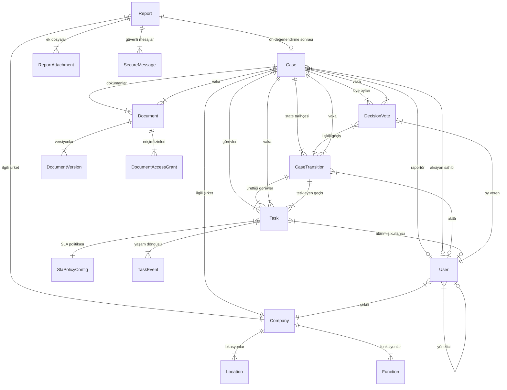
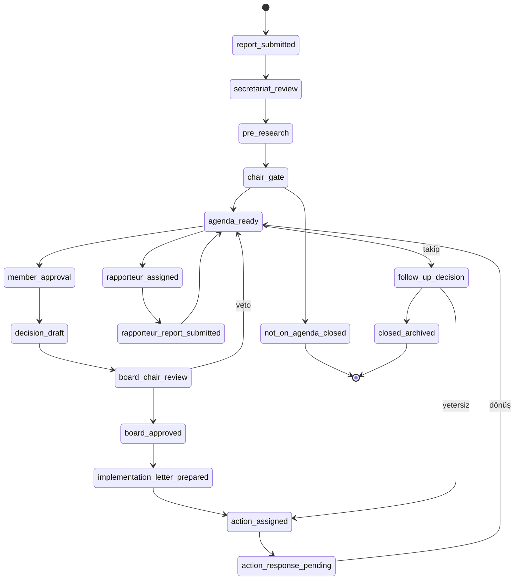
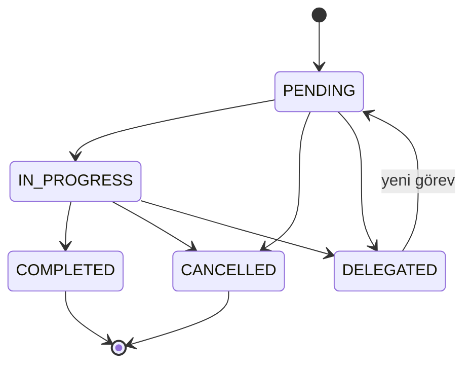
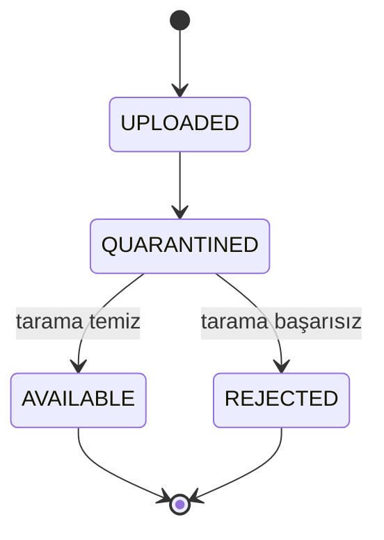

# Yıldız Holding Etik Bildirim Uygulaması — Domain Model

## Domain'e Genel Bakış

Etik Bildirim Uygulamasının domain modeli altı ana alt-domain'e ayrılır. **Intake** alt-domain'i dış bildirim formundan gelen ham kaydı (`report`) ve bildirimciyle güvenli iletişimi (`secure_message`) kapsar. **Case Management** alt-domain'i bildirimin vaka olarak yürütülmesini, dört aşamalı workflow state machine'ini ve karar sürecini modeller. **Task Management** alt-domain'i her workflow adımına karşılık gelen merkezi görev kaydını, SLA takibini ve delegation/reassignment akışlarını yönetir. **Document Management** alt-domain'i vaka ve görevlere bağlı dokümanları, per-document envelope encryption, erişim grant modeli ve malware tarama akışını kapsar. **Authorization** alt-domain'i kullanıcı kimliği, roller, permission set'leri, ABAC attribute'ları, clearance seviyeleri ve field-level visibility politikasını tanımlar. **Audit & Notification** alt-domain'i append-only denetim kaydı, chain hash bütünlüğü ve hassas içerik taşımayan bildirim dispatch akışını modeller.

Her alt-domain arasındaki bağlantılar foreign key ve event/outbox tabanlıdır; doğrudan modül-arası domain logic paylaşımı yoktur. Master data (company, location, function, position) HR/SAP'tan nightly read-only senkronize edilir ve tüm alt-domain'ler tarafından referans olarak kullanılır.

---

## Ana Entity'ler

### Report (Etik Bildirim)

Dış formdan gelen ilk kayıt varlığı. Login gerektirmeyen, kamuya açık web formu üzerinden oluşturulur. Her report bir `tracking_code` ve bildirimci tarafından belirlenen parola ile takip edilir.

**Sorumluluğu:**
- Dış formdan gelen ham bildirim verisini taşır ve saklama kaynağı olarak kalır.
- Anonim veya isimli bildirimci tercihini belirler.
- Kategori bazlı dinamik alan yapısını (`category_specific_data` JSONB) barındırır.
- Opsiyonel olarak bir `case` kaydına FK ile bağlanır; doğrudan kapatılabilir veya vaka olarak yürütülebilir.

**Ana attribute'lar (iş açısından):**
- `tracking_code` — 12 karakterli alfanümerik, unique, public-facing (örn: `ETK-2XA9-KP7M`)
- `tracking_code_password_hash` — argon2id hash; parola kurtarma yoktur
- `is_anonymous` — anonim bildirim bayrağı; true ise kimlik/iletişim alanları kaydedilmez
- `company_id` — ilgili Yıldız Holding şirketi (zorunlu)
- `categories` — seçilen alt kategori kodları (çoklu); 18 alt kategori enum'u
- `category_group` — üst grup kodu (EMPLOYEE_HUMAN, ASSET_FINANCIAL, COMPLIANCE_LEGAL, EXTERNAL_ENVIRONMENT)
- `category_specific_data` — JSONB, encrypted; seçilen kategoriye göre dinamik ek alanlar
- `incident_description` — olay açıklaması (encrypted, zorunlu)
- `involved_persons` — JSONB dizi, encrypted; ilgili kişiler (fail, mağdur, tanık, yönetici vb.)
- `witnesses` — JSONB dizi, encrypted
- `reporter_identity_*` — ad, unvan, ilişki (encrypted, nullable; yalnızca isimli bildirimde)
- `reporter_contact_*` — e-posta, telefon (encrypted, nullable)
- `urgent_risk_flag` — acil risk bayrağı (can/çevre/veri)
- `confidentiality_level` — varsayılan `SENSITIVE`; council_secretary veya council_chair güncelleyebilir
- `status` — SUBMITTED, ACKNOWLEDGED, UNDER_REVIEW, CLOSED
- `kvkk_consent_version` — onaylanan KVKK aydınlatma metni versiyonu

**İlişkiler:**
- → Company (N-1): Bildirim tek şirkete bağlı
- → Case (N-1, nullable): Ön değerlendirme sonrası opsiyonel olarak case'e bağlanır
- ← ReportAttachment (1-N): Bildirim ekleri
- ← SecureMessage (1-N): Bildirimci ↔ sekreterya güvenli mesajlar

**Yaşam döngüsü:** SUBMITTED → ACKNOWLEDGED → UNDER_REVIEW → CLOSED
- SUBMITTED: Form gönderildi; henüz sekreterya tarafından ele alınmadı.
- ACKNOWLEDGED: Sekreterya kaydı gördü ve işleme aldı.
- UNDER_REVIEW: Ön değerlendirme veya case süreci devam ediyor.
- CLOSED: İşlem tamamlandı veya doğrudan kapatıldı.

**Değişmezler:**
- `tracking_code` oluşturulduktan sonra değiştirilemez.
- `is_anonymous = true` ise `reporter_identity_*` ve `reporter_contact_*` alanları boş kalır ve API yanıtına dahil edilmez.
- Varsayılan `confidentiality_level` her zaman `SENSITIVE` olarak atanır; bildirimci gizlilik seviyesini seçmez.
- `tracking_code_password_hash` yalnızca argon2id (memory ≥ 64 MB, iterations ≥ 3, parallelism ≥ 1) ile üretilir.

---

### Case (Vaka)

Ön değerlendirmeye alınan ve workflow state machine üzerinden yürütülen bildirim kaydı. Bir `report` doğrudan kapatılabilir veya `case` olarak işlenebilir.

**Sorumluluğu:**
- Dört aşamalı workflow state machine'in durumunu taşır.
- Workflow versiyonu, gizlilik seviyesi ve atanmış rol/kullanıcı referanslarını yönetir.
- Tüm task, document, decision_vote ve case_transition kayıtlarının üst bağlam kaynağıdır.

**Ana attribute'lar:**
- `report_id` — kaynak report FK
- `current_state` — son durum alanı (performans ve listeleme için); denetim kaynağı `case_transition`
- `workflow_version` — hangi state machine versiyonuyla yürütüldüğü
- `confidentiality_level` — NORMAL, SENSITIVE, STRICTLY_CONFIDENTIAL
- `assigned_rapporteur_user_id` — atanmış raportör (nullable)
- `assigned_action_owner_user_id` — atanmış aksiyon sahibi (nullable)
- `company_id` — ilgili şirket (report'tan taşınır)
- `opened_at`, `closed_at` — vaka açılış/kapanış zamanları

**İlişkiler:**
- → Report (N-1): Her case bir report'a bağlı
- → Company (N-1): İlgili şirket
- → User (N-1, nullable): Atanmış raportör
- → User (N-1, nullable): Atanmış aksiyon sahibi
- ← CaseTransition (1-N): Append-only state geçiş tarihçesi
- ← Task (1-N): Vaka kapsamındaki görevler
- ← Document (1-N): Vaka kapsamındaki dokümanlar
- ← DecisionVote (1-N): Kurul üye oyları

**Yaşam döngüsü:** Dört aşamalı state machine — ayrıntılar "Durum Makineleri" bölümünde.

**Değişmezler:**
- `current_state` yalnızca backend `WorkflowCommandHandler` üzerinden değiştirilebilir; doğrudan set edilemez.
- `confidentiality_level` yalnızca `council_secretary` ve `council_chair` tarafından gerekçeli ve auditli şekilde değiştirilebilir.
- Case oluşturulduğunda `report.case_id` FK ile bağlanır; report silinmez, kalıcı kayıt olarak kalır.

---

### CaseTransition (Vaka State Geçişi)

Vaka state değişimlerinin append-only tarihçe kaydı. `case.current_state` son durum kısayoludur; denetim kaynağı bu tablodur.

**Sorumluluğu:**
- Kim, ne zaman, hangi state'ten hangi state'e geçiş yaptı bilgisini saklar.
- Geçiş gerekçesini, tetikleyen komutu ve idempotency key'i taşır.
- Audit event'leriyle correlation ID üzerinden bağlanır.

**Ana attribute'lar:**
- `case_id` — FK
- `from_state`, `to_state` — geçiş yönü
- `command` — tetikleyen WorkflowCommand
- `performed_by_user_id` — aktör (nullable; system actor olabilir)
- `actor_type` — USER veya SYSTEM
- `reason_text_masked` — gerekçe (encrypted, nullable)
- `idempotency_key` — çift geçiş koruması
- `optimistic_lock_version` — concurrent update koruması
- `audit_event_id` — ilişkili audit kaydı
- `transitioned_at` — geçiş zamanı

**İlişkiler:**
- → Case (N-1): Her geçiş bir vakaya bağlı
- → User (N-1, nullable): Geçişi yapan kullanıcı
- ← Task (1-N): Bu geçişin ürettiği görevler

**Değişmezler:**
- Kayıtlar append-only'dir; update veya delete yapılamaz.
- Her geçiş aynı transaction içinde audit outbox kaydı oluşturur; audit yazılamazsa geçiş fail-closed davranır.

---

### DecisionVote (Kurul Üye Oyu)

Kurul üyelerinin karar yazısına verdiği onay, itiraz veya sessiz kabul kaydı.

**Sorumluluğu:**
- Oy birliği mekanizmasının veri kaynağıdır.
- Sessiz kabul kuralının denetlenebilir kaydını tutar.

**Ana attribute'lar:**
- `case_id` — FK
- `transition_id` — ilişkili member_approval geçişi
- `voter_user_id` — oy veren kurul üyesi
- `vote_type` — APPROVE, REJECT, SILENT_ACCEPTANCE
- `reason_text` — gerekçe (encrypted, nullable; itirazda zorunlu)
- `voted_at` — oy zamanı
- `is_silent_acceptance` — sistem tarafından mı üretildi
- `created_by_system` — true ise actor_type=SYSTEM
- `audit_event_id` — ilişkili audit kaydı

**İlişkiler:**
- → Case (N-1): Oy bir vakaya bağlı
- → CaseTransition (N-1): İlişkili geçiş
- → User (N-1): Oy veren kullanıcı

**Değişmezler:**
- Aynı kullanıcı aynı transition için tek oy verebilir.
- 24 takvim saati içinde dönüş yoksa sistem `SILENT_ACCEPTANCE` üretir; `actor_type=SYSTEM`, `reason=timeout`.
- Kararlar oy birliğiyle alınır; itiraz eden üye varsa karar yazısı revize edilir.

---

### User (İç Kullanıcı)

Platformu kullanan kurumsal kimlik sahibi kişi. JIT provisioning ile ilk SSO girişinde oluşturulur veya admin tarafından manuel eklenir. Rol atanmadığı sürece hiçbir içeriğe erişemez.

**Sorumluluğu:**
- Kimlik, organizasyonel konum ve yetki bilgilerini taşır.
- RBAC rol set'i ve ABAC attribute'ları üzerinden yetkilendirme kararlarının girdisidir.

**Ana attribute'lar:**
- `employee_id` — HR/SAP sicil (unique, nullable — admin manuel ekleyebilir)
- `email` — kurumsal e-posta
- `display_name` — ad soyad
- `company_id`, `location_id`, `function_id`, `position_code` — organizasyonel attribute'lar (HR/SAP'tan senkron)
- `manager_user_id` — yönetici referansı (self-reference, nullable)
- `roles` — atanmış rol kodları seti
- `clearance_level` — NORMAL, SENSITIVE, STRICTLY_CONFIDENTIAL
- `is_active` — aktif/pasif durumu; pasif kullanıcı login yapamaz
- `is_general_secretary` — council_member üzerinde attribute; ayrı sistem rolü değil
- `oidc_subject_id` — IdP tarafından verilen unique identifier

**İlişkiler:**
- → Company (N-1): Kullanıcı tek şirkete bağlı
- → User (N-1, self, nullable): Yönetici referansı
- ← Task (1-N): Kullanıcıya atanmış görevler
- ← CaseTransition (1-N): Kullanıcının yaptığı state geçişleri
- ← DecisionVote (1-N): Kullanıcının verdiği oylar

**Yaşam döngüsü:** PROVISIONED → ACTIVE → PASSIVE (reactivate edilebilir)
- JIT provisioning veya admin ekleme ile PROVISIONED; rol atanınca ACTIVE.
- HR/SAP sync'te pasif gelen kullanıcıların erişimi otomatik kapatılır.
- Pasif durumda login mümkün değil; atanmış görevler yeniden atanır.

**Değişmezler:**
- JIT provisioning yalnızca kullanıcı kaydını oluşturur; hiçbir rol atamaz. Rol ataması ayrı adımdır ve maker-checker gerektirir.
- `clearance_level` kullanıcının görebileceği en yüksek gizlilik seviyesidir; `clearance_level >= case.confidentiality_level` koşulu sağlanmadan içeriğe erişilemez.
- Bir kullanıcı kendi manager'ı olamaz (cycle engelleme).
- Silinmez; yalnızca pasifleştirilir.

---

### Task (Görev)

Workflow adımlarına karşılık gelen merkezi görev kaydı. Görevler ayrı ekran mantığına gömülmez; tek görev modeli üzerinden SLA, delegation ve bildirim yönetilir.

**Sorumluluğu:**
- Her workflow adımında hangi rolün/kullanıcının hangi işi yapması gerektiğini tanımlar.
- SLA takibi, hatırlatma ve eskalasyon mekanizmasının veri kaynağıdır.
- Delegation ve reassignment akışlarını kayıt altında tutar.

**Ana attribute'lar:**
- `case_id` — FK
- `task_type` — görev tipi enum (11 tip; görev tipi kataloğu aşağıda)
- `status` — PENDING, IN_PROGRESS, COMPLETED, CANCELLED, DELEGATED
- `assigned_role` — hedef rol kodu
- `assigned_user_id` — atanmış kullanıcı (nullable; role bazlı da olabilir)
- `assigned_company_id`, `assigned_function_id` — ABAC scope
- `due_at` — SLA bitiş zamanı
- `sla_policy_id` — SLA konfigürasyon referansı
- `sla_paused_at`, `sla_pause_reason` — bekleme durumu
- `created_by_transition_id` — tetikleyen state geçişi
- `completed_by_user_id`, `completed_at` — tamamlama bilgisi
- `outcome` — görev sonucu (nullable; APPROVED, REJECTED, SUBMITTED, vb.)
- `delegated_from_task_id` — delegation zinciri (nullable)

**Görev tipi kataloğu:**

| task_type | Tetikleyen state | Varsayılan sahip | SLA |
|---|---|---|---|
| `secretariat_review_task` | `report_submitted` | council_secretary | 3 iş günü |
| `pre_research_task` | `secretariat_review` | council_secretary | 5 iş günü |
| `chair_gate_task` | `pre_research` | council_chair | 3 iş günü |
| `rapporteur_assign_task` | `agenda_ready` (araştırma gerekli) | council_secretary | 3 iş günü |
| `rapporteur_report_task` | `rapporteur_assigned` | Atanan rapporteur | 10 iş günü |
| `member_approval_task` | `agenda_ready` → üye onayına sunuldu | Her council_member için ayrı | 24 takvim saati |
| `decision_draft_task` | `member_approval` tamamlandı | council_secretary | 5 iş günü |
| `board_review_task` | `decision_draft` | board_chair | 5 iş günü |
| `implementation_letter_task` | `board_approved` | council_secretary | 3 iş günü |
| `action_response_task` | `action_assigned` | Atanan action_owner | 14 iş günü |
| `follow_up_review_task` | `agenda_ready` (aksiyon sonrası) | council_secretary / kurul | 5 iş günü |

Tüm SLA değerleri (24 saat sessiz kabul ve 14 iş günü aksiyon dönüşü hariç) `task_sla_admin` ekranından konfigüre edilebilir.

**İlişkiler:**
- → Case (N-1): Görev bir vakaya bağlı
- → CaseTransition (N-1): Tetikleyen geçiş
- → User (N-1, nullable): Atanmış kullanıcı
- → SlaPolicyConfig (N-1): SLA konfigürasyonu
- → Task (N-1, self, nullable): Delegation kaynağı
- ← TaskEvent (1-N): Görev yaşam döngüsü olayları

**Yaşam döngüsü:** PENDING → IN_PROGRESS → COMPLETED / CANCELLED / DELEGATED (ayrıntılar "Durum Makineleri" bölümünde)

**Değişmezler:**
- Her görev bir `case_transition` kaydına bağlıdır; bağımsız görev açılamaz.
- Task completion idempotent çalışır; aynı görev için çift tıklama çift state geçişi oluşturmaz.
- `action_owner` kendi aksiyon SLA'ını durduramaz; SLA pause yalnızca `council_secretary` tarafından gerekçeli yapılır.
- Rapporteur ve action_owner görevleri yalnızca atanmış kullanıcı/kapsam üzerinden görünür.

---

### ApprovalWorkItem (Maker-Checker Onay Görevi)

Maker-checker gerektiren admin işlemleri için checker kuyruğu kaydı. **Vaka workflow Task entity'sinden ayrıdır** — `case_id` ve `case_transition` bağı yoktur; birleşik “Görevlerim” ekranına API projeksiyonu ile dahil edilir.

**Sorumluluğu:**
- Maker proposal oluştuğunda ilgili action matrix `checker_role` için açık onay işi yaratır.
- Checker rolüne sahip iç kullanıcılar kuyruğu `GET /api/v1/tasks` birleşik listesinde görür.
- Onay/red kararı mevcut admin approve endpoint mantığına delegate edilir; iş kapanır.

**Ana attribute'lar:**
- `category` — onay kategorisi (`ROLE_ASSIGNMENT`, `CLEARANCE_CHANGE`, `SYSTEM_SETTING_CHANGE`, …)
- `action_code` — action matrix aksiyon kodu
- `assigned_checker_role` — checker rolü (proposal anı snapshot)
- `requested_by` — maker kullanıcı ID
- `status` — PENDING, COMPLETED, REJECTED, CANCELLED
- `summary` — maskeli özet (kullanıcı adı/metadata; etik içerik yok)
- `target_type`, `target_id` — onaylanacak domain kaydına referans (ör. `user_roles.id`, change batch id)

**İlişkiler:**
- → User (N-1): Maker ve checker
- → ActionMatrixConfig (mantıksal): `action_code` ile eşleşme
- Domain batch/role kayıtlarına `target_type` + `target_id` ile referans (FK polymorphic değil — uygulama katmanı doğrular)

**Değişmezler:**
- Maker ve checker aynı kişi olamaz.
- Checker yalnızca `assigned_checker_role` kullanıcı rollerinden birine sahipse decide edebilir.
- Onay özeti vaka içeriği, report metni veya decrypt edilmiş alan taşımaz.
- Delege edilemez (MVP); yalnızca checker rol havuzu görür.

---

### Document (Doküman)

Vaka/workflow'a bağlı kapalı arşiv ve delil yönetimi kaydı. Genel amaçlı dosya paylaşımı değildir; her doküman bir report, case, task, transition veya action kaydıyla ilişkilidir.

**Sorumluluğu:**
- Doküman metadata'sını süreç bağlamına bağlar.
- Per-document envelope encryption, hash bütünlüğü ve gizlilik/retention kararlarını taşır.
- Erişim politikası doküman bazında uygulanır; vaka erişimi doğrudan doküman erişimi vermez.

**Ana attribute'lar:**
- `case_id`, `report_id`, `task_id`, `transition_id` — bağlam FK'ları
- `document_category` — 13 kategori enum (aşağıda)
- `title`, `version_no`, `status` — doküman metadata
- `confidentiality_level` — dokümanın gizlilik seviyesi
- `storage_key_ciphertext` — şifreli object storage yolu
- `content_sha256` — bütünlük hash'i
- `size_bytes`, `mime_type` — teknik metadata
- `encrypted_dek`, `kms_key_id` — per-document encryption anahtarları
- `malware_scan_status` — PENDING, CLEAN, QUARANTINED, REJECTED
- `retention_policy_id`, `archived_at` — saklama/arşiv bilgisi
- `uploaded_by_user_id`, `uploaded_at` — yükleme bilgisi

**Doküman kategori kataloğu:**

| Kategori | Açıklama |
|---|---|
| `incoming_report_attachment` | Bildirimci tarafından yüklenen ek dosyalar |
| `pre_research_note` | Ön araştırma sürecinde oluşturulan notlar/belgeler |
| `company_evidence` | Şirketten gelen kanıt belgeleri |
| `disciplinary_document` | Disiplin süreci belgeleri |
| `rapporteur_report` | Raportör inceleme raporu |
| `council_agenda_pack` | Kurul gündemi paketi |
| `decision_draft` | Karar yazısı taslağı |
| `member_approval_record` | Üye onay/itiraz kaydı |
| `board_chair_approval` | HYKB onay/veto kaydı |
| `implementation_letter` | Uygulama/aksiyon yazısı |
| `action_response` | İlgili şirket aksiyon dönüş belgeleri |
| `follow_up_decision` | Takip kararı belgeleri |
| `closure_note` | Kapanış notu |

**İlişkiler:**
- → Case (N-1): Doküman bir vakaya bağlı
- → Task (N-1, nullable): İlişkili görev
- ← DocumentVersion (1-N): Append-only versiyonlar
- ← DocumentAccessGrant (1-N): Erişim izinleri

**Yaşam döngüsü:** UPLOADED → QUARANTINED → AVAILABLE / REJECTED (ayrıntılar "Durum Makineleri" bölümünde)

**Değişmezler:**
- Dokümanlar overwrite edilmez; yeni yüklemeler yeni `version_no` ile append-only tutulur.
- Tarama tamamlanmadan doküman başka kullanıcıya gösterilmez ve karar paketine eklenmez.
- `closed_archived` durumundaki vakalarda dokümanlar arşive alınır; ancak erişim politikası gevşetilmez.
- Full-text/OCR index oluşturulmaz; arama metadata alanlarıyla sınırlıdır.

---

### DocumentAccessGrant (Doküman Erişim İzni)

"Sadece kime atandıysa o görür" ilkesinin doküman bazlı uygulama kaydı.

**Sorumluluğu:**
- Holding seviyesi role sahip olmak tek başına tüm dokümanları açma hakkı vermez; grant kaydı gerekir.
- State, görev, karar paketi veya aksiyon kapsamında oluşturulur.

**Ana attribute'lar:**
- `document_id` — FK
- `granted_to_user_id` — erişim verilen kullanıcı
- `granted_to_role` — erişim verilen rol (nullable; role bazlı grant)
- `grant_scope` — FULL_ACCESS, METADATA_ONLY
- `granted_by_transition_id` — tetikleyen geçiş
- `granted_at`, `revoked_at` — geçerlilik

**Değişmezler:**
- Grant yoksa doküman erişimi reddedilir (deny-by-default).
- `action_owner` yalnızca kendisine gönderilen uygulama/aksiyon yazısını ve kendi dönüş dokümanlarını görür.
- `rapporteur` yalnızca atandığı vaka ve inceleme kapsamındaki dokümanları görür.

---

### SecureMessage (Güvenli Mesaj)

Bildirimci ile kurul sekreterliği arasındaki güvenli iletişim kaydı. Normal e-posta içeriğine taşınmaz.

**Sorumluluğu:**
- Ek bilgi talebi ve cevabını güvenli kanalda tutar.
- E-posta yalnızca "takip ekranında yeni bir mesajınız var" bildirimi gönderir.

**Ana attribute'lar:**
- `report_id` — FK
- `direction` — INBOUND_FROM_REPORTER, OUTBOUND_TO_REPORTER
- `sender_type` — SYSTEM_USER, ANONYMOUS_REPORTER
- `sender_user_id` — iç kullanıcı ID (nullable; reporter tarafında null)
- `message_body` — encrypted
- `attachments` — encrypted JSONB (nullable)
- `is_read` — okundu bayrağı
- `created_at` — mesaj zamanı

**İlişkiler:**
- → Report (N-1): Mesaj bir bildirime bağlı

**Değişmezler:**
- Yalnızca `council_secretary` iç taraftan mesaj gönderebilir ve okuyabilir.
- Bildirimci tarafı `tracking_code` + parola ile erişir; session açılmaz.
- Mesaj içerikleri e-posta'ya, log'a veya audit event'ine plaintext olarak yazılmaz.

---

### AuditEvent (Denetim Kaydı)

Güvenlik, yetkilendirme, workflow, doküman, rol/clearance, admin ayarı ve entegrasyon işlemleri için append-only denetim kaydı.

**Sorumluluğu:**
- Hukuki/kurumsal denetim ve olay inceleme amacıyla tasarlanmış ayrı bir kayıt katmanıdır.
- İçerik kopyalamaz; metadata, yetki kararı ve olay izini tutar.
- Chain hash bütünlüğü ve tamper-evidence sağlar.

**Ana attribute'lar (48 alan, ana gruplar):**
- Kimlik/zaman: `audit_event_id`, `occurred_at`, `recorded_at`
- Olay: `event_type` (merkezi enum katalog), `event_category`, `severity`
- Aktör: `actor_type`, `actor_id`, `actor_role_snapshot`, `clearance_level_snapshot`
- Konu/kaynak: `subject_type`, `subject_id`, `case_id`, `company_id`, `document_version_id`
- Sonuç: `action`, `outcome`, `reason_code`, `reason_text_masked`
- Yetki: `policy_decision_id`, `data_classification`
- Teknik: `correlation_id`, `request_id`, `session_id_hash`, `idempotency_key`, `duration_ms`
- Kimlik doğrulama: `authentication_method`, `ip_address_hash`, `user_agent_hash`, `geo_risk_flag`
- Süreç: `workflow_version`, `notification_event_id`
- Özel prosedür: `break_glass_session_id`, `maker_checker_request_id`
- Değişiklik: `before_masked`, `after_masked`, `metadata_json`
- Retention: `retention_class`, `legal_hold_flag`
- Bütünlük: `prev_hash`, `event_hash`

**Değişmezler:**
- Append-only; update, delete ve overwrite yapılamaz. Düzeltme gerekiyorsa yeni `audit_correction_event` eklenir.
- Kritik business işlemleri (case_transition, document_download, role_change, member_vote vb.) audit kaydı olmadan başarılı sayılmaz (fail-closed).
- Audit log plaintext etik içerik, parola, token veya decrypt edilmiş veri içermez.
- `ip_address_hash` ve `user_agent_hash` pepper+SHA-256 ile üretilir; kimlik geri çıkarılamaz.

---

### Master Data Entity'leri

**Company (Şirket)**, **Location (Lokasyon)**, **Function (Fonksiyon)**, **Position (Pozisyon)**: HR/SAP'tan nightly read-only senkronize edilen referans veriler. Uygulama bu verilerin master kaynağı değildir; salt okunur ve FK olarak kullanır. Source wins yaklaşımıyla çalışır; uygulama master data alanlarını manuel düzeltmez.

**SlaPolicyConfig:** Görev tipi başına SLA süresi, uyarı eşikleri, günlük hatırlatma ve eskalasyon alıcısı. `task_sla_admin` ekranından yönetilir.

**BusinessCalendar:** Resmi tatil, holding özel tatili ve yarım gün kayıtları. 14 iş günü SLA hesabında kullanılır.

**SystemSetting:** Runtime davranışını etkileyen parametreler (cache TTL, rate limit profilleri, brute-force eşikleri, session süreleri, SLA süreleri, worker aralıkları). `system_settings` ekranından maker-checker ile yönetilir.

**ActionMatrixConfig:** Maker-checker gerektiren aksiyonlar ve her aksiyon için maker/checker rolleri. `action_matrix_admin` ekranından yönetilir.

**NotificationTemplate:** Bildirim şablonları; `dictionary_text_admin` ekranından aktif/pasif ve metin düzenlemesi yapılabilir; her değişiklik versiyonlu ve config audit kapsamındadır.

---

## Entity İlişki Diyagramı

---

## İş Kuralları (Domain Invariantları)

1. **Deny-by-default:** Bir işlem için RBAC izni ve ABAC koşulları birlikte sağlanmadıkça erişim verilmez. UI guard yalnızca kullanıcı deneyimi optimizasyonudur; backend kararı yerine geçemez.

2. **Clearance hiyerarşisi:** `NORMAL < SENSITIVE < STRICTLY_CONFIDENTIAL`. Kullanıcı `clearance_level >= case.confidentiality_level` koşulunu sağlamadan içeriğe erişemez.

3. **Admin içerik görmez:** `admin` rolü teknik ve yönetsel ayarları yönetir; vakalara ait hiçbir veriyi — bildirim metni, ek dosya, raportör raporu, karar yazısı, aksiyon detayları, güvenli mesajlar — göremez. Per-field AES-256-GCM şifreleme bu kısıtı teknik olarak garantiler.

4. **Varsayılan gizlilik:** Yeni oluşturulan her bildirimin varsayılan `confidentiality_level` değeri `SENSITIVE` olur. Yalnızca `council_secretary` ve `council_chair` gerekçeli olarak `NORMAL` veya `STRICTLY_CONFIDENTIAL` seviyesine güncelleyebilir.

5. **Oy birliği ve sessiz kabul:** Kurul kararları oy birliğiyle alınır. 24 takvim saati içinde dönüş yapılmazsa sessiz kabul uygulanır; sistem `SILENT_ACCEPTANCE` vote kaydı üretir. İtiraz eden üye varsa karar yazısı revize edilir.

6. **Raportör döngüsü:** Raportör süreci opsiyonel ve döngüseldir. Rapor tamamlanınca vaka `agenda_ready` state'ine geri döner. İkinci rapor gerekirse aynı döngü tekrar eder.

7. **Aksiyon dosyayı kapatmaz:** Aksiyon dönüşü dosyayı otomatik kapatmaz; dönüş sonrası vaka `agenda_ready` state'ine geçer ve sonraki kurul gündeminde takip kararı verilir.

8. **HYKB veto dönüşü:** Veto verilirse vaka doğrudan `agenda_ready` state'ine döner; ayrı bir `board_vetoed_returned` state'i yoktur.

9. **Doküman grant zorunluluğu:** Doküman erişimi vaka erişiminden ayrıca doğrulanır. Grant yoksa doküman erişimi reddedilir. Holding seviyesi role sahip olmak tek başına tüm dokümanları açma hakkı vermez.

10. **Append-only tarihçe:** Workflow geçmişi (`case_transition`), görev yaşam döngüsü (`task_event`), doküman versiyonları ve audit log kayıtları append-only tutulur; update veya delete yapılamaz.

11. **Fail-closed audit:** Kritik business işlemleri audit kaydı olmadan başarılı sayılmaz. Domain transaction ile aynı transaction içinde `audit_outbox` kaydı oluşturulur.

12. **İdempotent komutlar:** Task completion ve transition komutları idempotent çalışır; çift tıklama, tekrar gönderim veya eşzamanlı onay yarışında çift state geçişi oluşmaz.

13. **SLA iş günü hesabı:** 14 iş günü SLA hesabında hafta sonları ve Türkiye resmi tatilleri dahil edilmez; holding özel tatilleri ve yarım gün davranışı `business_calendar_admin` ile yönetilir.

14. **JIT provisioning rol atamaz:** İlk SSO girişinde kullanıcı kaydı oluşturulur; ancak hiçbir rol atanmaz. Rol ataması ayrı adımdır ve maker-checker gerektirir.

15. **Anonim bildirimci session'sız:** Anonim takip doğrulamasında session açılmaz, cookie bırakılmaz; her istek yeniden `tracking_code` + parola doğrulamasından geçer.

16. **Maker-checker zorunluluğu:** Kritik rol/clearance ataması, STRICTLY_CONFIDENTIAL yükseltme, legal hold, retention override, workflow config değişikliği, KVKK metin yayını, break-glass başlatma ve notification template kritik değişikliği maker-checker gerektirir. Maker ve checker aynı kişi olamaz.

---

## Durum Makineleri

### Case State Machine (Vaka Workflow)

Vaka dört aşamada ilerler. Tüm state geçişleri backend `WorkflowCommandHandler` üzerinden yapılır.

**State listesi:**

| State | Aşama | Açıklama |
|---|---|---|
| `report_submitted` | 1 | Bildirim geldi; henüz sekreterya tarafından ele alınmadı |
| `secretariat_review` | 1 | Sekreterya ön değerlendirme yapıyor |
| `pre_research` | 1 | Ön araştırma ve bilgi toplama aşaması |
| `chair_gate` | 1 | Kurul başkanı gündeme alma/ret kararı veriyor |
| `not_on_agenda_closed` | 1 | Gündeme alınmadı; gerekçeli, auditli kapanış (hard delete değil) |
| `agenda_ready` | 2 | Kurul gündeminde; doğrudan üye onayına sunulabilir veya raportör atanabilir |
| `rapporteur_assigned` | 2 | Raportör görevlendirildi; inceleme yapılıyor |
| `rapporteur_report_submitted` | 2 | Raportör raporu tamamlandı; vaka `agenda_ready`'e geri döner |
| `member_approval` | 2 | Kurul üyelerine sunuldu; 24 saat onay/itiraz bekleniyor |
| `decision_draft` | 3 | Karar yazısı taslağı hazırlanıyor |
| `board_chair_review` | 3 | HYKB onay/veto bekliyor |
| `board_approved` | 3 | HYKB onayladı |
| `implementation_letter_prepared` | 4 | Uygulama yazısı hazırlandı |
| `action_assigned` | 4 | Aksiyon sahibine atandı; 14 iş günü bekleniyor |
| `action_response_pending` | 4 | Aksiyon dönüşü bekleniyor |
| `follow_up_decision` | 4 | Kurul takip kararı aşaması |
| `closed_archived` | 4 | Vaka kapatıldı ve arşivlendi |

**Geçiş tablosu:**

| From | To | Tetikleyici | Koşullar |
|---|---|---|---|
| `report_submitted` | `secretariat_review` | Sekreterya kaydı işleme alır | council_secretary rolü |
| `secretariat_review` | `pre_research` | Ön araştırma başlatılır | council_secretary rolü |
| `pre_research` | `chair_gate` | Ön araştırma tamamlanır | council_secretary rolü |
| `chair_gate` | `not_on_agenda_closed` | Gündeme alınmaz | council_chair rolü, gerekçe zorunlu |
| `chair_gate` | `agenda_ready` | Gündeme alınır | council_chair rolü |
| `agenda_ready` | `rapporteur_assigned` | Raportör atanır | council_secretary rolü, araştırma gerekli kararı |
| `agenda_ready` | `member_approval` | Üye onayına sunulur | council_secretary rolü |
| `rapporteur_assigned` | `rapporteur_report_submitted` | Rapor yüklenir | Atanmış rapporteur |
| `rapporteur_report_submitted` | `agenda_ready` | Döngü — kurul gündemine geri döner | Otomatik |
| `member_approval` | `decision_draft` | Tüm üyeler onayladı (veya sessiz kabul) | Oy birliği sağlandı |
| `member_approval` | `member_approval` | İtiraz → karar revize | İtiraz eden üye var |
| `decision_draft` | `board_chair_review` | HYKB'ye sunulur | council_secretary rolü |
| `board_chair_review` | `board_approved` | HYKB onayladı | board_chair rolü |
| `board_chair_review` | `agenda_ready` | HYKB veto → sonraki kurul gündemine döner | board_chair rolü, veto gerekçesi |
| `board_approved` | `implementation_letter_prepared` | Uygulama yazısı hazırlanır | council_secretary rolü |
| `implementation_letter_prepared` | `action_assigned` | Aksiyon sahibine atanır | council_secretary rolü |
| `action_assigned` | `action_response_pending` | Aksiyon SLA başlar | Otomatik |
| `action_response_pending` | `agenda_ready` | Aksiyon dönüşü yapıldı → kurul gündemine taşınır | action_owner dönüş yaptı |
| `agenda_ready` (takip) | `follow_up_decision` | Takip kararı verilir | Kurul kararı |
| `follow_up_decision` | `closed_archived` | Kapatma kararı | Kurul kararı |
| `follow_up_decision` | `action_assigned` | Yeniden aksiyon döngüsü | Kurul kararı, yetersiz bulundu |

### Task State Machine (Görev Yaşam Döngüsü)

| State | Açıklama |
|---|---|
| `PENDING` | Görev oluşturuldu; henüz ele alınmadı |
| `IN_PROGRESS` | Kullanıcı görevi üstlendi ve çalışıyor |
| `COMPLETED` | Görev başarıyla tamamlandı |
| `CANCELLED` | Görev iptal edildi (vaka kapanması, yeniden atama vb.) |
| `DELEGATED` | Görev başka kullanıcıya devredildi |

### Document State Machine (Doküman Yaşam Döngüsü)

| State | Açıklama |
|---|---|
| `UPLOADED` | Dosya yüklendi; tarama kuyruğuna alındı |
| `QUARANTINED` | Malware taraması devam ediyor |
| `AVAILABLE` | Tarama temiz; erişime açık (grant koşullarıyla) |
| `REJECTED` | Tarama başarısız veya dosya tipi/boyut reddedildi |

---

## Kardinalite Özet Tablosu

| Entity A | Entity B | İlişki | Not |
|---|---|---|---|
| Report | Case | 1-0..1 | Bildirim case'e dönüşmeyebilir (doğrudan kapanabilir) |
| Report | Company | N-1 | Bildirim tek şirkete bağlı |
| Report | ReportAttachment | 1-N | Bildirim N ek dosya içerebilir |
| Report | SecureMessage | 1-N | Bildirim N güvenli mesaj içerebilir |
| Case | CaseTransition | 1-N | Vaka N state geçişi kaydı içerir |
| Case | Task | 1-N | Vaka N görev içerir |
| Case | Document | 1-N | Vaka N doküman içerir |
| Case | DecisionVote | 1-N | Vaka N üye oyu içerir |
| Case | User (rapporteur) | N-0..1 | Vaka en fazla bir atanmış raportöre sahip |
| Case | User (action_owner) | N-0..1 | Vaka en fazla bir atanmış aksiyon sahibine sahip |
| CaseTransition | Task | 1-N | Bir geçiş N görev üretebilir |
| Task | TaskEvent | 1-N | Görev N yaşam döngüsü olayı içerir |
| Task | SlaPolicyConfig | N-1 | Görev tek SLA politikasına bağlı |
| Task | Task (delegation) | N-0..1 | Görev başka görevden devir alınmış olabilir |
| Document | DocumentVersion | 1-N | Doküman N versiyon içerir |
| Document | DocumentAccessGrant | 1-N | Doküman N erişim izni içerir |
| User | Company | N-1 | Kullanıcı tek şirkete bağlı |
| User | User (manager) | N-0..1 | Kullanıcı en fazla bir yöneticiye bağlı |
| Company | Location | 1-N | Şirket N lokasyon içerir |
| Company | Function | 1-N | Şirket N fonksiyon içerir |

---

*Bu doküman Yıldız Holding Etik Bildirim Uygulaması mimari kararlarından türetilmiştir. Kararlar değiştiğinde doküman yeniden üretilir.*
