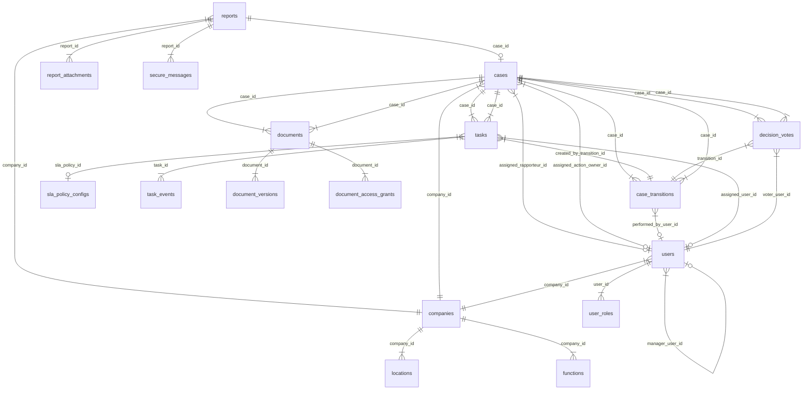

# Yıldız Holding Etik Bildirim Uygulaması — Database Schema

## DB Engine ve Versiyon

Veritabanı motoru **PostgreSQL** (en güncel stabil major versiyon) olarak seçilmiştir. Production ortamında AWS managed PostgreSQL (RDS) hedeflenir; development ortamında local PostgreSQL çalışır. ORM olarak **Prisma ORM** kullanılır; migration aracı **prisma migrate**'tir.

PostgreSQL seçim gerekçesi: JSONB desteği (kategori bazlı dinamik alanlar ve encryption metadata), güçlü transaction isolation (workflow idempotency), partial index desteği (soft-delete filtreleme), PITR continuous backup (4 saat RPO hedefi) ve advisory lock desteği (worker tekil çalıştırma).

---

## Şemaya Genel Bakış

Veritabanı şeması sekiz mantıksal gruba ayrılır. Tüm tablolar aynı PostgreSQL veritabanında, `public` schema altında tutulur.

| Grup | Tablolar |
|---|---|
| Auth & Users | `users`, `user_roles`, `user_sessions` |
| Master Data | `companies`, `locations`, `functions`, `positions`, `hr_sync_runs` |
| Intake | `reports`, `report_attachments`, `secure_messages` |
| Case Management | `cases`, `case_transitions`, `decision_votes` |
| Task | `tasks`, `task_events` |
| Document | `documents`, `document_versions`, `document_access_grants` |
| Audit & Notification | `audit_outbox`, `audit_events`, `audit_seals`, `notification_events`, `notification_templates` |
| Config & Admin | `sla_policy_configs`, `business_calendar_entries`, `system_settings`, `action_matrix_configs`, `field_visibility_configs`, `kvkk_consent_versions` |

---

## Standart Alanlar

Tüm tablolarda aşağıdaki audit alanları zorunludur:

| Alan | Tip | Default | Açıklama |
|---|---|---|---|
| `id` | `TEXT` (CUID) | `cuid()` | Primary key; Prisma `@id @default(cuid())` |
| `created_at` | `TIMESTAMPTZ` | `now()` | Kayıt oluşturma zamanı |
| `updated_at` | `TIMESTAMPTZ` | Auto on update | Son güncelleme zamanı; Prisma `@updatedAt` |
| `created_by` | `TEXT` | nullable | Oluşturan kullanıcı ID; seed data için nullable |

**İstisna:** `audit_events` tablosunda `updated_at` yoktur — append-only olduğu için güncelleme yapılmaz.

---

## Soft Delete Stratejisi

Uygulama genelinde hard delete yasaktır. Soft delete stratejisi entity tipine göre iki şekilde uygulanır:

**`is_active` boolean (kullanıcılar ve master data):** `users`, `companies`, `locations`, `functions`, `positions` tablolarında `is_active BOOLEAN NOT NULL DEFAULT true` kullanılır. Pasif kayıtlar sorguya default olarak dahil edilmez; Prisma middleware veya `$extends` ile otomatik `WHERE is_active = true` filtresi uygulanır.

**Append-only (workflow, audit, doküman):** `case_transitions`, `task_events`, `audit_events`, `document_versions` ve `decision_votes` tabloları append-only'dir; soft delete uygulanmaz çünkü zaten silinmez.

**Retention-driven purge (kapalı vakalar):** `cases`, `reports`, `documents` ve ilişkili kayıtlar retention süresi dolduğunda denetlenebilir imha akışıyla (`purge_job_id`, `purge_event_id`) temizlenir. Vaka verisi 10 yıl, audit 10 yıl, güvenlik logları 1 yıl, teknik loglar 180 gün saklanır.

---

## Encryption Stratejisi

Hassas vaka alanları ve doküman içerikleri **per-field AES-256-GCM** ile veritabanında şifreli saklanır. Şifreleme/çözme yalnızca backend `CryptoService` üzerinden, KMS policy geçtikten sonra yapılır.

**Şifreli alan kuralları:**
- Her şifreli alan TEXT olarak saklanır (base64-encoded ciphertext + IV + auth tag).
- Her kayıt için `encryption_metadata` JSONB alanı, alan adı → `{ encrypted_dek, kms_key_id, algorithm }` eşlemesini tutar. Her alan kendi DEK'ine sahiptir; tek DEK tüm alanları açmaz.
- Şifreli alanlar üzerinde index oluşturulamaz; arama yalnızca şifrelenmemiş metadata alanlarıyla yapılır.
- Plaintext değer log, cache veya ara storage'a yazılmaz.
- KMS decrypt yetkisi yalnızca runtime backend service account'a verilir.

**Şifreli alan gösterimi:** Aşağıdaki tablo tanımlarında şifreli alanlar `🔒` işaretiyle belirtilir.

---

## Tablo Tanımları

### users

Platformu kullanan iç kullanıcılar. JIT provisioning ile ilk SSO girişinde veya admin tarafından manuel oluşturulur.

| Kolon | Tip | Null | Default | Kısıt | Açıklama |
|---|---|---|---|---|---|
| `id` | TEXT | No | cuid() | PK | — |
| `oidc_subject_id` | TEXT | Yes | — | UNIQUE | IdP tarafından verilen unique identifier |
| `employee_id` | VARCHAR(20) | Yes | — | UNIQUE | HR/SAP sicil numarası |
| `email` | TEXT | No | — | UNIQUE | Kurumsal e-posta |
| `display_name` | TEXT | No | — | — | Ad soyad |
| `company_id` | TEXT | Yes | — | FK → companies | HR/SAP'tan senkron |
| `location_id` | TEXT | Yes | — | FK → locations | HR/SAP'tan senkron |
| `function_id` | TEXT | Yes | — | FK → functions | HR/SAP'tan senkron |
| `position_code` | VARCHAR(50) | Yes | — | — | HR/SAP pozisyon kodu |
| `manager_user_id` | TEXT | Yes | — | FK → users | Yönetici referansı (self) |
| `clearance_level` | TEXT | No | 'NORMAL' | CHECK | NORMAL, SENSITIVE, STRICTLY_CONFIDENTIAL |
| `is_general_secretary` | BOOLEAN | No | false | — | council_member üzerinde attribute |
| `is_active` | BOOLEAN | No | true | — | Aktif/pasif durumu |
| `provisioned_at` | TIMESTAMPTZ | Yes | — | — | JIT provisioning zamanı |
| `last_login_at` | TIMESTAMPTZ | Yes | — | — | Son giriş zamanı |
| `created_at` | TIMESTAMPTZ | No | now() | — | — |
| `updated_at` | TIMESTAMPTZ | No | now() | — | — |
| `created_by` | TEXT | Yes | — | — | — |

**Index'ler:** `idx_users_email` UNIQUE, `idx_users_oidc_subject` UNIQUE (nullable), `idx_users_employee_id` UNIQUE (nullable), `idx_users_company_id`, `idx_users_is_active` partial (WHERE is_active = true).

---

### user_roles

Kullanıcı-rol atamaları. Her atama maker-checker ve audit kapsamındadır.

| Kolon | Tip | Null | Default | Kısıt | Açıklama |
|---|---|---|---|---|---|
| `id` | TEXT | No | cuid() | PK | — |
| `user_id` | TEXT | No | — | FK → users | — |
| `role_code` | TEXT | No | — | CHECK | Rol enum: council_secretary, council_chair, council_member, rapporteur, board_chair, action_owner, admin |
| `assigned_by` | TEXT | No | — | FK → users | Atamayı yapan kullanıcı |
| `approved_by` | TEXT | Yes | — | FK → users | Maker-checker onaylayan |
| `reason` | TEXT | Yes | — | — | Atama gerekçesi |
| `is_active` | BOOLEAN | No | true | — | Aktif/geri alınmış |
| `assigned_at` | TIMESTAMPTZ | No | now() | — | — |
| `revoked_at` | TIMESTAMPTZ | Yes | — | — | Geri alınma zamanı |
| `audit_event_id` | TEXT | Yes | — | — | İlişkili audit kaydı |
| `created_at` | TIMESTAMPTZ | No | now() | — | — |
| `updated_at` | TIMESTAMPTZ | No | now() | — | — |

**Index'ler:** `idx_user_roles_user_active` (user_id, is_active) partial (WHERE is_active = true), UNIQUE (user_id, role_code) partial (WHERE is_active = true).

---

### companies

Yıldız Holding ve bağlı şirketler. HR/SAP'tan read-only senkronize edilir.

| Kolon | Tip | Null | Default | Kısıt | Açıklama |
|---|---|---|---|---|---|
| `id` | TEXT | No | cuid() | PK | — |
| `name` | TEXT | No | — | — | Şirket adı |
| `code` | VARCHAR(20) | No | — | UNIQUE | Kısa kod |
| `source_system` | TEXT | Yes | — | — | Kaynak sistem (HR/SAP) |
| `source_record_id` | TEXT | Yes | — | — | Kaynak kayıt ID |
| `source_updated_at` | TIMESTAMPTZ | Yes | — | — | Kaynaktaki son güncelleme |
| `sync_run_id` | TEXT | Yes | — | — | Son senkron job referansı |
| `is_active` | BOOLEAN | No | true | — | — |
| `created_at` | TIMESTAMPTZ | No | now() | — | — |
| `updated_at` | TIMESTAMPTZ | No | now() | — | — |

**`locations`**, **`functions`**, **`positions`** tabloları aynı yapıdadır; ek olarak `company_id` FK taşırlar.

---

### reports

Dış formdan gelen etik bildirim kaydı. Birçok alan per-field şifrelidir.

| Kolon | Tip | Null | Default | Kısıt | Açıklama |
|---|---|---|---|---|---|
| `id` | TEXT | No | cuid() | PK | — |
| `tracking_code` | VARCHAR(12) | No | — | UNIQUE | Public-facing takip kodu |
| `tracking_code_password_hash` | TEXT | No | — | — | argon2id hash |
| `is_anonymous` | BOOLEAN | No | true | — | Anonim bildirim bayrağı |
| `reporter_identity_name` | TEXT 🔒 | Yes | — | — | İsimli bildirimde ad soyad |
| `reporter_identity_title` | TEXT 🔒 | Yes | — | — | Pozisyon/unvan |
| `reporter_identity_relation` | TEXT 🔒 | Yes | — | — | Bildirilen kişiyle ilişki enum |
| `reporter_contact_email` | TEXT 🔒 | Yes | — | — | E-posta |
| `reporter_contact_phone` | TEXT 🔒 | Yes | — | — | Telefon |
| `reporter_country` | VARCHAR(3) | Yes | — | — | ISO 3166-1 alpha-3 |
| `reporter_city` | VARCHAR(100) | Yes | — | — | — |
| `incident_country` | VARCHAR(3) | No | — | — | Olayın ülkesi |
| `incident_city` | VARCHAR(100) | No | — | — | Olayın şehri |
| `incident_location_detail` | TEXT | Yes | — | — | Tesis/ofis/fabrika adı |
| `company_id` | TEXT | No | — | FK → companies | İlgili şirket |
| `category_group` | TEXT | No | — | CHECK | Üst grup enum |
| `categories` | TEXT[] | No | — | — | Alt kategori kodları (çoklu) |
| `is_uncertain_category` | BOOLEAN | No | false | — | "Emin değilim" bayrağı |
| `incident_description` | TEXT 🔒 | No | — | — | Olay açıklaması |
| `incident_date_start` | DATE | Yes | — | — | Olay başlangıç tarihi |
| `incident_date_end` | DATE | Yes | — | — | Olay bitiş tarihi |
| `incident_is_ongoing` | BOOLEAN | No | false | — | Devam ediyor mu |
| `incident_recurrence` | TEXT | Yes | — | CHECK | SINGLE, RECURRING, UNKNOWN |
| `how_reporter_learned` | TEXT | Yes | — | CHECK | WITNESSED, VICTIM, TOLD_BY_OTHERS, DOCUMENT, OTHER |
| `previously_reported` | BOOLEAN | No | false | — | Daha önce bildirildi mi |
| `previously_reported_to` | TEXT | Yes | — | — | Nereye bildirildi |
| `urgent_risk_flag` | BOOLEAN | No | false | — | Acil risk bayrağı |
| `urgent_risk_description` | TEXT 🔒 | Yes | — | — | Acil risk açıklaması |
| `involved_persons` | JSONB 🔒 | Yes | — | — | İlgili kişiler dizisi |
| `witnesses` | JSONB 🔒 | Yes | — | — | Tanıklar dizisi |
| `category_specific_data` | JSONB 🔒 | Yes | — | — | Kategori bazlı dinamik alanlar |
| `encryption_metadata` | JSONB | No | — | — | Alan → DEK/KMS mapping |
| `status` | TEXT | No | 'SUBMITTED' | CHECK | SUBMITTED, ACKNOWLEDGED, UNDER_REVIEW, CLOSED |
| `confidentiality_level` | TEXT | No | 'SENSITIVE' | CHECK | NORMAL, SENSITIVE, STRICTLY_CONFIDENTIAL |
| `channel` | TEXT | No | 'WEB_FORM' | CHECK | WEB_FORM, EMAIL_FORWARD, MANUAL (faz 2) |
| `kvkk_consent_version` | VARCHAR(20) | No | — | — | Onaylanan KVKK metni versiyonu |
| `kvkk_consent_at` | TIMESTAMPTZ | No | — | — | KVKK onay zamanı |
| `language` | VARCHAR(5) | No | 'tr' | — | — |
| `submitted_at` | TIMESTAMPTZ | No | — | — | Form gönderim zamanı |
| `last_activity_at` | TIMESTAMPTZ | Yes | — | — | Son aktivite |
| `case_id` | TEXT | Yes | — | FK → cases | Case'e bağlanırsa |
| `created_at` | TIMESTAMPTZ | No | now() | — | — |
| `updated_at` | TIMESTAMPTZ | No | now() | — | — |

**Index'ler:** `idx_reports_tracking_code` UNIQUE, `idx_reports_company_id`, `idx_reports_status`, `idx_reports_submitted_at`, `idx_reports_confidentiality_level`, `idx_reports_case_id`. Şifreli alanlara index oluşturulmaz.

---

### report_attachments

Bildirim ek dosyaları. Dosya içerikleri private object storage'da şifreli saklanır.

| Kolon | Tip | Null | Default | Kısıt | Açıklama |
|---|---|---|---|---|---|
| `id` | TEXT | No | cuid() | PK | — |
| `report_id` | TEXT | No | — | FK → reports | — |
| `original_filename` | TEXT 🔒 | No | — | — | Orijinal dosya adı |
| `storage_key` | TEXT | No | — | — | Object storage şifreli yol |
| `encrypted_dek` | TEXT | No | — | — | Doküman DEK (KMS ile sarılı) |
| `kms_key_id` | TEXT | No | — | — | KMS key referansı |
| `content_sha256` | VARCHAR(64) | No | — | — | Bütünlük hash |
| `file_size_bytes` | BIGINT | No | — | — | Dosya boyutu |
| `mime_type` | VARCHAR(100) | No | — | — | MIME tipi |
| `malware_scan_status` | TEXT | No | 'PENDING' | CHECK | PENDING, CLEAN, QUARANTINED, REJECTED |
| `uploaded_at` | TIMESTAMPTZ | No | now() | — | — |
| `uploaded_by` | VARCHAR(50) | No | — | — | 'reporter' veya iç kullanıcı ID |
| `created_at` | TIMESTAMPTZ | No | now() | — | — |
| `updated_at` | TIMESTAMPTZ | No | now() | — | — |

**İzin verilen dosya tipleri:** PDF, DOCX, XLSX, JPG, JPEG, PNG, MP4, MOV, ZIP, TXT. Tek dosya maksimum 50 MB, toplam 200 MB. Bu değerler `system_settings` tablosundan runtime'da konfigüre edilebilir.

---

### cases

Ön değerlendirme sonrası oluşturulan vaka kaydı. Workflow state machine'in mevcut durumunu taşır.

| Kolon | Tip | Null | Default | Kısıt | Açıklama |
|---|---|---|---|---|---|
| `id` | TEXT | No | cuid() | PK | — |
| `report_id` | TEXT | No | — | FK → reports, UNIQUE | Kaynak bildirim (1-1) |
| `current_state` | TEXT | No | — | CHECK | Workflow state enum (17 state) |
| `workflow_version` | VARCHAR(20) | No | — | — | State machine versiyonu |
| `confidentiality_level` | TEXT | No | 'SENSITIVE' | CHECK | NORMAL, SENSITIVE, STRICTLY_CONFIDENTIAL |
| `company_id` | TEXT | No | — | FK → companies | İlgili şirket |
| `assigned_rapporteur_id` | TEXT | Yes | — | FK → users | Atanmış raportör |
| `assigned_action_owner_id` | TEXT | Yes | — | FK → users | Atanmış aksiyon sahibi |
| `opened_at` | TIMESTAMPTZ | No | now() | — | Vaka açılış zamanı |
| `closed_at` | TIMESTAMPTZ | Yes | — | — | Vaka kapanış zamanı |
| `optimistic_lock_version` | INTEGER | No | 0 | — | Concurrent update koruması |
| `created_at` | TIMESTAMPTZ | No | now() | — | — |
| `updated_at` | TIMESTAMPTZ | No | now() | — | — |
| `created_by` | TEXT | No | — | — | Vakayı açan kullanıcı |

**Index'ler:** `idx_cases_report_id` UNIQUE, `idx_cases_current_state`, `idx_cases_company_id`, `idx_cases_confidentiality_level`, `idx_cases_assigned_rapporteur`, `idx_cases_assigned_action_owner`, `idx_cases_opened_at`.

---

### case_transitions

Vaka state geçiş tarihçesi. Append-only; denetim kaynağıdır.

| Kolon | Tip | Null | Default | Kısıt | Açıklama |
|---|---|---|---|---|---|
| `id` | TEXT | No | cuid() | PK | — |
| `case_id` | TEXT | No | — | FK → cases | — |
| `from_state` | TEXT | No | — | — | Önceki state |
| `to_state` | TEXT | No | — | — | Yeni state |
| `command` | TEXT | No | — | — | WorkflowCommand enum |
| `actor_type` | TEXT | No | — | CHECK | USER, SYSTEM |
| `performed_by_user_id` | TEXT | Yes | — | FK → users | Aktör (system ise null) |
| `reason_text_masked` | TEXT 🔒 | Yes | — | — | Gerekçe (encrypted) |
| `encryption_metadata` | JSONB | Yes | — | — | Şifreli alan DEK mapping |
| `idempotency_key` | TEXT | No | — | UNIQUE | Çift geçiş koruması |
| `audit_event_id` | TEXT | Yes | — | — | İlişkili audit kaydı |
| `transitioned_at` | TIMESTAMPTZ | No | now() | — | Geçiş zamanı |
| `created_at` | TIMESTAMPTZ | No | now() | — | — |

**Index'ler:** `idx_ct_case_id`, `idx_ct_idempotency_key` UNIQUE, `idx_ct_transitioned_at`, `idx_ct_to_state`.

---

### decision_votes

Kurul üye oyları. 24 saat sessiz kabul dahil.

| Kolon | Tip | Null | Default | Kısıt | Açıklama |
|---|---|---|---|---|---|
| `id` | TEXT | No | cuid() | PK | — |
| `case_id` | TEXT | No | — | FK → cases | — |
| `transition_id` | TEXT | No | — | FK → case_transitions | İlişkili member_approval geçişi |
| `voter_user_id` | TEXT | No | — | FK → users | Oy veren üye |
| `vote_type` | TEXT | No | — | CHECK | APPROVE, REJECT, SILENT_ACCEPTANCE |
| `reason_text` | TEXT 🔒 | Yes | — | — | Gerekçe (encrypted; itirazda zorunlu) |
| `encryption_metadata` | JSONB | Yes | — | — | — |
| `is_silent_acceptance` | BOOLEAN | No | false | — | Sistem tarafından mı üretildi |
| `created_by_system` | BOOLEAN | No | false | — | actor_type=SYSTEM |
| `voted_at` | TIMESTAMPTZ | No | now() | — | Oy zamanı |
| `audit_event_id` | TEXT | Yes | — | — | İlişkili audit kaydı |
| `created_at` | TIMESTAMPTZ | No | now() | — | — |

**Index'ler:** `idx_dv_case_id`, `idx_dv_transition_id`, UNIQUE (transition_id, voter_user_id).

---

### tasks

Merkezi görev kaydı. Her workflow adımına karşılık gelen görev.

| Kolon | Tip | Null | Default | Kısıt | Açıklama |
|---|---|---|---|---|---|
| `id` | TEXT | No | cuid() | PK | — |
| `case_id` | TEXT | No | — | FK → cases | — |
| `task_type` | TEXT | No | — | CHECK | 11 görev tipi enum |
| `status` | TEXT | No | 'PENDING' | CHECK | PENDING, IN_PROGRESS, COMPLETED, CANCELLED, DELEGATED |
| `assigned_role` | TEXT | No | — | — | Hedef rol kodu |
| `assigned_user_id` | TEXT | Yes | — | FK → users | Atanmış kullanıcı |
| `assigned_company_id` | TEXT | Yes | — | FK → companies | ABAC scope |
| `assigned_function_id` | TEXT | Yes | — | FK → functions | ABAC scope |
| `due_at` | TIMESTAMPTZ | Yes | — | — | SLA bitiş zamanı |
| `sla_policy_id` | TEXT | Yes | — | FK → sla_policy_configs | SLA konfigürasyonu |
| `sla_paused_at` | TIMESTAMPTZ | Yes | — | — | SLA pause zamanı |
| `sla_pause_reason` | TEXT | Yes | — | — | Pause nedeni |
| `created_by_transition_id` | TEXT | No | — | FK → case_transitions | Tetikleyen geçiş |
| `completed_by_user_id` | TEXT | Yes | — | FK → users | Tamamlayan |
| `completed_at` | TIMESTAMPTZ | Yes | — | — | Tamamlanma zamanı |
| `outcome` | TEXT | Yes | — | — | Görev sonucu |
| `delegated_from_task_id` | TEXT | Yes | — | FK → tasks | Delegation kaynağı |
| `visibility_policy_id` | TEXT | Yes | — | — | Görünürlük politikası |
| `created_at` | TIMESTAMPTZ | No | now() | — | — |
| `updated_at` | TIMESTAMPTZ | No | now() | — | — |
| `created_by` | TEXT | Yes | — | — | — |

**Index'ler:** `idx_tasks_case_id`, `idx_tasks_status`, `idx_tasks_assigned_user`, `idx_tasks_task_type`, `idx_tasks_due_at`, `idx_tasks_created_by_transition`.

---

### task_events

Görev yaşam döngüsü olayları. Append-only.

| Kolon | Tip | Null | Default | Kısıt | Açıklama |
|---|---|---|---|---|---|
| `id` | TEXT | No | cuid() | PK | — |
| `task_id` | TEXT | No | — | FK → tasks | — |
| `event_type` | TEXT | No | — | CHECK | CREATED, STARTED, COMPLETED, CANCELLED, DELEGATED, SLA_WARNED, SLA_BREACHED, PAUSED, RESUMED |
| `actor_type` | TEXT | No | — | CHECK | USER, SYSTEM |
| `actor_user_id` | TEXT | Yes | — | FK → users | — |
| `metadata_json` | JSONB | Yes | — | — | Ek bilgi (eski/yeni sahip vb.) |
| `occurred_at` | TIMESTAMPTZ | No | now() | — | — |
| `created_at` | TIMESTAMPTZ | No | now() | — | — |

---

### documents

Vaka/workflow'a bağlı doküman metadata. İçerikler private object storage'da şifreli saklanır.

| Kolon | Tip | Null | Default | Kısıt | Açıklama |
|---|---|---|---|---|---|
| `id` | TEXT | No | cuid() | PK | — |
| `case_id` | TEXT | No | — | FK → cases | — |
| `report_id` | TEXT | Yes | — | FK → reports | — |
| `task_id` | TEXT | Yes | — | FK → tasks | — |
| `transition_id` | TEXT | Yes | — | FK → case_transitions | — |
| `document_category` | TEXT | No | — | CHECK | 13 kategori enum |
| `title` | TEXT | No | — | — | Doküman başlığı |
| `current_version_no` | INTEGER | No | 1 | — | Son versiyon numarası |
| `status` | TEXT | No | 'UPLOADED' | CHECK | UPLOADED, QUARANTINED, AVAILABLE, REJECTED |
| `confidentiality_level` | TEXT | No | — | CHECK | NORMAL, SENSITIVE, STRICTLY_CONFIDENTIAL |
| `retention_policy_id` | TEXT | Yes | — | — | Saklama politikası |
| `archived_at` | TIMESTAMPTZ | Yes | — | — | Arşiv zamanı |
| `uploaded_by_user_id` | TEXT | Yes | — | FK → users | — |
| `uploaded_at` | TIMESTAMPTZ | No | now() | — | — |
| `created_at` | TIMESTAMPTZ | No | now() | — | — |
| `updated_at` | TIMESTAMPTZ | No | now() | — | — |

**Index'ler:** `idx_docs_case_id`, `idx_docs_document_category`, `idx_docs_status`, `idx_docs_confidentiality_level`, `idx_docs_uploaded_at`.

---

### document_versions

Doküman versiyonları. Append-only; overwrite yapılmaz.

| Kolon | Tip | Null | Default | Kısıt | Açıklama |
|---|---|---|---|---|---|
| `id` | TEXT | No | cuid() | PK | — |
| `document_id` | TEXT | No | — | FK → documents | — |
| `version_no` | INTEGER | No | — | — | Versiyon numarası |
| `storage_key_ciphertext` | TEXT | No | — | — | Şifreli object storage yolu |
| `encrypted_dek` | TEXT | No | — | — | Doküman DEK (KMS ile sarılı) |
| `kms_key_id` | TEXT | No | — | — | KMS key referansı |
| `content_sha256` | VARCHAR(64) | No | — | — | Bütünlük hash |
| `size_bytes` | BIGINT | No | — | — | Dosya boyutu |
| `mime_type` | VARCHAR(100) | No | — | — | MIME tipi |
| `original_filename_encrypted` | TEXT | No | — | — | Şifreli orijinal dosya adı |
| `malware_scan_status` | TEXT | No | 'PENDING' | CHECK | PENDING, CLEAN, QUARANTINED, REJECTED |
| `scanned_at` | TIMESTAMPTZ | Yes | — | — | Tarama zamanı |
| `uploaded_by_user_id` | TEXT | Yes | — | FK → users | — |
| `created_at` | TIMESTAMPTZ | No | now() | — | — |

**Index'ler:** `idx_dv_document_id`, UNIQUE (document_id, version_no).

---

### document_access_grants

Doküman bazlı erişim izinleri. Deny-by-default; grant yoksa erişim reddedilir.

| Kolon | Tip | Null | Default | Kısıt | Açıklama |
|---|---|---|---|---|---|
| `id` | TEXT | No | cuid() | PK | — |
| `document_id` | TEXT | No | — | FK → documents | — |
| `granted_to_user_id` | TEXT | Yes | — | FK → users | Kullanıcı bazlı grant |
| `granted_to_role` | TEXT | Yes | — | — | Rol bazlı grant |
| `grant_scope` | TEXT | No | 'FULL_ACCESS' | CHECK | FULL_ACCESS, METADATA_ONLY |
| `granted_by_transition_id` | TEXT | Yes | — | FK → case_transitions | Tetikleyen geçiş |
| `granted_at` | TIMESTAMPTZ | No | now() | — | — |
| `revoked_at` | TIMESTAMPTZ | Yes | — | — | Geri alınma zamanı |
| `created_at` | TIMESTAMPTZ | No | now() | — | — |

---

### secure_messages

Bildirimci ↔ kurul sekreterliği güvenli mesajlaşma. E-posta'ya taşınmaz.

| Kolon | Tip | Null | Default | Kısıt | Açıklama |
|---|---|---|---|---|---|
| `id` | TEXT | No | cuid() | PK | — |
| `report_id` | TEXT | No | — | FK → reports | — |
| `direction` | TEXT | No | — | CHECK | INBOUND_FROM_REPORTER, OUTBOUND_TO_REPORTER |
| `sender_type` | TEXT | No | — | CHECK | SYSTEM_USER, ANONYMOUS_REPORTER |
| `sender_user_id` | TEXT | Yes | — | FK → users | İç kullanıcı (reporter tarafında null) |
| `message_body` | TEXT 🔒 | No | — | — | Mesaj içeriği (encrypted) |
| `attachments_metadata` | JSONB 🔒 | Yes | — | — | Ek dosya referansları (encrypted) |
| `encryption_metadata` | JSONB | No | — | — | Alan → DEK/KMS mapping |
| `is_read` | BOOLEAN | No | false | — | Okundu bayrağı |
| `created_at` | TIMESTAMPTZ | No | now() | — | — |

**Index'ler:** `idx_sm_report_id`, `idx_sm_direction`, `idx_sm_created_at`.

---

### audit_outbox

Fail-closed transactional outbox. Domain mutation ile aynı Prisma `$transaction` içinde yazılır; worker dispatcher `PENDING` kayıtları `audit_events` sink'ine aktarır.

| Kolon | Tip | Null | Default | Kısıt | Açıklama |
|---|---|---|---|---|---|
| `id` | TEXT | No | cuid() | PK | — |
| `occurred_at` | TIMESTAMPTZ | No | — | — | Olay zamanı |
| `event_type` | TEXT | No | — | CHECK (merkezi enum) | AuditEventType katalog |
| `event_category` | TEXT | No | — | CHECK | AUTH, AUTHZ, WORKFLOW, DOCUMENT, CONFIG, TRACKING, SYSTEM |
| `severity` | TEXT | No | — | CHECK | INFO, WARN, HIGH, CRITICAL |
| `actor_type` | TEXT | No | — | CHECK | USER, SYSTEM, ANONYMOUS |
| `actor_id` | TEXT | Yes | — | — | Aktör kimliği |
| `action` | TEXT | No | — | — | İşlem adı |
| `outcome` | TEXT | No | — | CHECK | ALLOWED, DENIED, SUCCESS, FAILURE |
| `resource_type` | TEXT | Yes | — | — | Kaynak tipi |
| `resource_id` | TEXT | Yes | — | — | Kaynak ID |
| `case_id` | TEXT | Yes | — | — | İlişkili vaka |
| `company_id` | TEXT | Yes | — | — | İlişkili şirket |
| `correlation_id` | TEXT | Yes | — | — | İstek zinciri |
| `idempotency_key` | TEXT | Yes | — | UNIQUE | Tekrar işlemeyi engeller |
| `metadata_json` | JSONB | Yes | — | — | Maskeli metadata; plaintext içerik yasak |
| `dispatch_status` | TEXT | No | PENDING | CHECK | PENDING, SENT, FAILED, RETRYING, PERMANENTLY_FAILED |
| `retry_count` | INTEGER | No | 0 | — | Worker yeniden deneme sayısı |
| `error_code` | TEXT | Yes | — | — | Son hata kodu |
| `processed_at` | TIMESTAMPTZ | Yes | — | — | Dispatcher işlem zamanı |
| `created_at` | TIMESTAMPTZ | No | now() | — | — |

**Kritik kurallar:** Plaintext etik içerik, parola, token veya decrypt edilmiş veri `metadata_json`'a yazılmaz. Outbox yazımı domain transaction dışında yapılamaz (fail-closed).

**Index'ler:** `idx_audit_outbox_dispatch_status`, `idx_audit_outbox_correlation_id`, `idx_audit_outbox_created_at`, `idx_audit_outbox_event_type`.

---

### audit_events

Append-only denetim kaydı. 48 alanlı genişletilmiş şema. Update ve delete yapılamaz.

| Kolon Grubu | Kolonlar | Açıklama |
|---|---|---|
| **Kimlik/zaman** | `id` (PK), `occurred_at`, `recorded_at` | Olay kimliği ve zamanları |
| **Olay** | `event_type` (CHECK — merkezi enum), `event_category`, `severity` | Olay sınıflandırması |
| **Aktör** | `actor_type`, `actor_id`, `actor_role_snapshot`, `actor_attribute_snapshot` (JSONB), `clearance_level_snapshot` | İşlem anındaki aktör durumu |
| **Konu/kaynak** | `subject_type`, `subject_id`, `resource_type`, `resource_id`, `case_id`, `company_id`, `function_id`, `location_id`, `document_version_id` | Etkilenen kaynaklar |
| **Sonuç** | `action`, `outcome`, `reason_code`, `reason_text_masked` | İşlem sonucu |
| **Yetki** | `policy_decision_id`, `data_classification` | Yetki kararı referansı |
| **Teknik** | `correlation_id`, `request_id`, `session_id_hash`, `idempotency_key`, `source_surface`, `duration_ms` | İstek/oturum izleme |
| **Kimlik doğrulama** | `authentication_method`, `ip_address_hash`, `user_agent_hash`, `geo_risk_flag`, `attempt_count`, `lockout_triggered` | Giriş güvenliği |
| **Süreç** | `workflow_version`, `notification_event_id` | Süreç bağlamı |
| **Özel prosedür** | `break_glass_session_id`, `maker_checker_request_id` | Break-glass ve maker-checker |
| **Değişiklik** | `before_masked`, `after_masked`, `metadata_json` (JSONB) | Maskeli değişiklik izleri |
| **Retention** | `retention_class`, `legal_hold_flag` | Saklama politikası |
| **Bütünlük** | `prev_hash`, `event_hash` | Chain hash / tamper-evidence |

**Kritik kurallar:** `ip_address_hash` ve `user_agent_hash` pepper+SHA-256 ile üretilir; kimlik geri çıkarılamaz. `geo_risk_flag` yalnızca boolean (Türkiye dışı giriş = true). Plaintext etik içerik, parola, token veya decrypt edilmiş veri bu tabloya yazılmaz. `updated_at` alanı yoktur — kayıtlar güncellenmez.

**Index'ler:** `idx_ae_event_type`, `idx_ae_case_id`, `idx_ae_actor_id`, `idx_ae_occurred_at`, `idx_ae_correlation_id`, `idx_ae_event_category`, `idx_ae_retention_class`.

---

### audit_seals

Günlük/partisyon bazlı audit chain doğrulama manifest'i.

| Kolon | Tip | Null | Default | Kısıt | Açıklama |
|---|---|---|---|---|---|
| `id` | TEXT | No | cuid() | PK | — |
| `seal_date` | DATE | No | — | UNIQUE | Mühürlenen gün |
| `event_count` | INTEGER | No | — | — | Gündeki toplam event sayısı |
| `first_event_hash` | TEXT | No | — | — | İlk event hash |
| `last_event_hash` | TEXT | No | — | — | Son event hash |
| `seal_hash` | TEXT | No | — | — | Seal manifest hash |
| `verified_at` | TIMESTAMPTZ | Yes | — | — | Son doğrulama zamanı |
| `verification_status` | TEXT | Yes | — | CHECK | VALID, BROKEN, PENDING |
| `created_at` | TIMESTAMPTZ | No | now() | — | — |

---

### sla_policy_configs

Görev tipi başına SLA konfigürasyonu. `task_sla_admin` ekranından yönetilir.

| Kolon | Tip | Null | Default | Kısıt | Açıklama |
|---|---|---|---|---|---|
| `id` | TEXT | No | cuid() | PK | — |
| `task_type` | TEXT | No | — | UNIQUE | Görev tipi enum |
| `sla_duration` | INTEGER | No | — | — | SLA süresi (saat veya iş günü) |
| `sla_unit` | TEXT | No | 'business_days' | CHECK | calendar_hours, business_days |
| `warning_threshold_hours` | INTEGER | No | 24 | — | SLA dolmadan kaç saat önce uyarı |
| `daily_overdue_notification` | BOOLEAN | No | true | — | Günlük aşım bildirimi |
| `escalation_role` | TEXT | No | 'council_secretary' | — | Eskalasyon alıcısı |
| `is_active` | BOOLEAN | No | true | — | — |
| `created_at` | TIMESTAMPTZ | No | now() | — | — |
| `updated_at` | TIMESTAMPTZ | No | now() | — | — |

---

### business_calendar_entries, system_settings, action_matrix_configs, field_visibility_configs, kvkk_consent_versions

Bu Config & Admin tabloları aynı temel yapıyı paylaşır: `id`, standart alanlar, `is_active`, `version_no` (versiyonlu config), `approved_by` (maker-checker) ve `audit_event_id`.

**business_calendar_entries:** `date`, `day_type` (WORKDAY, WEEKEND, OFFICIAL_HOLIDAY, COMPANY_HOLIDAY, HALF_DAY), `description`.

**system_settings:** `key` (UNIQUE), `value` (JSONB), `category` (auth_cache, rate_limit, brute_force, session, sla, worker), `version_no`.

**action_matrix_configs:** `action_code` (UNIQUE), `maker_role`, `checker_role`, `is_active`.

**field_visibility_configs:** `role_code`, `field_name`, `is_visible` (BOOLEAN). UNIQUE (role_code, field_name).

**kvkk_consent_versions:** `version_code` (UNIQUE), `content_text` (KVKK metni), `published_at`, `is_active`.

---

### notification_events, notification_templates

**notification_events:** `id`, `event_type` (merkezi enum), `channel` (IN_APP, EMAIL, SECURE_REPORTER_MESSAGE), `recipient_user_id` (nullable), `recipient_tracking_code` (nullable — anonim bildirimci), `template_id`, `dispatch_status` (PENDING, SENT, FAILED, RETRYING), `retry_count`, `sent_at`, `error_code`, `correlation_id`, `created_at`.

**notification_templates:** `id`, `template_code` (UNIQUE), `channel`, `subject_template`, `body_template`, `is_active`, `version_no`, `created_at`, `updated_at`.

---

### hr_sync_runs

HR/SAP nightly senkron job kayıtları.

| Kolon | Tip | Null | Default | Kısıt | Açıklama |
|---|---|---|---|---|---|
| `id` | TEXT | No | cuid() | PK | — |
| `sync_type` | TEXT | No | — | — | FULL, DELTA |
| `status` | TEXT | No | — | CHECK | STARTED, COMPLETED, FAILED |
| `started_at` | TIMESTAMPTZ | No | — | — | — |
| `finished_at` | TIMESTAMPTZ | Yes | — | — | — |
| `records_processed` | INTEGER | Yes | — | — | İşlenen kayıt sayısı |
| `records_created` | INTEGER | Yes | — | — | Yeni kayıt |
| `records_updated` | INTEGER | Yes | — | — | Güncellenen kayıt |
| `records_deactivated` | INTEGER | Yes | — | — | Pasifleştirilen kayıt |
| `error_code` | TEXT | Yes | — | — | Hata kodu |
| `error_detail_masked` | TEXT | Yes | — | — | Maskeli hata detayı |
| `created_at` | TIMESTAMPTZ | No | now() | — | — |

---

## Entity İlişki Diyagramı (Fiziksel)

---

## Index Stratejisi

**Genel ilkeler:**
- Her FK kolonuna default index eklenir (Prisma `@relation` otomatik üretir).
- `status`, `current_state`, `event_type` gibi düşük kardinalite kolonlar WHERE koşullarında sık kullanıldığında partial index tercih edilir.
- Composite index'ler sık kullanılan sorgu pattern'lerine göre eklenir: `(case_id, status)`, `(assigned_user_id, status)`, `(company_id, confidentiality_level)`.
- **Şifreli alanlar üzerinde index oluşturulmaz.** Arama yalnızca şifrelenmemiş metadata alanlarıyla yapılır: case_id, company_id, status, category, date, confidentiality_level, document_category, task_type.

**Performans notları:**
- `audit_events` tablosu yüksek hacimde büyüyecektir; `occurred_at` üzerine partitioning (range partition, aylık) production'da değerlendirilir.
- `case_transitions` tablosu `(case_id, transitioned_at)` composite index ile son geçişe hızlı erişim sağlar.
- Dashboard aggregate sorguları için `cases` tablosunda `(current_state, company_id)` composite index yeterlidir; materialized view MVP'de yoktur.

---

## Migration Stratejisi

**Araç:** Prisma migrate (`npx prisma migrate dev` development, `npx prisma migrate deploy` production).

**Kurallar:**
- Production'da `prisma db push`, `prisma migrate reset` veya otomatik schema update kullanılmaz.
- Her migration dosyası versiyon kontrollüdür ve repository'de saklanır.
- Migration PR'ları rollback/forward plan, sentetik migration testi ve veri gizliliği etkisi değerlendirmesi içerir.
- Append-only tabloların (`audit_events`, `case_transitions`, `task_events`, `document_versions`, `decision_votes`) mevcut kayıtları migration ile değiştirilemez.
- Yeni kolon ekleme nullable veya default değerli olmalıdır; existing data'yı bozmaz.
- Enum/state değeri silmek yerine deprecated işaretlenir; mevcut kayıtlar korunur.
- Migration sırası: schema change → seed update → application deploy. Migration ve deploy ayrı adımlardır.
- Her migration temiz schema ve temsilî sentetik schema üzerinde CI'da test edilir; production'da elle SQL çalıştırılmaz.

---

*Bu doküman Yıldız Holding Etik Bildirim Uygulaması mimari kararlarından türetilmiştir. Kararlar değiştiğinde doküman yeniden üretilir.*
