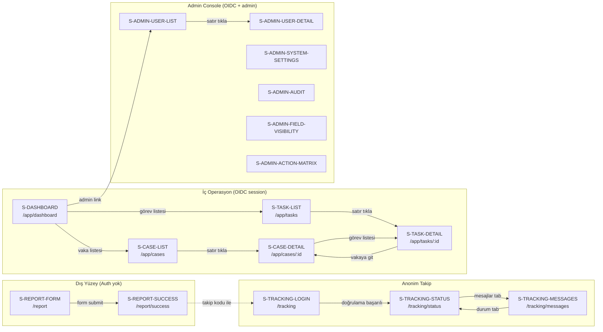

# Yıldız Holding Etik Bildirim Uygulaması — Screen Catalog

## Ekran Haritası

### Ekran listesi

| Ekran ID | Route | Layout | Erişim (Rol) | Seviye |
|---|---|---|---|---|
| S-REPORT-FORM | `/report` | PublicIntakeLayout | Public (auth yok) | Kritik |
| S-REPORT-SUCCESS | `/report/success` | PublicIntakeLayout | Public | Kritik |
| S-TRACKING-LOGIN | `/tracking` | AnonymousFollowupLayout | Public (tracking code + parola) | Kritik |
| S-TRACKING-STATUS | `/tracking/status` | AnonymousFollowupLayout | Tracking auth (in-memory) | Kritik |
| S-TRACKING-MESSAGES | `/tracking/messages` | AnonymousFollowupLayout | Tracking auth (in-memory) | Kritik |
| S-AUTH-CALLBACK | `/auth/callback` | — (redirect) | OIDC callback | İkincil |
| S-DASHBOARD | `/app/dashboard` | InternalLayout | Tüm iç roller | Kritik |
| S-CASE-LIST | `/app/cases` | InternalLayout | council_secretary, council_chair, council_member, board_chair, rapporteur, action_owner | Kritik |
| S-CASE-DETAIL | `/app/cases/:id` | InternalLayout | Rol + ABAC + clearance + grant | Kritik |
| S-TASK-LIST | `/app/tasks` | InternalLayout | Tüm iç roller (kendi görevleri) | Kritik |
| S-TASK-DETAIL | `/app/tasks/:id` | InternalLayout | Görev sahibi + sekreterya | Kritik |
| S-ADMIN-USER-LIST | `/app/admin/users` | AdminLayout | admin | Kritik |
| S-ADMIN-USER-DETAIL | `/app/admin/users/:id` | AdminLayout | admin + maker-checker | Kritik |
| S-ADMIN-MASTER-DATA | `/app/admin/master-data` | AdminLayout | admin (system) | İkincil |
| S-ADMIN-SYSTEM-SETTINGS | `/app/admin/settings` | AdminLayout | system + maker-checker | Kritik |
| S-ADMIN-FIELD-VISIBILITY | `/app/admin/field-visibility` | AdminLayout | admin + maker-checker | Kritik |
| S-ADMIN-ACTION-MATRIX | `/app/admin/action-matrix` | AdminLayout | admin + maker-checker | Kritik |
| S-ADMIN-SLA-POLICIES | `/app/admin/sla-policies` | AdminLayout | admin | İkincil |
| S-ADMIN-BUSINESS-CALENDAR | `/app/admin/business-calendar` | AdminLayout | business admin | İkincil |
| S-ADMIN-NOTIFICATION-TEMPLATES | `/app/admin/notification-templates` | AdminLayout | admin | İkincil |
| S-ADMIN-KVKK-TEXTS | `/app/admin/kvkk-texts` | AdminLayout | admin / council_secretary | İkincil |
| S-ADMIN-AUDIT | `/app/admin/audit` | AdminLayout | audit/security rolü | Kritik |
| S-ADMIN-DOCUMENT-OPS | `/app/admin/document-ops` | AdminLayout | system admin | İkincil |
| S-ADMIN-SYSTEM-HEALTH | `/app/admin/system-health` | AdminLayout | system admin | İkincil |
| S-NOTIFICATION-CENTER | `/app/notifications` + sidebar drawer | InternalLayout | Tüm iç roller | İkincil |
| S-FORBIDDEN | `/403` | PublicIntakeLayout | Any | İkincil |
| S-NOT-FOUND | `/404` | PublicIntakeLayout | Any | İkincil |
| S-ERROR | `/500` | PublicIntakeLayout | Any | İkincil |
| S-SESSION-EXPIRED | — (modal overlay) | — | Authenticated users | İkincil |

### Ekran akış diyagramı



---

## Global Navigasyon Yapısı

### Sidebar menü hiyerarşisi (InternalLayout)

Sidebar menü rol bazlı filtrelenir; kullanıcı yalnızca yetkili olduğu menü öğelerini görür. Menü öğesi görünür olması içerik erişimi vermez — backend guard'ları her istekte yeniden çalışır.

```
📊 Dashboard                          → /app/dashboard          [tüm iç roller]
📁 Vakalar                            → /app/cases              [council_secretary, council_chair, council_member, board_chair, rapporteur, action_owner]
✅ Görevlerim                         → /app/tasks              [tüm iç roller — kendi görevleri]
---
⚙️ Yönetim (admin rolü gerekir)
  👥 Kullanıcılar                     → /app/admin/users
  🔄 Master Data Senkron              → /app/admin/master-data
  ⚙️ Sistem Ayarları                  → /app/admin/settings
  👁️ Alan Görünürlüğü                 → /app/admin/field-visibility
  🔐 Aksiyon Matrisi                  → /app/admin/action-matrix
  ⏱️ SLA Politikaları                 → /app/admin/sla-policies
  📅 İş Günü Takvimi                  → /app/admin/business-calendar
  📧 Bildirim Şablonları              → /app/admin/notification-templates
  📝 KVKK Metinleri                   → /app/admin/kvkk-texts
  📋 Audit Log                        → /app/admin/audit
  💾 Doküman Operasyonları            → /app/admin/document-ops
  🏥 Sistem Sağlığı                   → /app/admin/system-health
```

Admin menü grubu yalnızca `admin` rolüne sahip kullanıcılara gösterilir. Alt öğelerin erişim hakları kendi içinde farklılık gösterebilir (örneğin audit_viewer ayrı yetki gerektirir); backend guard son sözdür.

### Topbar içeriği

| Bölge | İçerik | Davranış |
|---|---|---|
| Sol | Uygulama logosu + "Etik Bildirim Sistemi" metni | Logo tıklanınca /app/dashboard |
| Orta | — (boş) | Arama kutusu MVP'de yok |
| Sağ — Bildirimler | NotificationBell ikonu + badge (okunmamış sayısı) | Tıklanınca NotificationCenter drawer açılır |
| Sağ — Kullanıcı | Avatar + display_name + rol etiketi | Dropdown: Profil bilgisi (read-only), Çıkış |

Breadcrumb: MVP'de breadcrumb kullanılmaz. Route derinliği sığdır (maksimum 3 seviye: /app/cases/:id); sidebar aktif öğe vurgusu yeterlidir.

### PublicIntakeLayout / AnonymousFollowupLayout topbar

Dış yüzeylerde sidebar yoktur. Header yalnızca Yıldız Holding logosu ve "Etik Bildirim Hattı" başlığını içerir. Footer'da KVKK gizlilik linki, versiyon ve Yıldız Holding copyright yer alır. Internal menü öğeleri, kullanıcı bilgisi ve bildirim ikonu bu yüzeylerde kesinlikle gösterilmez.

---

## Layout Component'leri

### PublicIntakeLayout

Kullanılan ekranlar: S-REPORT-FORM, S-REPORT-SUCCESS, S-FORBIDDEN, S-NOT-FOUND, S-ERROR.

Yapı: Dikey ortalanmış, dar container (max-width: 720px). Header (logo + başlık) → main content → footer (KVKK link + copyright). Sidebar yoktur. Auth guard yoktur — tamamen public.

Güvenlik: Dış CDN script'i ve üçüncü taraf analytics yüklenmez. Console.log'da PII yasaktır. localStorage/sessionStorage kullanılmaz.

### AnonymousFollowupLayout

Kullanılan ekranlar: S-TRACKING-LOGIN, S-TRACKING-STATUS, S-TRACKING-MESSAGES.

Yapı: PublicIntakeLayout ile benzer dar container. Header (logo + "Bildirim Takip" başlığı) → main content → footer. Sidebar yoktur.

Auth guard: `TrackingContext` provider sarar. `tracking_code` + parola bellekte tutulur (cookie/storage yok). Context boşsa `/tracking` login sayfasına redirect edilir. Her API isteğinde tracking_code + parola yeniden gönderilir; backend session açmaz.

### InternalLayout

Kullanılan ekranlar: S-DASHBOARD, S-CASE-LIST, S-CASE-DETAIL, S-TASK-LIST, S-TASK-DETAIL, S-NOTIFICATION-CENTER.

Yapı: Sol sidebar (240px, collapse edilebilir) + topbar (64px) + main content area. Sidebar menü öğeleri rol bazlı filtrelenir.

Auth guard: `AuthGuard` bileşeni `GET /api/v1/auth/me` çağırır. 401 → `/auth/login?returnUrl=...` redirect. 200 → `CurrentUser` context'e set edilir. `RoleGuard` route bazında rol kontrol eder; yetersiz rol → `/403`.

Session timeout: Backend 401 döndüğünde API client interceptor toast gösterir ("Oturumunuz sona erdi") ve login sayfasına redirect eder.

### AdminLayout

Kullanılan ekranlar: S-ADMIN-USER-LIST, S-ADMIN-USER-DETAIL, S-ADMIN-MASTER-DATA, S-ADMIN-SYSTEM-SETTINGS, S-ADMIN-FIELD-VISIBILITY, S-ADMIN-ACTION-MATRIX, S-ADMIN-SLA-POLICIES, S-ADMIN-BUSINESS-CALENDAR, S-ADMIN-NOTIFICATION-TEMPLATES, S-ADMIN-KVKK-TEXTS, S-ADMIN-AUDIT, S-ADMIN-DOCUMENT-OPS, S-ADMIN-SYSTEM-HEALTH.

Yapı: InternalLayout'un alt varyantı. Aynı topbar; sidebar yalnızca admin menü öğelerini gösterir. Operasyon ekranlarına giden breadcrumb yoktur.

Auth guard: `AuthGuard` + `RoleGuard('admin')`. Admin rolü olmayan kullanıcılar `/403`'e yönlendirilir. Admin olmak vaka içeriğine erişim sağlamaz — sidebar'da "Vakalar" menüsü admin layout'unda gösterilmez.

---

## Kritik Ekranlar

---

## S-REPORT-FORM — Etik Bildirim Formu

**Route:** `/report`
**Erişim:** Public — kimlik doğrulama yok, oturum yok
**Layout:** PublicIntakeLayout
**Seviye:** Kritik

### Görsel Yapı

Form 10 adımlı multi-step wizard olarak çalışır. Ekran yukarıdan aşağıya şu bölümlerden oluşur:

1. **Step Indicator** — Üstte yatay adım göstergesi. Aktif adım vurgulu, tamamlanan adımlar onay ikonu ile işaretli. 10 adım sırasıyla: Giriş & KVKK → Konum → Şirket & Olay Yeri → Kategori → Olay Bilgileri → Ek Sorular → Kanıt/Dosya → Kimlik Tercihi → Takip Şifresi → Gönderim Özeti.
2. **Form Content Area** — Aktif adımın alanları. Her adım kendi Zod schema'sıyla validate edilir; geçersizse "İleri" butonu tıklanamaz.
3. **Navigation Buttons** — Alt kısımda "Geri" (ilk adımda gizli) ve "İleri" (son adımda "Gönder") butonları. "İleri" tıklandığında mevcut adımın validation'ı çalışır.

### Veri Kaynağı

| Endpoint | Method | Amaç |
|---|---|---|
| `GET /api/v1/intake/categories` | GET | Kategori üst grupları ve alt kategorileri |
| `GET /api/v1/intake/companies` | GET | Yıldız Holding şirket listesi (dropdown) |
| `GET /api/v1/intake/kvkk-text` | GET | Aktif KVKK aydınlatma metni (versiyonlu) |
| `POST /api/v1/intake/reports` | POST | Form submit — tüm adımların verisi tek istekle gönderilir |

Query key'ler ve cache:
- `intake.categories` → staleTime: 30 dk, gcTime: 1 saat
- `intake.companies` → staleTime: 10 dk, gcTime: 30 dk
- `intake.kvkkText` → staleTime: 30 dk, gcTime: 1 saat

### State Yönetimi

- **Server state:** Kategori listesi, şirket listesi, KVKK metni — TanStack Query ile fetch edilir.
- **Form state:** Tüm 10 adımın verileri tek RHF (React Hook Form) `useForm` instance'ında tutulur. `useReportForm` custom hook form state'ini, aktif adımı, adım validation'ını ve navigation logic'ini yönetir.
- **Local state (useState):** Aktif adım index'i, dinamik alan render kararı (seçilen kategoriye bağlı).
- **URL state:** Yok — form wizard URL'e yansımaz (tarayıcı history bozulmasını önlemek için).
- **Tracking auth:** Yok — bu ekranda auth yoktur.

### Adım Detayları

**Adım 1 — Giriş ve KVKK Onayı:**
KVKK aydınlatma metni scrollable alan içinde gösterilir. Metin `GET /api/v1/intake/kvkk-text` ile çekilir; `kvkk_consent_version` form state'ine kaydedilir. "Okudum ve onaylıyorum" checkbox'ı zorunludur; işaretlenmeden ilerlenemez.

**Adım 2 — Bildirimcinin Konumu:**
Bildirimcinin bulunduğu ülke (dropdown, ISO 3166-1) ve şehir (text input). KVKK uyumu için toplanır.

**Adım 3 — İlgili Şirket ve Olay Yeri:**
`company_id` dropdown (zorunlu) — Yıldız Holding şirketleri. `incident_country` dropdown (zorunlu), `incident_city` text (zorunlu), `incident_location_detail` text (opsiyonel — tesis, fabrika, ofis adı).

**Adım 4 — Kategori Seçimi:**
İki seviyeli seçim: üst grup kartları (`EMPLOYEE_HUMAN`, `ASSET_FINANCIAL`, `COMPLIANCE_LEGAL`, `EXTERNAL_ENVIRONMENT`) → alt kategori checkbox listesi. Çoklu kategori seçilebilir. "Emin değilim / Genel etik ihlali" seçeneği ayrı checkbox olarak sunulur (`is_uncertain_category`).

**Adım 5 — Temel Olay Bilgileri (tüm kategoriler için ortak):**
`incident_description` (zorunlu, min 50 karakter, uzun metin alanı), `incident_date_start` (tarih seçici), `incident_date_end` (opsiyonel), `incident_is_ongoing` (evet/hayır/bilmiyorum), `incident_recurrence` (tekil/tekrarlayan/bilinmiyor), `how_reporter_learned` (dropdown), `involved_persons` (tekrarlanabilir kişi formu — ad/tanım, rol, şirket, departman, pozisyon, üst yönetici mi), `witnesses` (tekrarlanabilir — ad/tanım, iletişim, uygunluk), `previously_reported` (evet/hayır → koşullu `previously_reported_to`), `urgent_risk_flag` (evet/hayır → koşullu `urgent_risk_description`).

**Adım 6 — Kategori Bazlı Ek Sorular (dinamik):**
`DynamicCategoryFields` bileşeni seçilen `categories` değerine göre ek form alanlarını render eder. Her kategori kodu için tanımlı ek soru seti `packages/dto` içindeki schema tanımlarından gelir. Birden fazla kategori seçildiyse her kategorinin ek soruları sırayla gruplar halinde gösterilir, her grup kategori başlığıyla etiketlenir. Hiçbir kategoriye ait ek soru yoksa bu adım otomatik atlanır.

18 kategori için ayrı soru setleri tanımlıdır. Örnekler: `THEFT_FRAUD_EMBEZZLEMENT` → olay türü, varlık türü, tahmini kayıp, tespit yöntemi. `HARASSMENT` → taciz türü, olay yeri bağlamı, mağdur tipi, acil güvenlik riski, misilleme riski. `BRIBERY_CORRUPTION_GIFT` → rüşvet tipi, menfaat türü, değer, kamu görevlisi dahil mi, işlem bağlamı, aracı.

Özel kural: Taciz, ayrımcılık, insan hakları kategorileri seçildiğinde form kullanıcıya "Bu bildirim özel nitelikli kişisel veri içerebilir; yüksek gizlilik seviyesinde işlenecektir" bilgilendirmesi gösterir.

**Adım 7 — Kanıt ve Ek Dosya:**
`FileUploadZone` bileşeni: drag & drop ve dosya seçici. İzin verilen tipler: PDF, DOCX, XLSX, JPG, JPEG, PNG, MP4, MOV, ZIP, TXT. Tek dosya max 50 MB, toplam max 200 MB. Yükleme progress bar ile gösterilir. Yüklenen dosyalar mini listede (ad + boyut + kaldır butonu) görünür. Opsiyonel adım — dosya yüklemeden atlanabilir.

**Adım 8 — Kimlik Tercihi:**
İki opsiyon kartı: "Anonim kalmak istiyorum" (varsayılan seçili) ve "Kimliğimi paylaşmak istiyorum". Anonim seçildiğinde kimlik alanları gösterilmez. İsimli seçildiğinde: ad soyad (opsiyonel), e-posta (opsiyonel), telefon (opsiyonel), kurum/şirket (opsiyonel), pozisyon (opsiyonel), bildirilen kişiyle ilişkisi (dropdown: çalışan, eski çalışan, tedarikçi, müşteri, iş ortağı, vatandaş, diğer). Tüm kimlik alanları opsiyoneldir — isimli seçip hiçbir bilgi doldurmadan da ilerlenebilir.

**Adım 9 — Takip Şifresi Oluşturma:**
Zorunlu adım. Bildirimci takip şifresini kendisi belirler. İki alan: şifre + şifre tekrar. Minimum 8 karakter. Uyarı mesajı: "Bu şifreyi unutursanız bildiriminize tekrar erişemezsiniz. Lütfen güvenli bir yere not edin. Şifre kurtarma seçeneği yoktur." `autocomplete="off"` set edilir.

**Adım 10 — Gönderim Özeti:**
Tüm adımların özet görünümü (read-only). Her adım başlığı + altında doldurulan alanlar. Dosya listesi (ad + boyut). "Düzenle" linkleri her bölümde ilgili adıma geri dönüşü sağlar. Son onay: "Bildirimimi gönder" butonu. Bu buton tıklandığında tüm form verisi tek `POST /api/v1/intake/reports` isteğiyle gönderilir. Dosyalar aynı anda `multipart/form-data` olarak yüklenir.

### Durum Ekranları

- **Loading (sayfa ilk açılış):** Kategori ve şirket listeleri yüklenirken StepIndicator iskelet + spinner gösterilir. KVKK metni yüklenene kadar 1. adım content alanında skeleton.
- **Loading (submit):** "Gönder" butonuna basıldığında tam sayfa overlay spinner + "Bildiriminiz gönderiliyor..." mesajı. Buton devre dışı kalır.
- **Empty:** Uygulanmaz — form her zaman içerik gösterir.
- **Error (API — kategori/şirket yükleme):** Inline hata mesajı + "Tekrar Dene" butonu. Form ilerlenemez.
- **Error (submit hatası):** Toast (kırmızı) + hata mesajı. Form state korunur, kullanıcı düzeltip tekrar gönderebilir. Validation hataları ilgili adıma yönlendirilir.
- **Success (submit):** Redirect → `/report/success` ile tracking code teslim ekranına geçilir.

### Etkileşimler

| Element | Aksiyon |
|---|---|
| İleri butonu | Mevcut adım validation → geçerliyse sonraki adıma geç |
| Geri butonu | Bir önceki adıma dön (validation tetiklenmez) |
| StepIndicator adım tıklama | Yalnızca tamamlanmış adımlara geri dönüş (ileri atlama yasak) |
| Kategori kartı | Üst grup seçimi → alt kategori listesi göster |
| Anonim / İsimli seçim kartı | Kimlik alanları göster/gizle |
| Dosya sürükle-bırak | Dosya yükleme başlat, progress bar göster |
| Dosya kaldır butonu | Dosyayı listeden çıkar |
| Özet adım — Düzenle linki | İlgili adıma geri dön |
| Gönder butonu | Tüm form verisi + dosyalar tek istekle gönderilir |

### Edge Cases ve Kısıtlar

- Form hiçbir aşamada localStorage veya sessionStorage'a yazılmaz. Sayfa yenilenirse form sıfırlanır — kullanıcı bu davranışı browser çıkış uyarısı (beforeunload) ile bilgilendirilir.
- Çoklu kategori seçiminde Adım 6'daki dinamik alanlar seçilen tüm kategorilerin birleşimi olarak gösterilir; aynı alan adı farklı kategorilerde tekrar ederse bir kez render edilir.
- Kategori listesi veya şirket listesi backend'den yüklenemezse form ilerleyemez; inline hata + retry gösterilir.
- KVKK metninin versiyonu form state'ine kaydedilir; submit sırasında `kvkk_consent_version` payload'a eklenir.
- CSRF token double-submit cookie mekanizmasıyla zorunludur; her POST isteğinde `X-CSRF-Token` header otomatik eklenir.
- Rate limiting: `POST /api/v1/intake/reports` IP bazlı rate limit'e tabidir. Limit aşılırsa 429 döner; kullanıcıya "Çok sayıda bildirim gönderildi, lütfen bekleyin" mesajı gösterilir.
- Dosya yükleme: İzin verilmeyen dosya tipi sürüklenirse veya boyut limiti aşılırsa inline hata gösterilir, yükleme başlamaz.
- `incident_description` minimum 50 karakter kuralı RHF Zod schema'sında zorlanır; geçersizse inline field error gösterilir.
- Acil risk bayrağı (`urgent_risk_flag`) true olarak işaretlendiğinde `urgent_risk_description` alanı zorunlu hale gelir.
- Daha önce bildirildi (`previously_reported`) true olduğunda `previously_reported_to` zorunlu hale gelir.
- `involved_persons` dizisindeki `is_senior_management` bayrağı backend'de erişim kısıtlama politikasını tetikler (iddia edilen kişi üst yöneticiyse otomatik clearance kontrolü).

### Form Alanları (adım bazlı özet)

| Adım | Alan | Tip | Zorunlu | Validation | Default |
|---|---|---|---|---|---|
| 1 | `kvkk_consent` | Checkbox | Evet | checked === true | false |
| 2 | `reporter_country` | Dropdown (ISO) | Evet | Enum | — |
| 2 | `reporter_city` | Text | Evet | min 1 | — |
| 3 | `company_id` | Dropdown | Evet | UUID | — |
| 3 | `incident_country` | Dropdown (ISO) | Evet | Enum | — |
| 3 | `incident_city` | Text | Evet | min 1 | — |
| 3 | `incident_location_detail` | Text | Hayır | max 500 | — |
| 4 | `category_group` | Card select | Evet | Enum | — |
| 4 | `categories` | Checkbox group | Evet (en az 1) | Array min 1 | [] |
| 4 | `is_uncertain_category` | Checkbox | Hayır | boolean | false |
| 5 | `incident_description` | Textarea | Evet | min 50, max 10000 | — |
| 5 | `incident_date_start` | Date picker | Kategoriye göre | past or today | — |
| 5 | `incident_date_end` | Date picker | Hayır | ≥ start | — |
| 5 | `incident_is_ongoing` | Radio | Hayır | Enum | — |
| 5 | `incident_recurrence` | Radio | Hayır | Enum | — |
| 5 | `how_reporter_learned` | Dropdown | Hayır | Enum | — |
| 5 | `involved_persons` | Repeater | Hayır | Array of object | [] |
| 5 | `witnesses` | Repeater | Hayır | Array of object | [] |
| 5 | `previously_reported` | Radio | Hayır | boolean | false |
| 5 | `previously_reported_to` | Text | Koşullu | min 1 if reported | — |
| 5 | `urgent_risk_flag` | Radio | Hayır | boolean | false |
| 5 | `urgent_risk_description` | Textarea | Koşullu | min 1 if flagged | — |
| 6 | `category_specific_data` | Dinamik | Hayır | Kategoriye göre | {} |
| 7 | `attachments` | File upload | Hayır | max 50MB/dosya, 200MB toplam; allowlist | [] |
| 8 | `is_anonymous` | Card select | Evet | boolean | true |
| 8 | `reporter_identity_name` | Text | Hayır | max 200 | — |
| 8 | `reporter_identity_relation` | Dropdown | Hayır | Enum | — |
| 8 | `reporter_contact_email` | Text | Hayır | email format | — |
| 8 | `reporter_contact_phone` | Text | Hayır | phone format | — |
| 9 | `tracking_password` | Password | Evet | min 8 | — |
| 9 | `tracking_password_confirm` | Password | Evet | === password | — |

---

## S-REPORT-SUCCESS — Bildirim Başarılı / Takip Kodu Teslimi

**Route:** `/report/success`
**Erişim:** Public — yalnızca form submit sonrası redirect ile erişilir
**Layout:** PublicIntakeLayout
**Seviye:** Kritik

### Görsel Yapı

Ortalanmış, dar container içinde tek sayfa:

1. **Başarı ikonu ve başlık** — Yeşil onay ikonu + "Bildiriminiz Alındı" başlığı.
2. **Takip kodu kartı** — Büyük punto, kopyalanabilir: `ETK-XXXX-XXXX` formatında tracking code. "Kopyala" butonu (clipboard API + toast "Kopyalandı"). Kart arka planı vurgulu (highlight).
3. **Uyarı kutusu (Alert)** — Kırmızı/turuncu uyarı: "Takip kodunuzu ve şifrenizi güvenli bir yere kaydedin. Şifre kurtarma seçeneği yoktur. Bu bilgileri kaybederseniz bildiriminize tekrar erişemezsiniz."
4. **Açıklama metni** — Bildiriminizin kurul sekretaryası tarafından değerlendirileceği, takip ekranından durumunuzu kontrol edebileceğiniz bilgisi.
5. **Aksiyon butonları** — "Bildirim Takip Ekranına Git" (primary, → `/tracking`) ve "Yeni Bildirim Yap" (secondary, → `/report`).

### Veri Kaynağı

Bu ekran yeni API çağrısı yapmaz. Takip kodu, submit response'undan navigation state veya URL search param üzerinden taşınır. Submit response şekli: `{ data: { trackingCode: "ETK-2XA9-KP7M", submittedAt: "..." } }`.

- API: Yok (response verisi kullanılır)
- Query key: Yok
- Stale time: Uygulanmaz

### State Yönetimi

- **Server state:** Yok.
- **Local state:** `trackingCode` — submit response'undan gelen tracking code. React Router `useLocation().state` veya `useSearchParams` ile alınır.
- **URL state:** Opsiyonel `?code=ETK-XXXX-XXXX` — direct link ile erişilirse kullanılır.
- **Form state:** Yok.

### Durum Ekranları

- **Loading:** Yok — ekran statik içerik gösterir.
- **Empty (tracking code yok):** Kullanıcı doğrudan `/report/success` URL'ini açarsa tracking code bulunamaz. Bu durumda: "Bildiriminiz bulunamadı. Yeni bildirim yapmak için aşağıdaki butonu kullanın." + "Yeni Bildirim" butonu gösterilir.
- **Error:** Uygulanmaz.
- **Success:** Varsayılan durumdur — takip kodu gösterilir.

### Etkileşimler

| Element | Aksiyon |
|---|---|
| "Kopyala" butonu | Tracking code clipboard'a kopyalanır → toast "Takip kodu kopyalandı" |
| "Bildirim Takip Ekranına Git" | Route → `/tracking` |
| "Yeni Bildirim Yap" | Route → `/report` (form sıfırdan başlar) |

### Edge Cases ve Kısıtlar

- Bu ekran bildirimcinin takip şifresini göstermez — şifre yalnızca form sırasında girilmiştir ve backend'e hash olarak saklanmıştır.
- Tracking code gösterimi sırasında console.log'a PII yazılmaz.
- Sayfa yenilendiğinde navigation state kaybolur; URL param'dan code alınabiliyorsa gösterilir, alınamıyorsa empty state gösterilir.
- Browser back butonu kullanıcıyı forma geri götürmez (form submit başarılıysa history replace ile form adımı history'den silinir).
- Bu ekranda analytics veya üçüncü taraf script çalışmaz.

---

## S-TRACKING-LOGIN — Bildirim Takip Girişi

**Route:** `/tracking`
**Erişim:** Public — tracking code + parola ile doğrulama
**Layout:** AnonymousFollowupLayout
**Seviye:** Kritik

### Görsel Yapı

Ortalanmış dar container (max-width: 480px) içinde tek bir kart:

1. **Başlık ve açıklama** — "Bildirim Takip" başlığı + "Bildiriminizi takip etmek için takip kodunuzu ve şifrenizi giriniz." açıklama metni.
2. **Takip kodu alanı** — `tracking_code` text input. Placeholder: "ETK-XXXX-XXXX". `autocomplete="off"`.
3. **Şifre alanı** — `tracking_password` password input. `autocomplete="off"`. Şifre göster/gizle toggle ikonu.
4. **Giriş butonu** — "Giriş" primary button. Tıklanınca doğrulama isteği gönderilir.
5. **Hata mesajı alanı** — Inline alert (gizli, hata durumunda gösterilir).
6. **Yeni bildirim linki** — "Yeni bildirim yapmak ister misiniz?" → `/report` linki.

### Veri Kaynağı

| Endpoint | Method | Amaç |
|---|---|---|
| `POST /api/v1/tracking/verify` | POST | Tracking code + parola doğrulama |

Auth: `X-Tracking-Code` ve `X-Tracking-Password` custom header'ları ile gönderilir.

Query key: Kullanılmaz — doğrulama mutation'dır, cache'lenmez.

### State Yönetimi

- **Server state:** Yok — verify endpoint mutation olarak çağrılır.
- **Form state:** RHF ile `tracking_code` ve `tracking_password` alanları yönetilir.
- **Local state (useState):** `isLocked` (brute-force lockout durumu), `lockoutRemainingSeconds` (geri sayım).
- **URL state:** Yok.
- **Tracking auth:** Doğrulama başarılı olduğunda `TrackingContext`'e tracking_code + password set edilir (in-memory, cookie/storage yok). Sonra `/tracking/status`'a redirect yapılır.

### Durum Ekranları

- **Loading:** "Giriş" butonu spinner gösterir, input'lar devre dışı kalır.
- **Empty:** Uygulanmaz — form her zaman gösterilir.
- **Error (yanlış credentials):** Inline alert (kırmızı): "Takip kodu veya şifre hatalı." Form state korunur.
- **Error (brute-force lockout):** Inline alert (turuncu): "Çok fazla başarısız deneme. Lütfen {N} dakika sonra tekrar deneyin." Geri sayım göstergesi. Input ve buton devre dışı kalır.
- **Error (rate limit):** Inline alert: "Çok fazla istek gönderildi. Lütfen bekleyin." `Retry-After` header'ından bekleme süresi gösterilir.
- **Success:** TrackingContext set edilir → redirect `/tracking/status`.

### Etkileşimler

| Element | Aksiyon |
|---|---|
| Giriş butonu | Form validation → `POST /api/v1/tracking/verify` → başarılı ise context set + redirect |
| Enter tuşu | Form submit tetikler |
| Şifre göster/gizle | Password alanı type toggle |
| "Yeni bildirim" linki | Route → `/report` |

### Edge Cases ve Kısıtlar

- Session/cookie açılmaz. Her sayfa geçişinde TrackingContext bellekte tutulur; sayfa yenilenirse context sıfırlanır ve kullanıcı tekrar giriş yapmalıdır.
- Brute-force koruması: 5 başarısız deneme → 30 dakika kilit. Kilit süresi backend tarafından yönetilir; frontend `AUTH_ACCOUNT_LOCKED` hata kodunu aldığında kilit mesajı gösterir.
- Tracking code ve parola console.log'a yazılmaz.
- Tracking code formatı frontend'de basic regex ile kontrol edilir (alfanümerik, tire, 12 karakter); kesin doğrulama backend'de yapılır.
- CSRF token her POST isteğinde zorunludur.
- Dış form sayfası için ayrı lazy-load chunk yüklenir; internal bundle bu sayfaya sızmaz.

### Form Alanları

| Alan | Tip | Zorunlu | Validation | Default |
|---|---|---|---|---|
| `tracking_code` | Text | Evet | Alfanümerik + tire, ~12 karakter | — |
| `tracking_password` | Password | Evet | min 1 (backend doğrular) | — |

---

## S-TRACKING-STATUS — Bildirim Durum Takibi

**Route:** `/tracking/status`
**Erişim:** Tracking auth (TrackingContext zorunlu)
**Layout:** AnonymousFollowupLayout
**Seviye:** Kritik

### Görsel Yapı

Ortalanmış container (max-width: 640px) içinde:

1. **Başlık kartı** — "Bildirim Durumu" başlığı + takip kodu (maskeli: `ETK-****-KP7M`).
2. **Durum kartı** — Büyük status badge + durum etiketi. Dört basitleştirilmiş durum: `Gönderildi` (mavi), `Kabul Edildi` (sarı), `İnceleniyor` (turuncu), `Kapatıldı` (yeşil). Badge renk + ikon + metin ile gösterilir (yalnızca renge bağımlı olmaz — a11y).
3. **Zaman bilgisi** — Gönderim tarihi ve son güncelleme tarihi.
4. **Bilgilendirme metni** — Duruma göre açıklama: "Bildiriminiz kurul sekretaryası tarafından değerlendirilmektedir" gibi statik açıklamalar.
5. **Mesaj bildirim alanı** — Okunmamış mesaj varsa vurgulu kart: "Kurul sekretaryasından yeni bir mesajınız var." + "Mesajlara Git" butonu.
6. **Ek dosya yükleme alanı** — "Ek Kanıt Yükle" butonu → dosya upload dialog'u açar.
7. **Navigasyon butonları** — "Mesajlar" tab butonu ve "Çıkış" (TrackingContext temizle → `/tracking`).

### Veri Kaynağı

| Endpoint | Method | Amaç |
|---|---|---|
| `GET /api/v1/tracking/status` | GET | Bildirim durumu |
| `POST /api/v1/tracking/attachments` | POST | Ek dosya yükleme |

Auth: Her istekte `X-Tracking-Code` + `X-Tracking-Password` header.

Query key'ler:
- `tracking.status` → staleTime: 0 (always fresh), gcTime: 0
- Dosya yükleme: mutation, cache yok

### State Yönetimi

- **Server state:** `trackingStatus` — TanStack Query ile `GET /api/v1/tracking/status` çağrılır. Her ziyarette fresh fetch.
- **Local state:** `showUploadDialog` (boolean) — dosya upload modal açık/kapalı.
- **URL state:** Yok.
- **Tracking auth:** TrackingContext'ten `tracking_code` + `password` okunur. Context boşsa `/tracking`'e redirect.

### Durum Ekranları

- **Loading:** Status kartı skeleton (badge + 2 satır metin placeholder). Mesaj alanı gizli.
- **Empty:** Uygulanmaz — doğrulanmış bildirim her zaman status döndürür.
- **Error (401 — context geçersiz):** TrackingContext temizlenir → redirect `/tracking` + toast "Oturumunuz sona erdi, tekrar giriş yapın."
- **Error (diğer):** Inline error + "Tekrar Dene" butonu.
- **Success (dosya yükleme):** Toast (yeşil): "Dosyanız başarıyla yüklendi."

### Etkileşimler

| Element | Aksiyon |
|---|---|
| "Mesajlara Git" butonu | Route → `/tracking/messages` |
| "Mesajlar" tab | Route → `/tracking/messages` |
| "Ek Kanıt Yükle" butonu | Upload dialog açılır |
| Upload dialog — dosya seç/sürükle | Dosya yükleme başlar (progress bar) |
| Upload dialog — gönder | `POST /api/v1/tracking/attachments` → başarılı ise toast + dialog kapat |
| "Çıkış" butonu | TrackingContext temizlenir → redirect `/tracking` |
| Sayfa yenileme | TrackingContext bellekte → sıfırlanır → redirect `/tracking` |

### Edge Cases ve Kısıtlar

- Bildirimciye gösterilen status basitleştirilmiştir: `SUBMITTED`, `ACKNOWLEDGED`, `UNDER_REVIEW`, `CLOSED`. İç workflow state'leri (agenda_ready, rapporteur_assigned, board_chair_review vb.) bildirimciye gösterilmez.
- Dosya yükleme: allowlist (PDF, DOCX, XLSX, JPG, JPEG, PNG, MP4, MOV, ZIP, TXT), max 50 MB/dosya, 200 MB toplam. İzin verilmeyen tip veya boyut aşımında inline hata.
- Rate limit: dosya yükleme 10 req/5 dk. Aşılırsa toast uyarı + bekleme süresi.
- 401 hatası alındığında (parola değişmiş, tracking code geçersizleşmiş vb.) context temizlenir, kullanıcı giriş ekranına yönlendirilir.
- `hasUnreadMessages` verify response'undan gelir; status sayfası yüklenirken mesaj bildirimi alanı bu değere göre gösterilir.
- Takip kodu ekranda maskeli gösterilir (ilk ve son segmentler açık, orta kısım yıldız).

---

## S-TRACKING-MESSAGES — Güvenli Mesajlaşma

**Route:** `/tracking/messages`
**Erişim:** Tracking auth (TrackingContext zorunlu)
**Layout:** AnonymousFollowupLayout
**Seviye:** Kritik

### Görsel Yapı

Ortalanmış container (max-width: 640px) içinde:

1. **Başlık** — "Mesajlar" başlığı + "Durum" tab butonu (geri navigasyon).
2. **Mesaj listesi (thread)** — Kronolojik sırada mesaj balonları. `INBOUND` (kurul → bildirimci) mesajlar sol tarafa, farklı arka plan rengiyle gösterilir; gönderen etiketi "Etik Kurul Sekretaryası". `OUTBOUND` (bildirimci → kurul) mesajlar sağ tarafa, farklı renk; etiket "Siz". Her balonda mesaj metni + gönderim zamanı.
3. **Mesaj gönderim alanı** — Sayfanın alt kısmında sabit (sticky bottom). Textarea (max 5000 karakter) + "Gönder" butonu + dosya ekleme butonu (opsiyonel).
4. **Boş durum** — Henüz mesaj yoksa ortalanmış EmptyState: "Henüz mesaj bulunmuyor. Kurul sekretaryası sizinle buradan iletişim kurabilir."

### Veri Kaynağı

| Endpoint | Method | Amaç |
|---|---|---|
| `GET /api/v1/tracking/messages` | GET | Mesaj geçmişi |
| `POST /api/v1/tracking/messages` | POST | Yeni mesaj gönderme |
| `POST /api/v1/tracking/attachments` | POST | Mesajla birlikte dosya yükleme |

Auth: Her istekte `X-Tracking-Code` + `X-Tracking-Password` header.

Query key'ler:
- `tracking.messages` → staleTime: 0 (always fresh), gcTime: 0
- Mesaj gönderme ve dosya yükleme: mutation

Invalidation: mesaj gönderimi başarılı olduğunda `tracking.messages` invalidate edilir.

### State Yönetimi

- **Server state:** `messages` — TanStack Query ile `GET /api/v1/tracking/messages`. Her ziyarette fresh fetch.
- **Form state:** RHF ile `bodyText` alanı yönetilir. Submit sonrası form reset.
- **Local state:** `isSending` (gönderim progress).
- **URL state:** Yok.
- **Tracking auth:** TrackingContext'ten credentials okunur. Context boşsa `/tracking`'e redirect.

### Durum Ekranları

- **Loading (ilk yükleme):** 3 skeleton mesaj balonu (kısa/uzun alternatif yükseklikte).
- **Empty (mesaj yok):** EmptyState bileşeni: ikon + "Henüz mesaj bulunmuyor. Kurul sekretaryası sizinle buradan iletişim kurabilir." CTA yok — kullanıcı sadece bekler veya kendi mesaj gönderebilir.
- **Error (mesaj listesi):** Inline error + "Tekrar Dene" butonu.
- **Error (mesaj gönderim):** Toast (kırmızı): "Mesaj gönderilemedi. Tekrar deneyin." Mesaj metni korunur.
- **Error (401):** TrackingContext temizlenir → redirect `/tracking`.
- **Success (mesaj gönderildi):** Mesaj listesine eklenir (invalidation ile yeniden fetch). Textarea temizlenir. Scroll en alta kayar.

### Etkileşimler

| Element | Aksiyon |
|---|---|
| "Gönder" butonu | Form validation → `POST /api/v1/tracking/messages` → invalidate + scroll |
| Enter + Shift | Yeni satır (textarea'da) |
| Dosya ekleme butonu | Dosya seçici açılır → `POST /api/v1/tracking/attachments` |
| "Durum" tab butonu | Route → `/tracking/status` |
| Mesaj listesi scroll | Otomatik: sayfa yüklendiğinde en son mesaja scroll. Yeni mesaj gönderildiğinde en alta scroll |

### Edge Cases ve Kısıtlar

- Mesaj içeriği e-posta'ya taşınmaz; e-posta bildirimi yalnızca "Takip ekranında yeni mesajınız var" şeklinde içeriksiz olur.
- `bodyText` max 5000 karakter; aşılırsa inline validation hatası.
- Mesaj gönderme rate limit: 5 req/dk. Aşılırsa toast uyarı.
- Dosya yükleme: aynı kurallar (allowlist, 50 MB/dosya, 200 MB toplam).
- Mesaj listesinde mesaj silme veya düzenleme yoktur — append-only.
- Mesajlar kronolojik (en eski üstte, en yeni altta) sıralanır.
- Mesaj balonlarında XSS koruması: mesaj metni HTML render edilmez, plaintext olarak gösterilir.
- Console.log'a mesaj içeriği yazılmaz.
- Sayfa yenilendiğinde TrackingContext sıfırlanır → `/tracking` login'e redirect.
- Polling/WebSocket yoktur; mesajlar sayfa yenilendiğinde veya tab'a geri dönüldüğünde (refetchOnWindowFocus) güncellenir.

### Form Alanları

| Alan | Tip | Zorunlu | Validation | Default |
|---|---|---|---|---|
| `bodyText` | Textarea | Evet | min 1, max 5000 | — |
| `attachment` | File upload | Hayır | max 50MB, allowlist | — |

---

## S-DASHBOARD — Operasyonel Dashboard

**Route:** `/app/dashboard`
**Erişim:** Tüm iç roller (OIDC session) — veriler rol + ABAC scope ile filtrelenir
**Layout:** InternalLayout
**Seviye:** Kritik

### Görsel Yapı

Tam genişlik main content alanında grid layout:

1. **Özet kartları (SummaryCards)** — Üstte 4 kartlık yatay satır: Toplam Bildirim, Açık Vakalar, Bekleyen Görevlerim, SLA Aşımı. Her kart büyük sayı + kısa etiket + trend ikonu (varsa). SLA Aşımı kartı sıfırdan büyükse kırmızı vurgu; tıklanınca görev listesine filtre ile geçiş.
2. **Durum dağılımı chart'ı (StateDistributionChart)** — Sol tarafta horizontal bar chart veya donut chart: workflow state'lere göre açık vaka dağılımı (`secretariat_review`, `agenda_ready`, `rapporteur_assigned`, `action_assigned` vb.). Her segment tıklanabilir — vaka listesine state filtresiyle geçiş.
3. **Şirket kırılımı chart'ı (CompanyBreakdownChart)** — Sağ tarafta bar chart: şirket bazlı bildirim sayısı. Yalnızca kullanıcının ABAC scope'undaki şirketler gösterilir.
4. **SLA durumu widget'ı (SlaOverviewWidget)** — Altta compact kart: On Track / Warning / Overdue sayıları, renk kodlu (yeşil / sarı / kırmızı). Overdue sayısı tıklanınca görev listesine overdue filtresiyle geçiş.

### Veri Kaynağı

| Endpoint | Method | Amaç |
|---|---|---|
| `GET /api/v1/dashboard/summary` | GET | Aggregate dashboard verileri |

Query key'ler:
- `dashboard.summary` → staleTime: 1 dk, gcTime: 5 dk

### State Yönetimi

- **Server state:** `dashboardSummary` — TanStack Query ile fetch. Veriler `totalReports`, `openCases`, `closedCases`, `pendingTasks`, `overdueTaskCount`, `byState`, `byCompany`, `byCategory`, `slaOverview` alanlarını içerir.
- **Local state:** Yok.
- **URL state:** Yok.

### Durum Ekranları

- **Loading:** 4 skeleton kart (üst satır) + 2 skeleton chart alanı (orta) + 1 skeleton compact kart (alt). Progressive: kartlar chart'lardan önce render edilir.
- **Empty (yeni sistem, veri yok):** Kartlar sıfır değer gösterir. Chart alanlarında EmptyState: "Henüz bildirim bulunmuyor."
- **Empty (yetkisiz scope):** Rolsüz kullanıcı tüm kartlarda sıfır görür; deny-by-default gereği "yetki eksikliği" ifşa edilmez.
- **Error:** Inline error + "Tekrar Dene" butonu. Kartlar skeleton kalır.
- **Success:** Veriler kartlar ve chart'lara dağıtılır.

### Etkileşimler

| Element | Aksiyon |
|---|---|
| "Açık Vakalar" kartı tıklama | Route → `/app/cases?status=open` |
| "Bekleyen Görevlerim" kartı tıklama | Route → `/app/tasks?assignedToMe=true&status=open` |
| "SLA Aşımı" kartı tıklama | Route → `/app/tasks?slaStatus=overdue` |
| State chart segment tıklama | Route → `/app/cases?status={tıklanan state}` |
| Company chart bar tıklama | Route → `/app/cases?companyId={tıklanan şirket}` |
| SLA widget "Overdue" tıklama | Route → `/app/tasks?slaStatus=overdue` |

### Edge Cases ve Kısıtlar

- Dashboard yalnızca aggregate metadata döner; tekil vaka detayı, bildirim metni, kişi bilgisi içermez. `admin` rolü bu endpoint'e erişemez (admin dashboard kavramı yoktur — admin ekranları ayrıdır).
- `action_owner` yalnızca kendi şirketine ait aggregate görür; `byCompany` listesinde yalnızca kendi şirketi yer alır.
- `rapporteur` yalnızca atandığı vakaları sayar; global sayılar göremez.
- Chart'lar MUI veya lightweight chart kütüphanesi (recharts) ile render edilir. Kompleks chart kütüphanesi (D3.js) ilk fazda gerekmez.
- Dashboard verisi anlık güncellik kritik değildir (staleTime 1 dk). Mutation sonrası otomatik invalidation yapılmaz; sayfa yenilenince güncellenir.

---

## S-CASE-LIST — Vaka Listesi

**Route:** `/app/cases`
**Erişim:** council_secretary, council_chair, council_member, board_chair, rapporteur, action_owner — ABAC scope ile filtrelenir
**Layout:** InternalLayout
**Seviye:** Kritik

### Görsel Yapı

Tam genişlik main content alanında:

1. **Sayfa başlığı** — "Vakalar" + toplam kayıt sayısı (hesaplanabilirse).
2. **Filtre çubuğu (CaseFilters)** — Yatay filtre alanı. Filtreler: Durum (multi-select dropdown — state enum'ları), Şirket (dropdown), Gizlilik Seviyesi (dropdown), Tarih Aralığı (date range picker), "Bana Atananlar" (toggle switch). Filtreler URL query param'larına yansır (`?status=agenda_ready&companyId=clx1abc&assignedToMe=true`). "Filtreleri Temizle" linki.
3. **Vaka tablosu (DataTable)** — TanStack Table + MUI. Kolonlar: Vaka No (kısa ID), Durum (StatusBadge), Gizlilik (badge), Şirket, Kategori, Açılış Tarihi, Son Aktivite. Cursor-based pagination. Sıralama: açılış tarihi (varsayılan desc), son aktivite. Satır tıklama → vaka detayına geçiş.
4. **Pagination** — DataTablePagination: "Sonraki sayfa" / "Önceki sayfa" butonları. Toplam sayfa sayısı gösterilmez (cursor-based).

### Veri Kaynağı

| Endpoint | Method | Amaç |
|---|---|---|
| `GET /api/v1/cases` | GET | Filtrelenmiş, paginated vaka listesi |

Query key'ler:
- `cases.list(filters)` → staleTime: 30 sn, gcTime: 5 dk

Filters objesinde URL query param'ları ile senkronize edilen filtre değerleri bulunur.

### State Yönetimi

- **Server state:** `cases` — TanStack Query ile paginated fetch.
- **Local state:** Yok — tüm filtre state'i URL'de tutulur.
- **URL state:** `status`, `companyId`, `confidentialityLevel`, `dateFrom`, `dateTo`, `assignedToMe`, `sortBy`, `sortOrder`, `cursor` — tüm filtre ve pagination bilgisi URL query param'ları olarak saklanır. Sayfa yenilendiğinde filtreler korunur.
- **Form state:** Yok.

### Durum Ekranları

- **Loading (ilk yükleme):** DataTableSkeleton: 10 satır iskelet + filtre alanı normal render.
- **Loading (filtre değişikliği):** Tablo içeriği fade + skeleton overlay; filtre alanı interaktif kalır.
- **Empty (ilk yükleme, veri yok):** EmptyState: "Henüz vaka bulunmuyor." CTA yok.
- **Empty (filtre sonrası):** EmptyState: "Filtre kriterlerine uygun vaka bulunamadı." + "Filtreleri Temizle" butonu.
- **Empty (yetkisiz scope):** "Görüntülenecek vaka bulunmamıyor." — yetki eksikliği ifşa edilmez.
- **Error:** Inline error + "Tekrar Dene" butonu.

### Etkileşimler

| Element | Aksiyon |
|---|---|
| Tablo satırı tıklama | Route → `/app/cases/{id}` |
| Durum filtre dropdown | URL param güncelle → query invalidate → yeni fetch |
| Şirket filtre dropdown | URL param güncelle → query invalidate |
| "Bana Atananlar" toggle | `assignedToMe=true` URL param set/kaldır |
| Tarih aralığı seçimi | `dateFrom` / `dateTo` URL param güncelle |
| "Filtreleri Temizle" | Tüm URL query param'ları sıfırla |
| Kolon başlığı tıklama | `sortBy` + `sortOrder` toggle → URL param güncelle |
| "Sonraki sayfa" | `cursor` güncelle → sonraki sayfa fetch |

### Edge Cases ve Kısıtlar

- Her kullanıcı yalnızca RBAC+ABAC scope'undaki vakaları görür. `rapporteur` yalnızca atandığı vakaları, `action_owner` yalnızca kendi şirketine ait aksiyonlu vakaları görür. Backend guard satır filtrelemesi yapar; frontend ek filtreleme yapmaz.
- `admin` rolü bu endpoint'e erişemez — vaka listesi admin ekranlarından ayrıdır.
- Gizlilik filtresi kullanıcının clearance seviyesini aşan seçenekleri göstermez.
- Vaka No kolonu tam UUID değil, kısa format (varsa case_number veya ilk 8 karakter).
- StatusBadge: her state için sabit renk + ikon + metin. Renk tek başına anlam taşımaz (a11y).
- Cursor-based pagination toplam sayfa sayısı göstermez; sadece "Sonraki" ve "Önceki" butonları.

---

## S-CASE-DETAIL — Vaka Detayı ve Workflow

**Route:** `/app/cases/:id`
**Erişim:** Rol + ABAC + clearance + assignment — field masking policy uygulanır
**Layout:** InternalLayout
**Seviye:** Kritik

### Görsel Yapı

Tam genişlik main content alanında, dikey bölümler:

1. **Üst bilgi çubuğu** — Vaka no + durum badge (büyük) + gizlilik badge + şirket adı + kategori etiketi. "Vakalar" breadcrumb linki (← geri).
2. **Aksiyon çubuğu (CaseActionBar)** — Backend'den gelen `availableActions` listesine göre dinamik butonlar: "Gündeme Al", "Raportör Ata", "Üye Onayına Sun", "Karar Yaz", "HYKB Onayına Sun", "Aksiyon Ata", "Kapat" vb. Yalnızca mevcut kullanıcının mevcut state'te yapabileceği aksiyonlar gösterilir. `availableActions` boşsa aksiyon çubuğu gizlenir. Her buton tıklandığında `TransitionDialog` açılır.
3. **Tab navigasyonu** — Sekmeler: Özet, Zaman Çizelgesi, Dokümanlar, Oylar, Güvenli Mesajlar. Aktif tab URL'e yansımaz (local state).
4. **Özet tab'ı (varsayılan):**
   - Bildirim içeriği kartı: `incidentDescription`, `incidentDateStart`, `incidentIsOngoing`, `categories`, acil risk bayrağı. Alanlar field masking policy'ye göre gösterilir veya gizlenir.
   - İlgili kişiler kartı: `involvedPersons` listesi (ad/tanım, rol, şirket, üst yönetici bayrağı). Yetkisiz kullanıcılar bu kartı göremez.
   - Tanıklar kartı: `witnesses` listesi. Yalnızca yetkili roller görür.
   - Bildirimci bilgisi kartı: `reporterIdentityName`, `reporterContact*`. Yalnızca `council_secretary` (ve varsa `council_chair`) görür. Anonim bildirimde "Anonim bildirim" etiketi gösterilir.
   - Kategori bazlı ek bilgi kartı: `categorySpecificData` JSON render.
5. **Zaman çizelgesi tab'ı (CaseTimeline):**
   - Append-only transition listesi, kronolojik (en eski üstte). Her satır: tarih + saat, state geçişi (from → to), aksiyon ismi, yapan kullanıcı adı. Gerekçe alanı field masking'e tabi — yetkisiz kullanıcıya gösterilmez.
6. **Dokümanlar tab'ı (DocumentList):**
   - Kullanıcının `document_access_grant` sahip olduğu dokümanlar listelenir. Tablo: Doküman adı, Kategori, Versiyon, Durum (available/quarantined), Yüklenme tarihi, Yükleyen. İndirme butonu (signed URL tetikler). Yükleme butonu (state'e ve role göre gösterilir → DocumentUploadDialog açar). Quarantined dokümanlar gri, indirme devre dışı.
7. **Oylar tab'ı (VoteList):**
   - Kurul üye oyları tablosu: Üye adı, Oy (Onay/İtiraz/Sessiz Kabul), Tarih. Yalnızca `council_secretary`, `council_chair`, `council_member` görür. `member_approval` state'inde ise aktif kullanıcı `council_member` rolüne sahipse `CastVoteDialog` açan "Oy Ver" butonu gösterilir.
8. **Güvenli Mesajlar tab'ı (InternalMessageThread):**
   - Bildirimci ile güvenli mesajlaşma geçmişi. Yalnızca `council_secretary` görür. Mesaj balonları (INBOUND: bildirimci → kurul, OUTBOUND: kurul → bildirimci). Alt kısımda mesaj gönderim alanı (InternalMessageComposer).

### Veri Kaynağı

| Endpoint | Method | Amaç |
|---|---|---|
| `GET /api/v1/cases/:id` | GET | Vaka detayı (field-masked) |
| `GET /api/v1/cases/:id/transitions` | GET | Zaman çizelgesi |
| `POST /api/v1/cases/:id/transitions` | POST | Workflow transition komutu |
| `GET /api/v1/cases/:caseId/documents` | GET | Doküman listesi |
| `POST /api/v1/cases/:caseId/documents` | POST | Doküman yükleme |
| `GET /api/v1/documents/:id/download` | GET | Doküman indirme (signed URL) |
| `GET /api/v1/cases/:caseId/votes` | GET | Oy listesi |
| `POST /api/v1/cases/:caseId/votes` | POST | Oy verme |
| `GET /api/v1/cases/:caseId/secure-messages` | GET | Güvenli mesajlar (iç kullanıcı) |
| `POST /api/v1/cases/:caseId/secure-messages` | POST | Güvenli mesaj gönderme |

Query key'ler:
- `cases.detail(id)` → staleTime: 0 (always fresh)
- `cases.transitions(id)` → staleTime: 30 sn
- `cases.documents(id)` → staleTime: 30 sn
- `cases.votes(id)` → staleTime: 30 sn
- `cases.secureMessages(id)` → staleTime: 0 (always fresh)

Invalidation: transition mutation başarılı olduğunda `cases.detail`, `cases.transitions`, `cases.all`, `tasks.all`, `notifications.all` invalidate edilir. Oy mutation'ı `cases.votes` invalidate eder. Doküman upload `cases.documents` invalidate eder. Mesaj gönderimi `cases.secureMessages` invalidate eder.

### State Yönetimi

- **Server state:** Case detail, transitions, documents, votes, secure-messages — her biri ayrı TanStack Query.
- **Local state (useState/Zustand):** `activeTab` (özet/timeline/docs/votes/messages), `showTransitionDialog` (boolean + command tipi), `showUploadDialog`, `showVoteDialog`.
- **URL state:** Yok — tab ve modal state URL'e yansımaz.
- **Form state:** TransitionDialog içinde RHF (`command`, `reason`, `idempotencyKey`, `metadata`). VoteDialog içinde RHF (`voteType`, `reason`). MessageComposer içinde RHF (`bodyText`).

### Durum Ekranları

- **Loading (sayfa):** Üst bilgi çubuğu skeleton (badge + metin). Tab alanı skeleton. Aksiyon çubuğu gizli.
- **Loading (transition submit):** Tam sayfa overlay spinner + "İşleminiz gerçekleştiriliyor..." mesajı. Tüm aksiyon butonları devre dışı.
- **Empty (doküman tab'ı):** EmptyState: "Bu vakaya ait doküman bulunmuyor." + yükleme butonu (yetkili ise).
- **Empty (oy tab'ı):** EmptyState: "Henüz oy kullanılmamış."
- **Empty (mesaj tab'ı):** EmptyState: "Henüz mesaj bulunmuyor." + mesaj gönder composer (council_secretary ise).
- **Error (vaka yüklenemedi):** Tam sayfa error: "Vaka bulunamadı veya erişim yetkiniz yok." + "Vakalara Dön" butonu.
- **Error (transition reddi — CASE_INVALID_TRANSITION):** Toast: "Bu işlem vakanın mevcut durumunda yapılamaz." → case detail refetch (state güncellenmiş olabilir).
- **Error (transition — CASE_OPTIMISTIC_LOCK):** Toast: "Vaka başka bir kullanıcı tarafından güncellendi. Sayfa yenileniyor." → case detail refetch.
- **Success (transition):** Toast (yeşil): "İşlem başarıyla tamamlandı." + tüm ilgili query'ler invalidate.

### Etkileşimler

| Element | Aksiyon |
|---|---|
| CaseActionBar butonları | `showTransitionDialog` açılır (ilgili command tipi ile) |
| TransitionDialog — Onayla | `POST /cases/:id/transitions` → overlay spinner → başarı toast → invalidate |
| TransitionDialog — İptal | Dialog kapanır |
| Tab tıklama | `activeTab` değişir, ilgili tab verisi lazy fetch edilir |
| Doküman satırı — İndir butonu | `GET /documents/:id/download` → signed URL açılır |
| Doküman tab — Yükle butonu | DocumentUploadDialog açılır |
| DocumentUploadDialog — Gönder | `POST /cases/:caseId/documents` (multipart) → toast + invalidate |
| Oy tab — "Oy Ver" butonu | CastVoteDialog açılır |
| CastVoteDialog — Gönder | `POST /cases/:caseId/votes` → toast + invalidate |
| Mesaj tab — Gönder butonu | `POST /cases/:caseId/secure-messages` → invalidate + scroll |
| Breadcrumb "Vakalar" linki | Route → `/app/cases` |
| Raportör Ata komutu | TransitionDialog'da kullanıcı seçici (iç kullanıcı dropdown) + metadata.rapporteurUserId |
| Aksiyon Ata komutu | TransitionDialog'da kullanıcı/şirket seçici + metadata.actionOwnerUserId |

### Edge Cases ve Kısıtlar

- **Field masking:** Kullanıcının rolüne göre API'den dönen alanlar farklıdır. `action_owner` incidentDescription, involvedPersons, witnesses göremez — bu alanlar response'da yoktur; UI ilgili kartları render etmez. `admin` bu endpoint'e erişemez (404 döner).
- **availableActions:** Backend mevcut state + kullanıcı rol + gerekli koşulları (doküman yüklenmiş mi, oylar tamamlanmış mı) değerlendirip sadece geçerli aksiyonları döndürür. Frontend bu listeye göre buton render eder, kendi aksiyon eligibility hesabı yapmaz.
- **Idempotency:** Her transition komutu UUID v4 `idempotencyKey` içerir; çift tıklama veya retry aynı key ile gönderildiğinde tekrar transition oluşmaz.
- **Optimistic lock:** Concurrent update durumunda 409 döner; case detail yeniden fetch edilir ve kullanıcıya bilgi verilir.
- **TransitionDialog komut bazlı adapte olur:** `close_not_on_agenda` ve `board_veto` komutlarında `reason` alanı zorunlu olarak gösterilir. `assign_rapporteur` komutunda kullanıcı seçici (SSO iç kullanıcı listesi) ek alan olarak gösterilir. `assign_action` komutunda aksiyon sahibi seçici gösterilir.
- **Doküman quarantine:** QUARANTINED dokümanlar listede görünür ama gri + "Taranıyor" etiketi ile gösterilir; indirme butonu devre dışıdır. REJECTED dokümanlar "Reddedildi — zararlı içerik tespit edildi" etiketi gösterir.
- **Sessiz kabul gösterimi:** Oy listesinde sessiz kabul kayıtları `status: silent_acceptance`, `actor: system` şeklinde farklı badge ile gösterilir.
- **Güvenli mesaj güvenliği:** Mesaj içeriği console.log'a yazılmaz. Mesaj tab'ı yalnızca council_secretary'e gösterilir; diğer roller tab'ı göremez.
- **Doküman yükleme:** Yükleme butonu mevcut state ve kullanıcı rolüne göre gösterilir. Rapor yükleme → rapporteur + rapporteur_assigned state'i, karar dokümanı yükleme → council_secretary + decision_draft state'i vb. Frontend `availableActions` ve role'a göre buton gösterir.
- **404 dönen vaka:** "Vaka bulunamadı veya erişim yetkiniz yok." mesajı ile hata sayfası gösterilir. Yetki eksikliği ayrıca ifşa edilmez (RESOURCE_NOT_FOUND hem yok hem yetkisiz için aynı).

---

## S-TASK-LIST — Görev Listesi

**Route:** `/app/tasks`
**Erişim:** Tüm iç roller — kullanıcı yalnızca kendi görevlerini ve yetkili olduğu görevleri görür
**Layout:** InternalLayout
**Seviye:** Kritik

### Görsel Yapı

Tam genişlik main content alanında:

1. **Sayfa başlığı** — "Görevlerim" + bekleyen görev sayısı badge.
2. **Filtre çubuğu (TaskFilters)** — Yatay filtre alanı. Filtreler: Durum (multi-select: Açık, Devam Eden, Beklemede, Tamamlanmış, İptal), Görev Tipi (dropdown — task_type enum'ları: Ön Değerlendirme, Ön Araştırma, Gündeme Alma, Raportör Atama, Raportör Raporu, Üye Onayı, Karar Yazısı, HYKB Onayı, Uygulama Yazısı, Aksiyon Dönüşü, Takip Kararı), SLA Durumu (dropdown: Zamanında, Uyarı, Aşım), İlişkili Vaka (text input — vaka no ile arama). Filtreler URL query param'larına yansır. "Filtreleri Temizle" linki.
3. **SLA özet çubuğu** — Filtre çubuğunun altında compact satır: üç renk kodlu pill: "Zamanında: {N}" (yeşil), "Uyarı: {N}" (sarı), "Aşım: {N}" (kırmızı). Her pill tıklanınca ilgili SLA filtresi uygulanır.
4. **Görev tablosu (DataTable)** — TanStack Table + MUI. Kolonlar: Görev Tipi (etiket + ikon), İlişkili Vaka (kısa vaka no, tıklanabilir link), Durum, SLA Durumu (TaskSlaIndicator: renk + ikon + kalan süre metni), Son Tarih, Oluşturma Tarihi. Cursor-based pagination. Varsayılan sıralama: SLA aşımı önce (overdue → warning → on_track), sonra son tarih asc.
5. **Pagination** — DataTablePagination.

### Veri Kaynağı

| Endpoint | Method | Amaç |
|---|---|---|
| `GET /api/v1/tasks` | GET | Filtrelenmiş, paginated görev listesi |

Query key'ler:
- `tasks.list(filters)` → staleTime: 30 sn, gcTime: 5 dk

### State Yönetimi

- **Server state:** `tasks` — TanStack Query ile paginated fetch.
- **Local state:** Yok — filtre state'i URL'de.
- **URL state:** `status`, `taskType`, `slaStatus`, `caseId`, `sortBy`, `sortOrder`, `cursor`.
- **Form state:** Yok.

### Durum Ekranları

- **Loading:** DataTableSkeleton: 8 satır iskelet + SLA özet çubuğu skeleton (3 pill placeholder).
- **Loading (filtre değişikliği):** Tablo fade + skeleton; filtre alanı interaktif.
- **Empty (ilk yükleme, görev yok):** EmptyState: "Bekleyen göreviniz bulunmuyor." CTA yok.
- **Empty (filtre sonrası):** EmptyState: "Filtre kriterlerine uygun görev bulunamadı." + "Filtreleri Temizle" butonu.
- **Error:** Inline error + "Tekrar Dene" butonu.

### Etkileşimler

| Element | Aksiyon |
|---|---|
| Tablo satırı tıklama | Route → `/app/tasks/{id}` |
| Vaka no linki (satır içi) | Route → `/app/cases/{caseId}` |
| SLA pill tıklama | `slaStatus` URL param set → filtre uygula |
| Görev tipi filtre | `taskType` URL param güncelle |
| Durum filtre | `status` URL param güncelle |
| "Filtreleri Temizle" | Tüm URL param sıfırla |
| Kolon başlığı tıklama | `sortBy` + `sortOrder` toggle |

### Edge Cases ve Kısıtlar

- `slaStatus` veritabanında saklanmaz, runtime hesaplanır. Backend `business_calendar` ve `sla_policy_config` kullanarak `ON_TRACK`, `WARNING`, `OVERDUE` döndürür. Yarım gün ve tatil günleri SLA hesabına dahil edilmez.
- `overdue` ayrı status değildir; `due_at` ve mevcut zaman karşılaştırmasıyla türetilir.
- `rapporteur` yalnızca kendi atandığı vakaların görevlerini görür. `action_owner` yalnızca kendi şirketine atanmış aksiyon görevlerini görür.
- `council_secretary` tüm görevleri (kendi atanmışları + takip ettiği görevler) görebilir.
- TaskSlaIndicator bileşeni: kalan süreyi insan-okunur formatta gösterir ("2 gün kaldı", "3 saat kaldı", "1 gün aşım"). Renk + ikon + metin birlikte kullanılır (a11y).
- Görev tipi etiketi Türkçe gösterilir; backend `taskTypeLabel` alanı döndürür.

---

## S-TASK-DETAIL — Görev Detayı

**Route:** `/app/tasks/:id`
**Erişim:** Görev sahibi + sekreterya + üst yetkili roller
**Layout:** InternalLayout
**Seviye:** Kritik

### Görsel Yapı

Tam genişlik main content alanında, dikey bölümler:

1. **Üst bilgi çubuğu** — Görev tipi etiketi (büyük) + durum badge + SLA durumu (TaskSlaIndicator, büyük format: kalan süre veya aşım miktarı). "Görevlerim" breadcrumb linki (← geri).
2. **Görev bilgi kartı** — Grid layout ile:
   - Atanan kullanıcı (display name + rol)
   - İlişkili vaka (vaka no, tıklanabilir link → `/app/cases/{caseId}`)
   - Oluşturma tarihi + son tarih
   - SLA politikası bilgisi (süre, birim)
   - SLA pause durumu (varsa: "Beklemede — {neden}" etiketi)
   - Delegasyon bilgisi (varsa: "Devredildi: {önceki sahip} → {yeni sahip}")
3. **Aksiyon butonları** — Görev durumuna ve kullanıcı rolüne göre:
   - "Görevi Tamamla" butonu (primary) — görev sahibi, durum open/in_progress iken gösterilir
   - "Devret" butonu (secondary) — görev sahibi veya üst yetkili
   - "Vakaya Git" butonu (outlined) — her zaman gösterilir
4. **Tamamlama dialog'u** — "Görevi Tamamla" tıklandığında ConfirmDialog: "Bu görevi tamamlamak istiyor musunuz?" + `outcome` textarea (opsiyonel sonuç notu) + "Tamamla" / "İptal" butonları.
5. **Devir dialog'u** — "Devret" tıklandığında: kullanıcı seçici dropdown (aynı role sahip iç kullanıcılar) + `reason` textarea (zorunlu gerekçe) + "Devret" / "İptal" butonları.
6. **Görev olay geçmişi** — Alt kısımda compact timeline: görev oluşturulma, atama, SLA pause/resume, delegation, tamamlanma olayları kronolojik sırada.

### Veri Kaynağı

| Endpoint | Method | Amaç |
|---|---|---|
| `GET /api/v1/tasks/:id` | GET | Görev detayı + ilişkili case metadata |
| `POST /api/v1/tasks/:id/complete` | POST | Görevi tamamla |
| `POST /api/v1/tasks/:id/delegate` | POST | Görev devri |

Query key'ler:
- `tasks.detail(id)` → staleTime: 0 (always fresh)

Invalidation: complete veya delegate mutation başarılı olduğunda `tasks.detail(id)`, `tasks.all`, `cases.detail(caseId)`, `cases.transitions(caseId)`, `notifications.all` invalidate edilir.

### State Yönetimi

- **Server state:** `taskDetail` — TanStack Query ile fetch.
- **Local state:** `showCompleteDialog`, `showDelegateDialog` (boolean).
- **URL state:** Yok.
- **Form state:** Complete dialog içinde RHF (`outcome`, `idempotencyKey`). Delegate dialog içinde RHF (`delegateToUserId`, `reason`).

### Durum Ekranları

- **Loading:** Bilgi kartı skeleton + butonlar gizli.
- **Empty:** Uygulanmaz — geçerli görev ID her zaman detay döndürür.
- **Error (görev bulunamadı):** Tam sayfa error: "Görev bulunamadı veya erişim yetkiniz yok." + "Görevlere Dön" butonu.
- **Error (tamamlama hatası):** Toast: "Görev tamamlanamadı. {hata mesajı}" — görev state'i değişmiş olabilir, detail refetch.
- **Error (devir hatası):** Toast: "Devir işlemi başarısız. {hata mesajı}".
- **Success (tamamlama):** Toast (yeşil): "Görev başarıyla tamamlandı." → tüm ilgili query'ler invalidate. Görev kartı "Tamamlandı" badge gösterir.
- **Success (devir):** Toast (yeşil): "Görev başarıyla devredildi." → detail refetch, yeni atanan kullanıcı bilgisi güncellenir.

### Etkileşimler

| Element | Aksiyon |
|---|---|
| "Görevi Tamamla" butonu | Complete dialog açılır |
| Complete dialog — Tamamla | `POST /tasks/:id/complete` → overlay spinner → toast → invalidate |
| "Devret" butonu | Delegate dialog açılır |
| Delegate dialog — Devret | `POST /tasks/:id/delegate` → toast → invalidate |
| "Vakaya Git" butonu | Route → `/app/cases/{caseId}` |
| Breadcrumb "Görevlerim" | Route → `/app/tasks` |
| İlişkili vaka linki | Route → `/app/cases/{caseId}` |

### Edge Cases ve Kısıtlar

- Görev tamamlama side-effect olarak ilgili workflow transition'ı tetikleyebilir (backend tarafında). Örneğin `rapporteur_report_task` tamamlandığında vaka `rapporteur_report_submitted` state'ine geçer. Frontend bu yan etkiyi bilmek zorunda değildir; invalidation ile güncel state'i alır.
- Devir işlemi zorunlu gerekçe, eski sahip, yeni sahip, yapan kullanıcı ve zaman bilgisiyle auditlenir.
- `admin` yalnızca acil operasyonel yeniden atamada maskeli metadata ile devir yapabilir; vaka içeriğini göremez.
- SLA pause durumunda kalan süre göstergesi donmuş olarak gösterilir; "Beklemede" etiketi ile birlikte pause nedeni gösterilir.
- `member_approval_task` görev tipi için tamamlama butonu gösterilmez; bu görev oy verme (S-CASE-DETAIL → Oylar tab) ile tamamlanır.
- Tamamlanmış veya iptal edilmiş görevlerde aksiyon butonları gösterilmez; görev kartı read-only durumda kalır.
- `idempotencyKey` her complete isteğinde UUID v4 olarak üretilir; çift tıklama aynı görevi iki kez tamamlamaz.
- Kullanıcı seçici dropdown'da yalnızca aynı role sahip aktif iç kullanıcılar listelenir; görev tipi action_response_task ise aynı şirketteki action_owner'lar filtrelenir.

---

## S-ADMIN-USER-LIST — Kullanıcı Yönetimi Listesi

**Route:** `/app/admin/users`
**Erişim:** admin
**Layout:** AdminLayout
**Seviye:** Kritik

### Görsel Yapı

1. **Sayfa başlığı** — "Kullanıcı Yönetimi" + toplam aktif kullanıcı sayısı.
2. **Arama ve filtre çubuğu** — Metin arama (e-posta veya ad), Şirket dropdown, Rol dropdown (sistem rolleri), Aktif/Pasif toggle. Filtreler URL query param.
3. **Kullanıcı tablosu (DataTable)** — Kolonlar: Ad Soyad, E-posta, Şirket, Roller (chip listesi), Clearance Seviyesi (badge), Aktif/Pasif (durum badge), Son Giriş (tarih). Cursor-based pagination. Satır tıklama → kullanıcı detayına geçiş.
4. **Bekleyen onaylar kartı** — Tablo üstünde compact uyarı kartı: "N adet rol ataması onay bekliyor" + "Görüntüle" linki (onay bekleyen atamaları filtreler). Onay bekleyen yoksa kart gizli.

### Veri Kaynağı

| Endpoint | Method | Amaç |
|---|---|---|
| `GET /api/v1/admin/users` | GET | Kullanıcı metadata listesi |

Query key: `admin.users.list(filters)` → staleTime: 30 sn, gcTime: 5 dk.

### State Yönetimi

- **Server state:** Kullanıcı listesi — TanStack Query.
- **URL state:** `search`, `companyId`, `roleCode`, `isActive`, `cursor`.

### Durum Ekranları

- **Loading:** DataTableSkeleton 10 satır.
- **Empty (kullanıcı yok):** EmptyState: "Kullanıcı bulunamadı." (filtre sonuçsuz veya arama sonuçsuz).
- **Error:** Inline error + "Tekrar Dene".

### Etkileşimler

| Element | Aksiyon |
|---|---|
| Tablo satırı tıklama | Route → `/app/admin/users/{id}` |
| Metin arama | Debounced (300ms) → URL param güncelle → refetch |
| Rol filtre dropdown | URL param güncelle |
| "Bekleyen Onaylar" linki | Filtre: pendingApproval=true |

### Edge Cases ve Kısıtlar

- Admin kullanıcı listesi vaka bilgisi, atama detayı veya içerik içermez. Yalnızca kimlik metadata, roller, clearance ve sync bilgisi gösterilir.
- Arama debounce: 300ms bekleme sonrası API çağrısı. Minimum 2 karakter.
- JIT provisioning ile oluşturulan ama henüz rol atanmamış kullanıcılar "Rolsüz" badge ile gösterilir.

---

## S-ADMIN-USER-DETAIL — Kullanıcı Detay ve Rol/Clearance Yönetimi

**Route:** `/app/admin/users/:id`
**Erişim:** admin + maker-checker (rol atama/clearance değişikliği)
**Layout:** AdminLayout
**Seviye:** Kritik

### Görsel Yapı

1. **Üst bilgi kartı** — Kullanıcı adı, e-posta, şirket, lokasyon, fonksiyon, pozisyon, aktif/pasif durumu, son giriş tarihi, JIT provisioning tarihi. Tüm veriler read-only — admin burada düzenleme yapmaz (kaynak HR/SAP).
2. **Roller kartı** — Kullanıcının aktif rolleri tablo olarak: Rol Adı, Atama Tarihi, Atayan, Durum (Aktif / Onay Bekliyor / İptal Edilmiş). Her aktif rol satırında "Kaldır" butonu (destructive). Kartın üstünde "Rol Ata" butonu → RoleAssignDialog.
3. **Clearance kartı** — Mevcut clearance seviyesi (büyük badge: NORMAL / SENSITIVE / STRICTLY_CONFIDENTIAL) + "Seviye Değiştir" butonu → ClearanceUpdateDialog.
4. **Bekleyen onaylar kartı** — Bu kullanıcı için maker-checker onayı bekleyen işlemler listesi. Her satır: İşlem tipi, Talep Eden, Tarih, "Onayla" / "Reddet" butonları (checker rolünde olan kullanıcıya gösterilir).
5. **HR/SAP sync bilgisi kartı** — Son sync zamanı, kaynak, eşleşme durumu, varsa uyumsuzluk uyarıları (pozisyon değişmiş, şirket değişmiş vb.).

### Veri Kaynağı

| Endpoint | Method | Amaç |
|---|---|---|
| `GET /api/v1/admin/users/:id` | GET | Kullanıcı detay + roller + sync bilgisi |
| `POST /api/v1/admin/users/:id/roles` | POST | Rol ataması başlat (maker) |
| `POST /api/v1/admin/users/:id/roles/:roleId/approve` | POST | Rol ataması onayla (checker) |
| `DELETE /api/v1/admin/users/:id/roles/:roleId` | DELETE | Rol geri al |
| `PATCH /api/v1/admin/users/:id/clearance` | PATCH | Clearance güncelle |

Query key: `admin.users.detail(id)` → staleTime: 0 (always fresh).

Invalidation: Rol veya clearance mutation'ı başarılı olduğunda `admin.users.detail(id)` ve `admin.users.list` invalidate edilir.

### State Yönetimi

- **Server state:** Kullanıcı detayı — TanStack Query.
- **Local state:** `showRoleAssignDialog`, `showClearanceDialog`, `showRevokeConfirm` (boolean + target role).
- **Form state:** RoleAssignDialog → RHF (`roleCode`, `reason`). ClearanceUpdateDialog → RHF (`clearanceLevel`, `reason`). Approve/reject → RHF (`approved`, `reason`).

### Durum Ekranları

- **Loading:** Bilgi kartı + roller kartı skeleton.
- **Error (kullanıcı bulunamadı):** "Kullanıcı bulunamadı." + "Kullanıcılara Dön" butonu.
- **Success (rol atandı):** Toast (mavi): "Rol ataması onay için gönderildi." — rol PENDING_APPROVAL durumuna geçer.
- **Success (rol onaylandı):** Toast (yeşil): "Rol ataması onaylandı."
- **Success (clearance güncellendi):** Toast (yeşil): "Yetki seviyesi güncellendi."
- **Error (MAKER_CHECKER_SELF):** Toast: "Aynı kişi hem talep eden hem onaylayan olamaz."

### Etkileşimler

| Element | Aksiyon |
|---|---|
| "Rol Ata" butonu | RoleAssignDialog açılır: rol dropdown + gerekçe textarea |
| RoleAssignDialog — Ata | `POST /admin/users/:id/roles` → toast + invalidate |
| Rol satırı "Kaldır" | ConfirmDialog (destructive): gerekçe textarea zorunlu → `DELETE /admin/users/:id/roles/:roleId` |
| "Seviye Değiştir" butonu | ClearanceUpdateDialog: seviye dropdown + gerekçe textarea |
| ClearanceUpdateDialog — Kaydet | `PATCH /admin/users/:id/clearance` → toast + invalidate |
| Bekleyen onay "Onayla" | MakerCheckerApprovalDialog: onay/ret + gerekçe → `POST /admin/users/:id/roles/:roleId/approve` |
| Breadcrumb "Kullanıcılar" | Route → `/app/admin/users` |

### Edge Cases ve Kısıtlar

- Rol ataması hemen aktif olmaz; maker-checker akışına girer. Checker onaylayana kadar PENDING_APPROVAL durumundadır.
- Maker ve checker aynı kişi olamaz — backend teknik olarak zorlar, frontend de "Onayla" butonunu maker'a göstermez.
- Checker maker'dan düşük yetkili olamaz — bu kural action_matrix'te tanımlıdır.
- `STRICTLY_CONFIDENTIAL` clearance yükseltmesi maker-checker zorunlu + config audit.
- `council_secretary` rolü ataması checker olarak `board_chair` gerektirir. `board_chair` rolü ataması checker olarak farklı `admin` gerektirir. Bu eşleşmeler action_matrix'ten okunur.
- Admin vaka içeriğine erişemez; kullanıcı detay sayfasında kullanıcının vakaları, görevleri veya dokümanları listelenmez.
- HR/SAP sync uyumsuzlukları (şirket değişmiş, pozisyon kapanmış) sarı uyarı banner ile gösterilir. Admin bu verileri düzenleyemez — düzeltme HR/SAP kaynağında yapılır.
- Rol kaldırma destructive işlemdir; kırmızı confirm butonu + zorunlu gerekçe.

---

## S-ADMIN-FIELD-VISIBILITY — Alan Görünürlük Matrisi

**Route:** `/app/admin/field-visibility`
**Erişim:** admin + maker-checker
**Layout:** AdminLayout
**Seviye:** Kritik

### Görsel Yapı

1. **Sayfa başlığı** — "Alan Görünürlük Yönetimi" + açıklama: "Vaka alanlarının hangi roller tarafından görülebileceğini kontrol edin."
2. **Matris tablosu** — Satırlar: vaka alanları (`case_metadata`, `report_text`, `reporter_identity`, `reporter_contact`, `incident_date`, `incident_location`, `involved_persons`, `witnesses`, `attachments`, `pre_research_notes`, `rapporteur_report`, `council_decision_draft`, `council_decision_final`, `action_letter`, `action_response`, `secure_messages`). Sütunlar: roller (`council_secretary`, `council_chair`, `council_member`, `board_chair`, `rapporteur`, `action_owner`, `admin`). Hücre: checkbox (görünür/gizli). Değiştirilmiş hücreler sarı vurgulu.
3. **Değişiklik özeti** — Tablo altında: "N adet değişiklik yapıldı" + değişiklik listesi (alan + rol + eski → yeni).
4. **Aksiyon butonları** — "Kaydet" (primary, maker-checker tetikler) + "Değişiklikleri İptal Et" (secondary). "Kaydet" tıklandığında zorunlu gerekçe dialog'u açılır.

### Veri Kaynağı

| Endpoint | Method | Amaç |
|---|---|---|
| `GET /api/v1/admin/field-visibility` | GET | Mevcut matris |
| `PATCH /api/v1/admin/field-visibility` | PATCH | Matris güncelleme (maker-checker) |

Query key: `admin.fieldVisibility` → staleTime: 1 dk.

### State Yönetimi

- **Server state:** Mevcut matris — TanStack Query.
- **Local state:** `editedMatrix` (orijinalden farklı hücreleri tutan diff objesi), `isDirty` (değişiklik var mı), `showReasonDialog`.
- **Form state:** Reason dialog → RHF (`reason`).

### Durum Ekranları

- **Loading:** Tablo skeleton (16 satır × 7 sütun).
- **Error:** Inline error + retry.
- **Success (kaydedildi):** Toast: "Değişiklikler onay için gönderildi." veya "Değişiklikler kaydedildi." (maker-checker sonucuna göre).

### Etkileşimler

| Element | Aksiyon |
|---|---|
| Checkbox tıklama | `editedMatrix` diff'ine eklenir, hücre sarı vurgulu |
| "Kaydet" butonu | Reason dialog açılır → gerekçe girildikten sonra `PATCH` gönderilir |
| "İptal Et" butonu | `editedMatrix` sıfırlanır, tüm sarı vurgular kalkar |
| Sayfa çıkış (dirty) | Browser beforeunload uyarısı: "Kaydedilmemiş değişiklikler var" |

### Edge Cases ve Kısıtlar

- `admin` rolünün vaka içerik alanlarını görebilir yapma girişimi teknik olarak engellenir: `admin` sütununda içerik alanları için checkbox disabled + "Admin içerik göremez" tooltip.
- `council_secretary` rolünün `secure_messages` görünürlüğü kaldırılamaz — bu alan yalnızca sekreterya için anlamlıdır; checkbox disabled.
- Her değişiklik config audit'e yazılır. Maker-checker gerektirir.
- Matris değişiklikleri bulk olarak tek PATCH ile gönderilir; hücre bazlı API çağrısı yapılmaz.
- Sayfa çıkışında kaydedilmemiş değişiklik varsa browser uyarısı gösterilir.

---

## S-ADMIN-ACTION-MATRIX — Maker-Checker Aksiyon Matrisi

**Route:** `/app/admin/action-matrix`
**Erişim:** admin + maker-checker
**Layout:** AdminLayout
**Seviye:** Kritik

### Görsel Yapı

1. **Sayfa başlığı** — "Maker-Checker Aksiyon Matrisi" + açıklama: "Kritik işlemler için talep eden ve onaylayan rolleri yönetin."
2. **Aksiyon tablosu** — Satırlar: maker-checker gerektiren aksiyonlar (Rol atama, STRICTLY_CONFIDENTIAL clearance yükseltme, council_secretary rolü atama, board_chair rolü atama, Legal hold, Retention override, Workflow config, KVKK metin yayını, Break-glass başlatma, System settings, Notification template). Sütunlar: Aksiyon Adı, Maker Rolü (dropdown), Checker Rolü (dropdown), Son Güncelleme. Değiştirilmiş satırlar sarı vurgulu.
3. **Kısıt göstergeleri** — Her satır altında compact bilgi: "Maker ve checker aynı kişi olamaz" + "Checker maker'dan düşük yetkili olamaz" kuralları sistem tarafından zorlanır.
4. **Aksiyon butonları** — "Kaydet" + "İptal Et". Kaydet → gerekçe dialog'u.

### Veri Kaynağı

| Endpoint | Method | Amaç |
|---|---|---|
| `GET /api/v1/admin/action-matrix` | GET | Mevcut matris |
| `PATCH /api/v1/admin/action-matrix/:actionId` | PATCH | Satır güncelleme (maker-checker) |

Query key: `admin.actionMatrix` → staleTime: 1 dk.

### State Yönetimi

- **Server state:** Mevcut matris — TanStack Query.
- **Local state:** `editedRows` (değiştirilmiş satırlar diff), `isDirty`.
- **Form state:** Reason dialog → RHF (`reason`).

### Durum Ekranları

- **Loading:** Tablo skeleton (11 satır × 4 sütun).
- **Error:** Inline error + retry.
- **Success:** Toast: "Matris değişiklikleri onay için gönderildi."

### Etkileşimler

| Element | Aksiyon |
|---|---|
| Maker dropdown değişikliği | Satır sarı vurgulu, diff kaydedilir |
| Checker dropdown değişikliği | Satır sarı vurgulu, diff kaydedilir |
| "Kaydet" | Her değiştirilmiş satır için ayrı `PATCH` gönderilir (sıralı) → gerekçe dialog |
| "İptal Et" | `editedRows` sıfırlanır |

### Edge Cases ve Kısıtlar

- Aksiyon matrisinin kendisi de maker-checker kapsamındadır; matris değişikliği ayrı bir admin tarafından onaylanmalıdır.
- Dropdown seçeneklerinde yalnızca uygun roller listelenir. Checker dropdown'ında maker'dan düşük yetkili roller gösterilmez.
- Maker ve checker aynı rol seçildiğinde frontend uyarı gösterir: "Aynı rol hem talep eden hem onaylayan olamaz" — backend de bunu teknik olarak zorlar.
- Matris satırları silinemez; yalnızca maker/checker rolleri değiştirilebilir. Yeni aksiyon ekleme MVP'de admin ekranından yapılmaz (kod seviyesinde eklenir).

---

## S-ADMIN-SYSTEM-SETTINGS — Sistem Ayarları

**Route:** `/app/admin/settings`
**Erişim:** system rolü + maker-checker
**Layout:** AdminLayout
**Seviye:** Kritik

### Görsel Yapı

1. **Sayfa başlığı** — "Sistem Ayarları" + açıklama: "Runtime parametrelerini görüntüleyin ve değiştirin. Her değişiklik çift onay gerektirir."
2. **Parametre grubu tab'ları** — Yatay tab çubuğu: Yetki & Cache, Rate Limiting, Brute-Force, Session, SLA, Worker/Job. Her tab ilgili parametre grubunu filtreler.
3. **Parametre tablosu** — Her grup için tablo. Kolonlar: Parametre Adı (`key`, monospace font), Açıklama, Mevcut Değer, Birim (sn / dk / saat / iş günü / sayı), Son Güncelleyen, Son Güncelleme Tarihi. Her satırda "Düzenle" ikonu.
4. **Düzenleme dialog'u** — Satır "Düzenle" tıklandığında açılır: Parametre adı (read-only), mevcut değer (read-only), yeni değer input (tip parametreye göre: sayı, boolean toggle, text), zorunlu gerekçe textarea, "Kaydet" + "İptal" butonları.

### Veri Kaynağı

| Endpoint | Method | Amaç |
|---|---|---|
| `GET /api/v1/admin/system-settings` | GET | Tüm parametreler |
| `PATCH /api/v1/admin/system-settings/:key` | PATCH | Parametre güncelleme (maker-checker) |

Query key: `admin.systemSettings` → staleTime: 1 dk.

### State Yönetimi

- **Server state:** Parametre listesi — TanStack Query.
- **Local state:** `activeGroup` (tab seçimi), `editingKey` (düzenleme modundaki parametre key).
- **Form state:** Edit dialog → RHF (`value`, `reason`). Zod validation parametrenin beklenen tipine göre dinamik.

### Durum Ekranları

- **Loading:** Tab çubuğu normal + tablo skeleton (6 satır).
- **Error:** Inline error + retry.
- **Success (güncelleme):** Toast: "Ayar değişikliği onay için gönderildi." veya "Ayar güncellendi." Tablo satırı kısa süre yeşil vurgulu.
- **Error (MAKER_CHECKER_REQUIRED):** Toast (mavi): "İşlem çift onay gerektiriyor. Onay bekleniyor."

### Etkileşimler

| Element | Aksiyon |
|---|---|
| Grup tab tıklama | `activeGroup` değişir, tablo filtrelenir |
| Satır "Düzenle" ikonu | Edit dialog açılır |
| Edit dialog — Kaydet | `PATCH /admin/system-settings/:key` → toast + invalidate |
| Edit dialog — İptal | Dialog kapanır |

### Edge Cases ve Kısıtlar

- Tüm parametre değişiklikleri maker-checker + config audit kapsamındadır. `system` rolü dışında hiçbir aktör bu ayarlara yazamaz.
- Rate limiting profilleri, brute-force eşikleri ve session süreleri güvenlik parametreleridir; yanlış değer girilmesi sistemi savunmasız bırakabilir. Backend değer aralığı kontrolü yapar (örn. `session_idle_timeout_minutes` minimum 5, maksimum 120).
- Parametre değer tipi backend'den döner (`number`, `boolean`, `string`); edit dialog dinamik olarak uygun input component render eder.
- Parametreler doğrudan değiştirilemez — her PATCH maker-checker akışına girer; onay bekleyen değişiklikler sarı "Onay Bekliyor" badge ile gösterilir.

---

## S-ADMIN-AUDIT — Audit Log Görüntüleyici

**Route:** `/app/admin/audit`
**Erişim:** audit/security yetkili rolü (admin)
**Layout:** AdminLayout
**Seviye:** Kritik

### Görsel Yapı

1. **Sayfa başlığı** — "Audit Log" + açıklama: "Sistem denetim kayıtları. İçerik verileri gösterilmez — yalnızca maskeli metadata."
2. **Gelişmiş filtre paneli** — Genişletilebilir (collapse) filtre alanı. Filtreler:
   - Olay tipi (multi-select dropdown: CASE_VIEWED, CASE_TRANSITION, DOCUMENT_UPLOADED, DOCUMENT_DOWNLOADED, ROLE_ASSIGNMENT_REQUESTED, ROLE_ASSIGNMENT_APPROVED, CLEARANCE_UPDATED, SYSTEM_SETTING_CHANGED, TRACKING_VERIFY_ATTEMPT, SECURE_MESSAGE_SENT, FIELD_VISIBILITY_CHANGED, ACTION_MATRIX_CHANGED vb.)
   - Aktör kullanıcı (arama dropdown — kullanıcı adı/e-posta)
   - Kaynak tipi (dropdown: case, task, document, user, config, notification)
   - Kaynak ID (text input — vaka no, doküman ID, kullanıcı ID)
   - Tarih aralığı (date range picker)
   - Filtreler URL query param'larına yansır.
3. **Audit event tablosu (DataTable)** — Kolonlar: Zaman, Olay Tipi (etiket + renk kodu), Aktör (display name + rol snapshot), Kaynak Tipi, Kaynak ID (kısa format), Sonuç (SUCCESS / DENIED / FAILED badge), Correlation ID (monospace, kopyalanabilir). Cursor-based pagination. Varsayılan sıralama: zaman desc.
4. **Detay drawer** — Satır tıklandığında sağdan açılan drawer panel. İçerik: tüm audit event alanları key-value listesi olarak — `event_type`, `occurred_at`, `actor_type`, `actor_id`, `actor_role_snapshot`, `clearance_level_snapshot`, `subject_type`, `resource_id`, `action`, `outcome`, `reason_code`, `reason_text_masked`, `policy_decision_id`, `correlation_id`, `request_id`, `session_id_hash`, `source_surface`, `duration_ms`, `authentication_method`, `ip_address_hash`, `data_classification`, `retention_class`. İçerik alanları (bildirim metni, karar yazısı, doküman içeriği) kesinlikle gösterilmez.

### Veri Kaynağı

| Endpoint | Method | Amaç |
|---|---|---|
| `GET /api/v1/admin/audit-events` | GET | Audit event listesi (maskeli metadata) |

Query key: `admin.auditEvents(filters)` → staleTime: 30 sn, gcTime: 5 dk.

### State Yönetimi

- **Server state:** Audit event listesi — TanStack Query.
- **Local state:** `selectedEventId` (drawer açık mı ve hangi event), `filtersExpanded` (filtre paneli açık/kapalı).
- **URL state:** `eventType`, `actorUserId`, `resourceType`, `resourceId`, `dateFrom`, `dateTo`, `cursor`.

### Durum Ekranları

- **Loading:** DataTableSkeleton 15 satır + filtre paneli normal.
- **Empty (filtre sonrası):** EmptyState: "Filtre kriterlerine uygun denetim kaydı bulunamadı." + "Filtreleri Temizle".
- **Error:** Inline error + retry.

### Etkileşimler

| Element | Aksiyon |
|---|---|
| Filtre değişikliği | URL param güncelle → refetch |
| Tablo satırı tıklama | Detay drawer açılır (sağdan slide-in) |
| Drawer kapatma (X veya ESC) | Drawer kapanır, `selectedEventId` null |
| Correlation ID tıklama | Clipboard'a kopyala → toast "Kopyalandı" |
| "Filtreleri Temizle" | Tüm filtreler sıfırla |

### Edge Cases ve Kısıtlar

- Audit viewer içerik göstermez: bildirim metni, doküman içeriği, karar yazısı, raportör raporu, kişi bilgisi audit ekranında plaintext bulunmaz. `reason_text_masked` alanı backend'de maskelenmiş haliyle döner.
- Audit viewer'ın kendisi ayrıca loglanmaz (döngü riski).
- `ip_address_hash` ve `session_id_hash` ham değerleri değil, hash değerleri gösterilir — anonimlik korunur.
- Filtre paneli varsayılan kapalı (collapsed); "Filtreler" başlığına tıklayınca açılır. Mobil cihazlarda tam genişlik overlay olarak gösterilir.
- Tarih aralığı filtresinde varsayılan son 7 gün seçilidir; kullanıcı genişletebilir.
- Audit eventler append-only ve immutable; düzenleme veya silme butonu yoktur.
- Detay drawer'da her alan human-readable etiketlerle gösterilir (Türkçe: "Olay Tipi", "Aktör", "Kaynak" vb.). Null değerler "—" olarak gösterilir.
- Pagination cursor-based; toplam kayıt sayısı gösterilmez (performans: audit tablosu milyonlarca satır içerebilir).

---

## İkincil Ekranlar

---

## S-AUTH-CALLBACK — OIDC Callback
**Route:** `/auth/callback` | **Erişim:** Public (redirect) | **Layout:** —

OIDC Authorization Code Flow callback handler. Kullanıcı IdP'den authorization code ile bu route'a yönlendirilir. Sayfa tam ortada spinner + "Giriş yapılıyor..." mesajı gösterir. Backend token exchange, JIT provisioning ve session oluşturma yapar; başarılıysa `returnUrl` veya `/app/dashboard`'a redirect eder. Hata durumunda (token exchange başarısız, IdP reddetti) "Giriş başarısız. Tekrar deneyin." mesajı + "Tekrar Dene" butonu (→ `/auth/login`) gösterilir.

**Ana etkileşim:** Otomatik redirect — kullanıcı etkileşimi yok.

---

## S-ADMIN-MASTER-DATA — HR/SAP Senkron İzleme
**Route:** `/app/admin/master-data` | **Erişim:** admin (system) | **Layout:** AdminLayout

HR/SAP'tan gelen master data senkronizasyon durumunu gösterir. Üstte son senkron özet kartı: son çalışma zamanı, durum (COMPLETED / FAILED / RUNNING), işlenen kayıt sayısı, hata sayısı. Altta üç tab: Şirketler (tablo: ad, kaynak ID, aktif/pasif, son sync), Lokasyonlar (tablo), Fonksiyonlar (tablo). Her tabloda salt okunur metadata — düzenleme yapılmaz. Sync koşu geçmişi (son 30 koşu): tarih, durum, süre, kayıt/hata sayısı. Hata satırları kırmızı vurgulu, tıklanınca hata detayı (maskeli, PII yok) gösterilir.

API: `GET /api/v1/admin/master-data/companies`, `/locations`, `/functions`, `/sync-runs`. staleTime: 1 dk.

**Ana etkileşim:** Salt okunur izleme. Hata satırı tıklama → hata detay popover.

---

## S-ADMIN-SLA-POLICIES — SLA Politika Konfigürasyonu
**Route:** `/app/admin/sla-policies` | **Erişim:** admin | **Layout:** AdminLayout

Görev tipi bazlı SLA konfigürasyonları tablosu. Satırlar: 11 görev tipi (`secretariat_review_task`, `pre_research_task`, `chair_gate_task`, `rapporteur_assign_task`, `rapporteur_report_task`, `member_approval_task`, `decision_draft_task`, `board_review_task`, `implementation_letter_task`, `action_response_task`, `follow_up_review_task`). Kolonlar: Görev Tipi Adı, SLA Süresi, Birim (takvim saati / iş günü), Uyarı Eşiği, Günlük Aşım Bildirimi (aktif/pasif toggle), Eskalasyon Alıcı Rolü. Her satırda "Düzenle" ikonu → edit dialog (değer + gerekçe). `member_approval_task` (24 takvim saati) ve `action_response_task` (14 iş günü) satırları sabit SLA göstergesi ile işaretli; düzenlenebilir ama "iş kuralı" uyarısı gösterilir. Değişiklikler maker-checker + config audit kapsamında.

API: `GET /api/v1/admin/sla-policies`, `PATCH /api/v1/admin/sla-policies/:taskType`. staleTime: 1 dk.

**Ana etkileşim:** Satır düzenle → edit dialog → kaydet (maker-checker).

---

## S-ADMIN-BUSINESS-CALENDAR — İş Günü Takvimi
**Route:** `/app/admin/business-calendar` | **Erişim:** business admin | **Layout:** AdminLayout

SLA iş günü hesabı için takvim yönetimi. Üstte aylık takvim görünümü (MUI DateCalendar veya custom grid): hafta sonları gri, resmi tatiller kırmızı, holding özel tatilleri turuncu, yarım günler sarı. Altta tatil/özel gün listesi tablosu: tarih, tip (resmi tatil / holding tatili / yarım gün), açıklama. "Tatil/Özel Gün Ekle" butonu → form dialog: tarih seçici, tip dropdown, açıklama text. "Sil" butonu (destructive, ConfirmDialog). Türkiye resmi tatilleri varsayılan olarak yüklü; holding özel tatilleri admin tarafından eklenir. Değişiklikler audit kapsamında.

API: `GET /api/v1/admin/business-calendar`, `POST /api/v1/admin/business-calendar`. staleTime: 5 dk.

**Ana etkileşim:** Takvimde tarih seç → gün detayı göster. "Ekle" butonu → form dialog → kaydet.

---

## S-ADMIN-NOTIFICATION-TEMPLATES — Bildirim Şablonları
**Route:** `/app/admin/notification-templates` | **Erişim:** admin | **Layout:** AdminLayout

28 bildirim şablonunun listesi ve yönetimi. Tablo: Şablon Kodu, Şablon Adı, Kanal (in_app / email / secure_reporter_message), Aktif/Pasif toggle, Son Güncelleme, Versiyon. Satır tıklama → edit dialog: şablon metni (Türkçe), kullanılabilir placeholder listesi (read-only referans: `{{taskTypeLabel}}`, `{{dueDate}}` vb.), aktif/pasif toggle, gerekçe textarea. Şablon değişiklikleri maker-checker kapsamında (kritik şablonlar). Şablon içeriği vaka içeriği değildir; placeholder'lar runtime'da güvenli değerlerle doldurulur. Şablonlar serbest kod çalıştırmaz.

API: `GET /api/v1/admin/notification-templates`, `PATCH /api/v1/admin/notification-templates/:templateCode`. staleTime: 1 dk.

**Ana etkileşim:** Satır tıkla → edit dialog → metin düzenle → kaydet (maker-checker).

---

## S-ADMIN-KVKK-TEXTS — KVKK Metin Versiyonları
**Route:** `/app/admin/kvkk-texts` | **Erişim:** admin / council_secretary | **Layout:** AdminLayout

KVKK aydınlatma ve gizlilik metni versiyon yönetimi. Üstte aktif versiyon kartı: versiyon numarası, yürürlük tarihi, yayınlayan. Altta versiyon geçmişi tablosu: versiyon, yürürlük tarihi, durum (aktif / arşiv / taslak), yayınlayan. "Yeni Versiyon Oluştur" butonu → büyük metin editörü (textarea, markdown desteksiz — düz metin), yürürlük tarihi seçici, gerekçe. Yayınlama maker-checker kapsamında (maker: council_secretary, checker: admin). Önceki versiyonlar read-only görüntülenebilir. Her bildirim formunda hangi KVKK metin versiyonunun onaylandığı `kvkk_consent_version` ile kaydedilir; bu ekran o bağlantıyı sağlayan kaynak versiyon deposudur.

API: `GET /api/v1/admin/kvkk-texts`, `POST /api/v1/admin/kvkk-texts`. staleTime: 5 dk.

**Ana etkileşim:** "Yeni Versiyon" → metin editörü → yayınla (maker-checker). Eski versiyon satır tıkla → read-only görüntüleme.

---

## S-ADMIN-DOCUMENT-OPS — Doküman Operasyonları
**Route:** `/app/admin/document-ops` | **Erişim:** system admin | **Layout:** AdminLayout

Doküman teknik metadata izleme ve karantina yönetimi. Tablo: Doküman ID, İlişkili Vaka (kısa ID, içerik yok), Kategori, Dosya Boyutu, MIME Tipi, Malware Scan Durumu (PENDING / CLEAN / QUARANTINED / REJECTED badge'leri), Hash (kısaltılmış SHA-256), Yükleme Tarihi. Filtreler: scan durumu, tarih aralığı, MIME tipi. QUARANTINED satırları turuncu vurgulu; tıklanınca detay panel: karantina nedeni, scan engine çıktısı (maskeli), "Yeniden Tara" butonu (taramayı yeniden başlatır), "Reddet" butonu (dokümanı REJECTED yapar — kullanıcıya bildirim üretilir). Dosya içeriği önizlenemez, indirilemez — yalnızca teknik metadata görünür.

API: `GET /api/v1/admin/document-operations`. staleTime: 30 sn.

**Ana etkileşim:** QUARANTINED satır tıkla → detay panel → "Yeniden Tara" veya "Reddet".

---

## S-ADMIN-SYSTEM-HEALTH — Sistem Sağlık İzleme
**Route:** `/app/admin/system-health` | **Erişim:** system admin | **Layout:** AdminLayout

Worker, job, queue ve entegrasyon sağlık durumu. Üstte genel sağlık özet kartları: Database (UP/DOWN), Object Storage (UP/DOWN), SMTP (UP/DOWN), HR/SAP Sync (son çalışma durumu). Altta worker listesi tablosu: Worker Adı (notification_dispatcher, outbox_processor, hr_sync_worker, malware_scanner, sla_checker, retention_worker), Durum (RUNNING / STOPPED / ERROR), Son Çalışma, Bekleyen İş Sayısı, Hata Sayısı (son 24 saat). Hata sayısı > 0 olan satırlar kırmızı vurgulu. Otomatik yenileme: 30 saniyede bir refetch (`refetchInterval: 30000`). İçerik verisi, PII, parola veya vaka bilgisi kesinlikle gösterilmez.

API: `GET /api/v1/admin/system-health`. staleTime: 15 sn, refetchInterval: 30 sn.

**Ana etkileşim:** Salt okunur izleme. Hata satırı tıklama → son 10 hata logu popover (maskeli, correlation ID kopyalanabilir).

---

## S-NOTIFICATION-CENTER — Bildirim Merkezi
**Route:** `/app/notifications` (ayrıca sidebar drawer olarak topbar bell ikonundan açılır) | **Erişim:** Tüm iç roller | **Layout:** InternalLayout

Kullanıcının in-app bildirimleri. Drawer modunda: sağdan 360px genişlikte slide-in panel. Tam sayfa modunda: standart liste görünümü. Bildirim listesi: her satır — bildirim ikonu (görev tipi bazlı), başlık metni ("Yeni görev: Ön Değerlendirme"), zaman bilgisi (relative: "2 saat önce"), okundu/okunmadı durumu (okunmamışlar bold + sol kenarda mavi çizgi). Satır tıklama → ilgili kaynağa yönlendirme (vaka detay, görev detay vb.) + bildirim okundu olarak işaretlenir. Üstte "Tümünü Okundu İşaretle" butonu. Filtre: Tümü / Okunmamış toggle. Boş durum: "Bildiriminiz bulunmuyor." Bildirimler erişim hakkı üretmez — tıklanınca backend RBAC+ABAC yeniden kontrol eder; yetkisiz ise "Bu kaynağa erişim yetkiniz yok" toast gösterilir.

API: `GET /api/v1/notifications`, `PATCH /api/v1/notifications/:id/read`, `POST /api/v1/notifications/mark-all-read`. staleTime: 15 sn.

**Ana etkileşim:** Bildirim satırı tıkla → kaynağa navigate + okundu işaretle. Bell icon badge: okunmamış sayısı (polling 15 sn).

---

## S-FORBIDDEN — Yetkisiz Erişim (403)
**Route:** `/403` | **Erişim:** Any | **Layout:** PublicIntakeLayout

Ortalanmış minimal sayfa: büyük kilit ikonu + "Erişim Yetkiniz Yok" başlığı + "Bu sayfayı görüntüleme yetkiniz bulunmuyor." açıklama + "Ana Sayfaya Dön" butonu (authenticated ise → `/app/dashboard`, değilse → `/report`). Teknik detay, hata kodu veya policy bilgisi gösterilmez.

**Ana etkileşim:** "Ana Sayfaya Dön" → yönlendirme.

---

## S-NOT-FOUND — Sayfa Bulunamadı (404)
**Route:** `/404` (catch-all `*` route) | **Erişim:** Any | **Layout:** PublicIntakeLayout

Ortalanmış minimal sayfa: büyük soru işareti ikonu + "Sayfa Bulunamadı" başlığı + "Aradığınız sayfa mevcut değil veya taşınmış olabilir." açıklama + "Ana Sayfaya Dön" butonu.

**Ana etkileşim:** "Ana Sayfaya Dön" → yönlendirme.

---

## S-ERROR — Sunucu Hatası (500)
**Route:** `/500` | **Erişim:** Any | **Layout:** PublicIntakeLayout

Ortalanmış minimal sayfa: uyarı üçgeni ikonu + "Bir Hata Oluştu" başlığı + "Beklenmeyen bir hata meydana geldi. Lütfen daha sonra tekrar deneyin." açıklama + correlation ID (varsa, monospace, kopyalanabilir) + "Tekrar Dene" butonu (sayfa yeniler) + "Ana Sayfaya Dön" butonu. Stack trace, SQL hatası veya teknik detay gösterilmez.

**Ana etkileşim:** "Tekrar Dene" → sayfa reload. "Ana Sayfaya Dön" → yönlendirme.

---

## S-SESSION-EXPIRED — Oturum Sona Erdi (Modal)
**Route:** — (modal overlay, herhangi bir sayfada tetiklenebilir) | **Erişim:** Authenticated users | **Layout:** —

Backend 401 döndüğünde API client interceptor tarafından tetiklenen modal dialog. Modal: kilit ikonu + "Oturumunuz Sona Erdi" başlığı + "Güvenlik nedeniyle oturumunuz sonlandırıldı. Tekrar giriş yapmanız gerekiyor." mesajı + "Giriş Yap" butonu (→ `/auth/login?returnUrl={mevcut sayfa}`). ESC veya backdrop click ile kapatılamaz (forced modal). Kullanıcı "Giriş Yap" tıklayana kadar arka plan etkileşimi engellenir. Toast olarak da gösterilebilir (session timeout uyarısı oturumun bitmesinden birkaç dakika önce "Oturumunuz sona erecek" warning toast'ı).

**Ana etkileşim:** "Giriş Yap" → `/auth/login` redirect (returnUrl ile).

---

## Ortak Component'ler

### DataTable

TanStack Table v8 + MUI TableContainer wrapper. Tüm liste ekranlarında kullanılır.

**Props:**
- `columns`: TanStack column tanımları dizisi
- `data`: satır verisi
- `isLoading`: boolean — true ise DataTableSkeleton render edilir
- `pagination`: `{ nextCursor, hasMore }` — cursor-based
- `onPageNext / onPagePrev`: pagination callback'leri
- `onSortChange(sortBy, sortOrder)`: sıralama callback
- `onRowClick(row)`: satır tıklama callback
- `emptyState`: ReactNode — veri yoksa gösterilecek EmptyState bileşeni

**Varsayılan davranış:**
- Skeleton satır sayısı: 10 (liste), 8 (admin tablolar)
- Sıralama: kolon başlığı tıklama ile toggle (asc → desc → none)
- Satır hover: arka plan rengi hafif değişir
- Responsive: dar ekranlarda yatay scroll, kolon gizleme yok (responsive web yeterli — native mobil MVP dışı)
- Erişilebilirlik: `aria-label` tablo açıklaması, sıralama butonlarında `aria-sort`

### FormLayout

Standart form wrapper bileşeni. Tüm düzenleme dialog'ları ve ayar formlarında kullanılır.

**Yapı:**
- Form alanları dikey stack (MUI Stack, spacing: 2)
- FormActions alt kısımda sağa hizalı: İptal (secondary, sol) + Kaydet/Gönder (primary, sağ)
- Loading durumunda submit butonu spinner + disabled
- Dirty state tracking: kaydedilmemiş değişiklik varsa çıkış uyarısı

**Kural:** Submit butonu form'un en altında sağ tarafta. İptal butonu submit'in solunda. Destructive işlemlerde submit butonu kırmızı (`error` color).

### ConfirmDialog

Genel onay dialog'u. Tüm destructive ve kritik işlemlerde kullanılır.

**Props:**
- `open`: boolean
- `title`: string — dialog başlığı
- `message`: string — açıklama metni
- `confirmLabel`: string — onay butonu metni (varsayılan: "Onayla")
- `cancelLabel`: string — iptal butonu metni (varsayılan: "İptal")
- `confirmColor`: `"primary" | "error"` — yapıcı işlemlerde primary, destructive işlemlerde error
- `onConfirm`: callback
- `onCancel`: callback
- `loading`: boolean — onay butonu spinner
- `requireReason`: boolean — true ise textarea eklenir (zorunlu gerekçe)

**Boyut:** sm (400px). Backdrop click ile kapatılamaz. ESC ile kapatılabilir (form dirty değilse).

### EmptyState

Boş durum gösterimi. Tüm liste ve tab'larda veri yoksa kullanılır.

**Props:**
- `icon`: ReactNode — opsiyonel ikon veya illüstrasyon
- `title`: string — ana mesaj
- `description`: string — açıklama (opsiyonel)
- `action`: ReactNode — CTA butonu (opsiyonel)

**Üç kullanım senaryosu:**
1. İlk yükleme boş: ikon + açıklama + CTA (varsa)
2. Filtre sonrası boş: "Filtre kriterlerine uygun kayıt bulunamadı." + "Filtreleri Temizle" butonu
3. Yetkisiz scope: "Görüntülenecek kayıt bulunmamıyor." — yetki eksikliği ifşa edilmez, CTA yok

---

## Modal ve Dialog Standartları

### Modal boyutları

| Boyut | Genişlik | Kullanım |
|---|---|---|
| `sm` | 400px | Basit confirmation, tek alan dialog |
| `md` | 600px | Form dialog: oy verme, mesaj gönderme, ayar düzenleme, gerekçe girişi |
| `lg` | 800px | Detaylı form: dosya upload, rol atama + gerekçe + maker-checker, metin editörü |

### Close davranışı

| Mekanizma | ConfirmDialog | Form Dialog (dirty) | Form Dialog (clean) | Drawer |
|---|---|---|---|---|
| ESC tuşu | Kapalı (kapatmaz) | Uyarı dialog gösterir | Kapatır | Kapatır |
| Backdrop click | Kapalı (kapatmaz) | Uyarı dialog gösterir | Kapatır | Kapatır |
| X butonu | Kapatır | Uyarı dialog gösterir | Kapatır | Kapatır |

### Stacked modal yasağı

Bir modal açıkken üzerine ikinci modal açılmaz. ConfirmDialog + action modal birleşmesi gerekiyorsa akış sıralı yapılır: önce action modal kapatılır, sonra confirmation açılır. İstisna: session expired modal herhangi bir modal üzerine açılabilir (forced, en üst z-index).

### Confirmation dialog renkleri

| İşlem tipi | Confirm butonu rengi | Örnek |
|---|---|---|
| Yapıcı / ilerletici | primary (mavi) | Gündeme al, raportör ata, onayla |
| Destructive / geri dönüşsüz | error (kırmızı) | Kapat, reddet, veto, rol kaldır |
| Bilgilendirme | primary | Maker-checker onay bekliyor bildirimi |

### Focus management

Modal açıldığında focus modal içine kilitlenir (focus trap). İlk focus: form varsa ilk input alanı, yoksa confirm/cancel butonu. Modal kapandığında focus tetikleyen elemente döner. Tab sırası modal içinde döngüsel — modal dışına Tab ile çıkılamaz.
