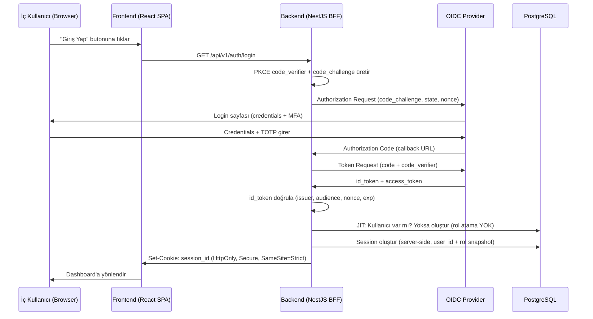
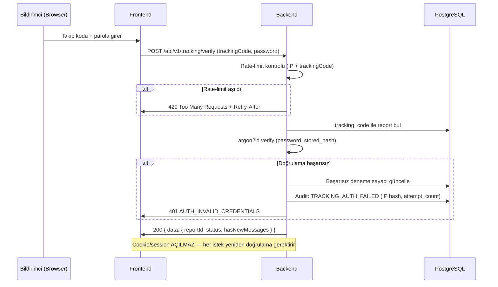

# Yıldız Holding Etik Bildirim Uygulaması — Güvenlik Uygulama Dokümanı

## Hedef Güvenlik Seviyesi

Uygulama OWASP ASVS v5.0.0 Level 3 gereksinimlerini karşılar. L3 gereksinimleri phased delivery ile uygulanır: MVP'de kritik %80 (kimlik, oturum, erişim kontrolü, kriptografi, input/dosya validasyonu, loglama, hata yönetimi) karşılanır; kalan %20 (formal pen-test belgesi, threat model dokümanı, HSM key ceremony kaydı, RASP değerlendirmesi, güvenlik eğitimi kayıtları) ilk production release öncesi tamamlanır. L3 taahhütlerinden hiçbiri production release bloğu olmadan ertelenmez.

Güvenlik tasarımı şu prensiplerle yürütülür: privacy by design, least privilege, need-to-know, deny-by-default, segregation of duties ve auditability.

---

## 1. Kimlik Doğrulama Akışı

### 1.1 İç Kullanıcı — OIDC Authorization Code Flow + PKCE

İç kullanıcılar (council_secretary, council_chair, council_member, rapporteur, board_chair, action_owner, admin) OIDC Authorization Code Flow + PKCE ile kimlik doğrular. Uygulama kendi iç kullanıcı parolası tutmaz.

Provider konfigürasyonu environment variable üzerinden yapılır ve kod değişmeden değiştirilebilir:

```
OIDC_ISSUER_URL=https://accounts.google.com        # dev
OIDC_CLIENT_ID=ethics-app-dev
OIDC_CLIENT_SECRET=<Secrets Manager'dan>
```

Development ortamında Google OAuth2/OIDC, production ortamında kurumun onaylı IdP'si (Keycloak, Azure AD, Okta vb.) kullanılır. `passport-openidconnect` + `@nestjs/passport` ile uygulanır.

Uygulama IdP'den yalnızca kimlik doğrulama sonucunu alır; domain rolleri (council_secretary, rapporteur vb.), clearance seviyesi ve ABAC kararları uygulamanın kendi policy katmanında çözülür. SSO gruplarının yanlış veya eksik gelmesi durumunda içerik erişimi sızıntısı bu ayrımla engellenir.

**JIT Provisioning kuralları:**

İç kullanıcı kaydı ilk SSO girişinde otomatik oluşturulur. JIT provisioning yalnızca kullanıcı kaydını oluşturur — hiçbir rol atamaz. Yeni oluşturulan kullanıcı sisteme girse bile rol atanmadığı sürece hiçbir içeriğe erişemez (deny-by-default). Rol ataması ayrı bir adımdır: admin veya yetkili kullanıcı tarafından manuel olarak yapılır, maker-checker ve audit logu gerektirir. JIT provisioning dışında admin kullanıcıları manuel olarak da sisteme ekleyebilir; bu durumda da kullanıcı rol atanmadan erişim kazanamaz.

HR/SAP nightly senkronu attribute'ları günceller, pasif kullanıcıların erişimi otomatik kapatılır. MVP'de HR/SAP entegrasyonu kapsam dışıdır; kullanıcılar manuel eklenir.

### 1.2 MFA — TOTP (Microsoft Authenticator)

MFA yöntemi TOTP (Time-based One-Time Password) olarak sabitlenmiştir. SMS OTP kullanılmaz — SIM swap, SS7 açığı ve carrier log riskleri nedeniyle NIST SP 800-63B tarafından "kısıtlı" kategorisinde tutulur.

Ortam kuralları:

| Ortam | MFA durumu | Gerekçe |
|---|---|---|
| `development` | Devre dışı bırakılabilir | Geliştirme sürecini yavaşlatmamak |
| `test` | Devre dışı bırakılabilir | CI/CD otomasyonu |
| `production` | Kesinlikle zorunlu | IdP tarafından teknik olarak zorlanır |

Uygulama tarafında ayrıca MFA kodu doğrulama yazılmaz — bu tamamen IdP sorumluluğundadır. İlk giriş onboarding: kullanıcı ilk production girişinde Microsoft Authenticator QR kodu okutarak TOTP kurulumunu tamamlar; kurulum tamamlanmadan erişim verilmez. Telefon numarası veya SMS toplanmaz — KVKK veri minimizasyonu gereği. Production IdP'sinde MFA politikasının TOTP zorunlu olarak konfigüre edilmesi production readiness checklist'inin parçasıdır.

### 1.3 Anonim Bildirimci Kimlik Doğrulama

Anonim veya dış bildirimci için sistem hesabı oluşturulmaz. Takip için `tracking_code` + bildirimci tarafından belirlenen parola kullanılır.

**Parola hash:** argon2id (memory ≥ 64 MB, iterations ≥ 3, parallelism ≥ 1). bcrypt veya md5 kullanılmaz.

**Session politikası:** Anonim takip doğrulamasında session açılmaz — her istek yeniden tracking_code + parola doğrulamasından geçer. Cookie bırakılmaz. Bu yaklaşım anonim kullanıcının iz bırakmamasını teknik olarak garanti eder.

**Parola kurtarma:** MVP'de yoktur. Parolayı unutan bildirimci yeni bildirim açabilir. Parola kurtarma için e-posta/telefon gibi kişisel veri tutmak anonimliği zayıflatır.

**Brute-force koruması:** Tracking_code + parola doğrulama başarısız denemeleri IP + tracking_code bazlı rate-limit'e girer; eşik aşılınca geçici kilit devreye girer ve güvenlik olayı olarak audit'e kaydedilir. Bildirimci kimliği yoksa ek kişisel veri toplanmaz.

### 1.4 Kimlik Doğrulama Sequence Diagram





### 1.5 Logout

İç kullanıcı logout endpoint'i (`POST /api/v1/auth/logout`) çağrıldığında:

1. Server-side session kaydı veritabanından silinir.
2. Session cookie'si `Set-Cookie: session_id=; Max-Age=0; HttpOnly; Secure; SameSite=Strict` ile temizlenir.
3. `SSO_LOGOUT_SUCCESS` audit event'i yazılır.

Client-side token silmek tek başına yeterli değildir; server'da da session imha edilir.

---

## 2. Token ve Session Yönetimi

### 2.1 Session Modeli

İç kullanıcı oturumları backend/BFF modeli ile yönetilir. Frontend token saklama modeli kullanılmaz; browser localStorage'da access token veya refresh token tutulmaz. React uygulaması aynı origin üzerinden backend API'lerine çağrı yapar; backend her istekte session, CSRF, RBAC+ABAC, clearance ve document policy kontrollerini uygular.

Session cookie özellikleri:

```
Set-Cookie: session_id=<opaque-id>;
  HttpOnly;
  Secure;
  SameSite=Strict;
  Path=/;
  Max-Age=<absolute_timeout_seconds>
```

Session verisi server-side PostgreSQL'de (`connect-pg-simple` veya eşdeğer session store) tutulur. Session kaydı şu bilgileri içerir: `user_id`, `roles_snapshot`, `clearance_level`, `company_id`, `created_at`, `last_activity_at`, `ip_address_hash`, `user_agent_hash`.

### 2.2 Session Süreleri

| Parametre | Süre | Açıklama |
|---|---|---|
| Idle timeout (standart roller) | 30 dakika | Kullanıcı 30 dakika işlem yapmazsa session sonlanır |
| Idle timeout (privileged roller) | 15 dakika | council_secretary, board_chair, admin için |
| Absolute timeout | 8 saat | Kullanıcı aktif olsa bile 8 saatte session yenilenir |
| Logout davranışı | Server-side imha + cookie temizliği | Client-side token silmek yetmez |

Tüm süreler `system_settings` tablosundan (`session_idle_timeout_minutes`, `session_absolute_timeout_hours`) runtime'da konfigüre edilebilir; değişiklik maker-checker ve config audit kapsamındadır.

"Beni hatırla" özelliği bulunmaz — etik bildirim uygulamasında güvenlik önceliklidir.

### 2.3 Concurrent Session

Aynı kullanıcının birden fazla aktif session'ı olabilir (farklı cihaz/browser). Ancak her session bağımsız idle/absolute timeout'a tabidir. Rol veya clearance değişikliğinde tüm aktif session'lar event-driven olarak invalidate edilir.

---

## 3. Yetkilendirme

### 3.1 Model: Hibrit RBAC + ABAC

Yetkilendirme modeli hibrit RBAC + ABAC olarak çalışır. RBAC "hangi işlemi yapabilir?" sorusunu, ABAC "hangi kayıt/alan/doküman üzerinde yapabilir?" sorusunu çözer. Yetkilendirme deny-by-default çalışır; bir işlem için RBAC izni ve ABAC koşulları birlikte sağlanmadıkça erişim verilmez.

ABAC koşulları dört ana attribute üzerinden uygulanır:

| Attribute | Açıklama | Örnek |
|---|---|---|
| `company_scope` | Kullanıcının şirket sınırı | action_owner yalnızca kendi şirketi |
| `assignment_scope` | Vaka/görev bazlı atama | rapporteur yalnızca atandığı vaka |
| `function_location_scope` | Fonksiyon ve lokasyon sınırı | Dar roller kendi fonksiyon/lokasyonu |
| `confidentiality_clearance` | Gizlilik seviye üst sınırı | clearance_level >= report.confidentiality_level |

### 3.2 Üç Katmanlı Savunma Derinliği

Yetki denetimi üç katmanda uygulanır; hiçbir katman tek başına yeterli sayılmaz:

**Katman 1 — API Guard / Policy Check:** `PolicyGuard` her endpoint'te RBAC permission ve ABAC koşullarını değerlendirir. Decorator tabanlı: `@RequirePermission('case:pre_review')`. Yetkisiz istek 403 döner.

**Katman 2 — ORM / Query Seviyesinde Row Filtering:** `PolicyScope` Prisma query'lerine otomatik WHERE koşulları ekler. Liste endpoint'lerinde kullanıcının görmemesi gereken satırlar sorgu seviyesinde filtrelenir — application code'a hiç ulaşmaz.

**Katman 3 — Response Serialization / Field Masking:** `FieldMaskingPolicy` yanıt oluşturulurken rol ve clearance bazlı alan gizleme uygular. Yetkisiz alanlar API yanıtına hiç eklenmez — null bile dönmez.

Yetkilendirme kodu yalnızca merkezi `PolicyGuard`, `PolicyScope`, `FieldMaskingPolicy` ve `DocumentPolicy` bileşenlerinden geçer; controller, repository, frontend veya worker içinde ad-hoc role/if kontrolü yazılmaz.

### 3.3 Yetki Çözümleme ve Cache

Yetki çözümleme runtime yapılır. MVP'de domain state veya authorization sonucu için genel amaçlı cache kullanılmaz. Kısa TTL cache yalnızca enum/master data gibi güvenli ve içeriksiz verilerde kullanılabilir. Yetki kararı, vaka içeriği, doküman içeriği, anonim takip parolası veya decrypt edilmiş veri cache'e yazılmaz.

Rol veya attribute değişikliklerinde tüm ilgili session'lar invalidate edilir.

### 3.4 Permission Enum Listesi

Yetkiler kod içinde enum/constant olarak tanımlanır. Serbest metin yetki isimleri yasaktır.

```typescript
export enum PermissionCode {
  REPORT_CREATE_MANUAL    = 'report:create_manual',
  CASE_PRE_REVIEW         = 'case:pre_review',
  CASE_SET_AGENDA         = 'case:set_agenda_decision',
  CASE_ASSIGN_RAPPORTEUR  = 'case:assign_rapporteur',
  REPORT_FILE_UPLOAD      = 'report:file_upload',
  COUNCIL_VOTE_DECISION   = 'council:vote_decision',
  BOARD_APPROVE_OR_VETO   = 'board:approve_or_veto',
  ACTION_RESPOND          = 'action:respond',
  DOCUMENT_DOWNLOAD       = 'document:download',
  AUDIT_VIEW_METADATA     = 'audit:view_metadata',
  ADMIN_MANAGE_ROLES      = 'admin:manage_roles',
  ADMIN_MANAGE_SETTINGS   = 'admin:manage_settings',
  ADMIN_VIEW_SYNC_STATUS  = 'admin:view_sync_status',
  // ... her yeni permission PR review gerektirir
}
```

### 3.5 Yetki Matrisi

| Resource | Action | council_secretary | council_chair | council_member | board_chair | rapporteur | action_owner | admin |
|---|---|---|---|---|---|---|---|---|
| /intake/reports | CREATE | ✗ (public) | ✗ (public) | ✗ (public) | ✗ (public) | ✗ (public) | ✗ (public) | ✗ (public) |
| /cases | LIST | ✓ (tüm, clearance sınırında) | ✓ (tüm, clearance) | ✓ (tüm, clearance) | ✓ (tüm, clearance) | ✓ (yalnızca atandığı) | ✓ (yalnızca kendi şirket aksiyonları) | ✓ (yalnızca metadata) |
| /cases/:id | READ | ✓ | ✓ | ✓ | ✓ | ✓ (atandığı) | ✓ (aksiyon alanları) | ✓ (metadata only) |
| /cases/:id/transition | UPDATE | ✓ | ✓ (chair_gate) | ✓ (member_vote) | ✓ (board_review) | ✓ (rapporteur_submit) | ✓ (action_respond) | ✗ |
| /cases/:id/assign-rapporteur | CREATE | ✓ | ✗ | ✗ | ✗ | ✗ | ✗ | ✗ |
| /cases/:id/confidentiality | UPDATE | ✓ | ✓ | ✗ | ✗ | ✗ | ✗ | ✗ |
| /documents | UPLOAD | ✓ | ✗ | ✗ | ✗ | ✓ (atandığı vaka) | ✓ (aksiyon dönüşü) | ✗ |
| /documents/:id | DOWNLOAD | ✓ (grant+clearance) | ✓ (grant+clearance) | ✓ (grant+clearance) | ✓ (grant+clearance) | ✓ (grant+atama) | ✓ (grant+kendi aksiyon) | ✗ |
| /tasks | LIST | ✓ (tüm) | ✓ (kendi) | ✓ (kendi) | ✓ (kendi) | ✓ (atandığı) | ✓ (kendi şirket) | ✗ |
| /tasks/:id | COMPLETE | ✓ | ✓ | ✓ | ✓ | ✓ (atandığı) | ✓ (kendi) | ✗ |
| /admin/roles | MANAGE | ✗ | ✗ | ✗ | ✗ | ✗ | ✗ | ✓ (maker-checker) |
| /admin/settings | MANAGE | ✗ | ✗ | ✗ | ✗ | ✗ | ✗ | ✓ (maker-checker) |
| /admin/audit | VIEW | ✗ | ✗ | ✗ | ✗ | ✗ | ✗ | ✓ (metadata only) |
| /tracking/* | VERIFY | ✗ | ✗ | ✗ | ✗ | ✗ | ✗ | ✗ |
| /secure-messages | READ/WRITE | ✓ | ✗ | ✗ | ✗ | ✗ | ✗ | ✗ |

Admin rolü teknik ve yönetsel ayarları yönetir; vakalara ait hiçbir veriyi göremez — vaka içeriği, bildirim metni, bildirimci kimliği, iletişim bilgisi, ilgili kişiler, tanıklar, ek dosya içeriği, ön araştırma notları, raportör raporu, karar yazısı, aksiyon detayları ve güvenli mesajlar admin rolüne hiçbir koşulda açılmaz.

### 3.6 Alan Görünürlük Matrisi (Field Visibility)

Vaka alanları field-level access policy ile sınıflandırılır; yetkisi olmayan kullanıcılar bir alanı API seviyesinde hiç alamaz — yanıtta alan yer almaz, plaintext client'a ulaşmaz.

| Alan | council_secretary | council_chair | council_member | board_chair | rapporteur | action_owner | admin |
|---|---|---|---|---|---|---|---|
| case_metadata (no, tarih, şirket, kategori, durum, gizlilik) | ✅ | ✅ | ✅ | ✅ | ✅ | ✅ | ✅ metadata only |
| report_text | ✅ | ✅ | ✅ | ✅ | ✅ | ❌ | ❌ |
| reporter_identity | ✅ | ✅ | ❌ | ❌ | ❌ | ❌ | ❌ |
| reporter_contact | ✅ | ❌ | ❌ | ❌ | ❌ | ❌ | ❌ |
| incident_date | ✅ | ✅ | ✅ | ✅ | ✅ | ❌ | ❌ |
| incident_location | ✅ | ✅ | ✅ | ✅ | ✅ | ❌ | ❌ |
| involved_persons | ✅ | ✅ | ✅ | ✅ | ✅ | ❌ | ❌ |
| witnesses | ✅ | ✅ | ❌ | ❌ | ✅ | ❌ | ❌ |
| attachments | ✅ | ✅ | ✅ | ✅ | ✅ | ❌ | ❌ |
| pre_research_notes | ✅ | ✅ | ❌ | ❌ | ✅ | ❌ | ❌ |
| rapporteur_report | ✅ | ✅ | ✅ | ✅ | ✅ own only | ❌ | ❌ |
| council_decision_draft | ✅ | ✅ | ✅ | ❌ | ❌ | ❌ | ❌ |
| council_decision_final | ✅ | ✅ | ✅ | ✅ | ❌ | ❌ | ❌ |
| action_letter | ✅ | ✅ | ✅ | ✅ | ❌ | ✅ own only | ❌ |
| action_response | ✅ | ✅ | ✅ | ✅ | ❌ | ✅ own only | ❌ |
| secure_messages | ✅ | ❌ | ❌ | ❌ | ❌ | ❌ | ❌ |

Uygulama kuralları: (1) Admin rolü içerik alanlarını hiçbir zaman göremez — sadece case_metadata. (2) action_owner yalnızca kendi şirketine ait aksiyon mektubu ve dönüşünü görür. (3) rapporteur yalnızca atandığı vakanın alanlarını görür. (4) Tüm görünürlük kararları `FieldVisibilityPolicy` servisi üzerinden çözümlenir; controller veya serializer katmanında ad-hoc if koşulu yazılmaz. (5) Görünmez alan API yanıtına hiç eklenmez.

Rol bazlı alan görünürlüğü admin panelinde `field_visibility_admin` ekranından checkbox matris arayüzüyle yönetilir; her değişiklik maker-checker + config audit gerektirir.

### 3.7 Doküman Erişim Politikası

Doküman erişimi vaka erişiminden ayrı bir `DocumentPolicy` ile yeniden doğrulanır; vaka detayını görebilen kullanıcı her eki otomatik göremez. Erişim `document_access_grant` modeliyle uygulanır; holding seviyesi role sahip olmak tek başına tüm dokümanları açma hakkı vermez.

Doküman erişim kontrolü: RBAC + ABAC + clearance + assignment + document_category + document_access_grant zincirinden geçer. Her doküman indirme denemesi (başarılı ve başarısız) audit log'a yazılır.

---

## 4. Şifre ve Kimlik Doğrulama Politikası

### 4.1 İç Kullanıcı

Uygulama iç kullanıcı parolası tutmaz. Kimlik doğrulama tamamen OIDC IdP üzerinden yapılır. Parola politikası, karmaşıklık kuralları ve parola geçmişi IdP'nin sorumluluğundadır.

### 4.2 Anonim Bildirimci

| Parametre | Değer |
|---|---|
| Hash algoritması | argon2id |
| Memory | ≥ 64 MB |
| Iterations | ≥ 3 |
| Parallelism | ≥ 1 |
| Minimum parola uzunluğu | 8 karakter |
| Parola kurtarma | Yok (anonimlik gereği) |

### 4.3 Brute-Force Koruması ve Hesap Kilitleme

| Parametre | Varsayılan | Konfigüre edilebilir |
|---|---|---|
| Maksimum başarısız deneme | 5 | Evet (system_settings: `brute_force_max_attempts`) |
| Kilitleme süresi | 15 dakika | Evet (system_settings: `brute_force_lockout_minutes`) |
| Kapsam | IP + tracking_code / IP + user | — |

Eşik aşıldığında geçici kilit devreye girer, güvenlik olayı olarak audit'e kaydedilir ve alarm üretilir. İç kullanıcı brute-force koruması IdP katmanında uygulanır.

---

## 5. Input Güvenliği

### 5.1 Server-Side Validation

Tüm inputlar server-side şema validasyonu, allowlist yaklaşımı ve output encoding'den geçer. Client-side validation yalnızca kullanıcı deneyimi içindir; güvenlik kontrolü sayılmaz.

Backend'de NestJS global `ValidationPipe` zorunludur:

```typescript
app.useGlobalPipes(new ValidationPipe({
  whitelist: true,
  forbidNonWhitelisted: true,
  transform: true,
  transformOptions: { enableImplicitConversion: false },
}));
```

Her DTO `class-validator` + `class-transformer` ile fully-typed ve validated olur. Zod şemaları `packages/dto` paylaşılan paketinde tutularak frontend ve backend arasında tip sözleşmesi korunur.

Hata mesajları hassas veri, stack trace, object key, SQL veya policy detayı döndürmez.

### 5.2 Dosya Yükleme Güvenliği

Dosya yükleme güvenlik kuralları `system_settings` tablosundan konfigüre edilebilir; değişiklik maker-checker + config audit kapsamındadır.

| Parametre | Varsayılan | Açıklama |
|---|---|---|
| İzin verilen tipler | PDF, DOCX, XLSX, JPG, JPEG, PNG, MP4, MOV, ZIP, TXT | MIME + uzantı eşleşmesi zorunlu; ZIP içeriği de taranır |
| Tek dosya boyutu | 50 MB | system_settings'ten değiştirilebilir |
| Toplam yükleme boyutu | 200 MB | Vaka başına |
| Malware tarama | Her yüklemede zorunlu | ClamAV (self-hosted, KVKK uyumlu) |
| QUARANTINED davranışı | Dosya erişime kapatılır, council_secretary bildirim alır | Otomatik silme yapılmaz |

Dosya upload akışı: `uploaded → quarantined → available` veya `rejected`. Tarama tamamlanmadan doküman başka kullanıcıya gösterilmez veya workflow karar paketine eklenmez.

Dosya tipi doğrulama hem uzantı hem MIME header kontrolü yapar; yalnızca uzantıya güvenmek yetersizdir. Content-Type sniffing engellemek için `X-Content-Type-Options: nosniff` header'ı zorunludur.

---

## 6. Ağ ve Header Politikası

### 6.1 CORS

CORS wildcard (`*`) hiçbir yüzeyde kullanılmaz. Her güvenlik yüzeyi için ayrı origin allowlist tanımlanır:

| Yüzey | Allowed Origins | Credentials |
|---|---|---|
| Public Intake | Dış form origin allowlist | false |
| Anonymous Tracking | Dış form origin allowlist | false |
| Internal Operations | Kurumsal origin allowlist | true |
| System Admin | Kurumsal origin (dar) | true |

Allowlist `system_settings` tablosundan runtime'da yönetilir.

### 6.2 Security Headers

Tüm yanıtlarda aşağıdaki header'lar Helmet middleware tarafından zorunlu olarak eklenir:

```
Content-Security-Policy: default-src 'self'; script-src 'self'; style-src 'self' 'unsafe-inline'; img-src 'self' data:; font-src 'self'; connect-src 'self'; frame-ancestors 'none'; base-uri 'self'; form-action 'self'
Strict-Transport-Security: max-age=31536000; includeSubDomains; preload
X-Frame-Options: DENY
X-Content-Type-Options: nosniff
Referrer-Policy: strict-origin-when-cross-origin
Permissions-Policy: camera=(), microphone=(), geolocation=()
X-XSS-Protection: 0
```

CSP nonce kullanımı SPA mimarisine uygun olarak yapılandırılır. Inline script yasaktır.

### 6.3 CSRF

Tüm state-changing endpoint'lerde CSRF koruması zorunludur. Double-submit cookie pattern kullanılır. `@Public()` decorator'lı endpoint'ler dahil tüm POST/PUT/PATCH/DELETE istekleri CSRF token doğrulamasından geçer.

### 6.4 NestJS Güvenlik Guard Zinciri

Aşağıdaki sıra global olarak uygulanır; herhangi bir katmanın eksik bırakılması veya bypass edilmesi production release bloğudur:

```
1. helmet                    → Security headers (CSP, HSTS, X-Frame, X-Content-Type, Referrer)
2. CsrfGuard                 → CSRF token doğrulama (state-changing endpoint'lerde zorunlu)
3. ThrottlerGuard            → Rate limiting (@nestjs/throttler, endpoint profil bazlı)
4. SessionGuard              → HttpOnly cookie session doğrulama
5. AuthGuard (OIDC)          → İç kullanıcı kimlik doğrulama (passport-openidconnect)
6. PolicyGuard               → RBAC + ABAC merkezi yetki değerlendirmesi
7. ValidationPipe (global)   → class-validator + class-transformer, whitelist:true
```

Agent/geliştirici kuralları: (1) `@Public()` decorator'ı yalnızca dış form ve anonim takip endpoint'lerinde kullanılabilir; admin/operasyon endpoint'i `@Public()` alamaz. (2) `PolicyGuard`'ı bypass eden `@SkipGuard()` tarzı decorator yazılamaz. (3) Her yeni controller/handler için PolicyGuard'a bağlı policy tanımı zorunludur; policy tanımı eksikse PR merge edilemez. (4) ValidationPipe global'dir; controller bazında devre dışı bırakılamaz.

---

## 7. Rate Limiting

Uygulama katmanı birincil güvenlik sınırıdır; WAF ek savunma derinliği olarak korunur. `@nestjs/throttler` ile endpoint bazlı rate limiting uygulanır.

| Endpoint Kategorisi | Limit | Window | Key | Açıklama |
|---|---|---|---|---|
| POST /api/v1/intake/reports | 5 | 1 dakika | IP | Dış form submit |
| POST /api/v1/tracking/verify | 5 | 15 dakika | IP + trackingCode | Anonim takip doğrulama |
| POST /api/v1/auth/login | 5 | 15 dakika | IP | SSO login başlatma |
| POST /api/v1/auth/callback | 10 | 5 dakika | IP | OIDC callback |
| GET /* (listeler) | 100 | 1 dakika | user | İç kullanıcı listeleme |
| POST/PUT/PATCH/DELETE /* | 50 | 1 dakika | user | İç kullanıcı mutation |
| POST /*/upload | 10 | 5 dakika | IP + user | Dosya yükleme |

429 yanıtı döndürüldüğünde `Retry-After` header'ı eklenir. Rate limit profilleri `system_settings` tablosundan (`rate_limit_intake_per_minute`, `rate_limit_tracking_per_minute`, `rate_limit_login_per_minute`, `rate_limit_upload_per_minute`) runtime'da konfigüre edilebilir; değişiklik maker-checker ve config audit kapsamındadır.

---

## 8. Encryption (Şifreleme)

### 8.1 In Transit

TLS 1.2+ zorunludur. HSTS header'ı (`max-age=31536000; includeSubDomains; preload`) ile enforce edilir. Application server doğrudan internete açılmaz; CloudFront + WAF + ALB public edge üzerinden TLS termination yapılır. Backend private subnet'te çalışır; ALB ile backend arasında da TLS kullanılır.

### 8.2 At Rest — Per-Field Encryption

Tüm hassas vaka alanları veritabanında per-field AES-256-GCM ile şifrelenir. DB admini, DBA, uygulama geliştiricisi ve altyapı ekibi dahil hiç kimse plaintext içeriğe veritabanı veya storage erişimiyle ulaşamaz.

**Şifreleme mimarisi:**

Her hassas alan için: `plaintext → AES-256-GCM(DEK) → encrypted_value + iv + auth_tag` ve `DEK → KMS KEK ile wrap → encrypted_dek` olarak saklanır. DB'de görünen değer anlamsız bytes dizisidir. Decrypt akışı yalnızca yetkili request anında: KMS policy kontrolü → DEK unwrap → AES-256-GCM decrypt → plaintext (RAM'de, log yok).

**Şifrelenen alanlar** (DB'de hiçbir zaman plaintext olmaz):

| # | Alan | Gerekçe |
|---|---|---|
| 1 | report_text | Bildirim metni — CONFIDENTIAL |
| 2 | reporter_identity | Bildirimci kimlik bilgisi — STRICTLY_CONFIDENTIAL |
| 3 | reporter_contact | Bildirimci iletişim bilgisi — STRICTLY_CONFIDENTIAL |
| 4 | involved_persons | İlgili kişiler — STRICTLY_CONFIDENTIAL |
| 5 | witnesses | Tanık bilgileri — STRICTLY_CONFIDENTIAL |
| 6 | rapporteur_report | Raportör raporu — CONFIDENTIAL |
| 7 | pre_research_notes | Ön araştırma notları — CONFIDENTIAL |
| 8 | council_decision_draft | Karar taslağı — CONFIDENTIAL |
| 9 | council_decision_final | Nihai karar — CONFIDENTIAL |
| 10 | action_letter | Aksiyon yazısı — CONFIDENTIAL |
| 11 | action_response | Aksiyon dönüşü — CONFIDENTIAL |
| 12 | secure_messages | Güvenli mesajlar — STRICTLY_CONFIDENTIAL |

**Şifrelenmeyen alanlar** (sorgu/filtre için metadata): case_id, case_status, category, incident_date, company_id, confidentiality_level, created_at, updated_at.

**Kesin kurallar:** (1) Her alan kendi DEK'ine sahiptir; tek DEK tüm alanları açmamalıdır. (2) DEK'ler KMS'te customer-managed KEK ile sarılır; erişim CloudTrail'de denetlenir. (3) Decrypt işlemi RAM'de yapılır; plaintext log, cache veya ara storage'a yazılmaz. (4) KMS decrypt yetkisi yalnızca runtime backend service account'a verilir; developer, DBA ve admin IAM hesabına verilmez. (5) Key rotation en az yıllık; rotation sırasında mevcut içerik yeniden şifrelenir. (6) `CryptoService` tek şifreleme/çözme noktasıdır; başka katmanda doğrudan crypto kodu yazılmaz.

### 8.3 At Rest — Per-Document Envelope Encryption

Doküman içerikleri per-document envelope encryption ile korunur; her dokümanın ayrı DEK'i olur, DEK KMS KEK ile şifrelenir. Object storage'da ham dosya blob'u şifrelidir; storage admin'i içeriği okuyamaz. S3 SSE-KMS customer-managed key ile encryption-at-rest ek katman olarak uygulanır.

### 8.4 KMS Konfigürasyonu

AWS KMS customer-managed symmetric keys kullanılır. S3, RDS ve EBS encryption-at-rest için de customer-managed KMS key kullanılır. Human decrypt yetkisi hiçbir IAM kullanıcısına verilmez — sadece backend runtime service account'a least-privilege IAM policy ile verilir. Tüm KMS erişimleri CloudTrail'de auditlenir. Key rotation minimum yıllık.

**Referans `CryptoService` arayüzü:**

```typescript
interface CryptoService {
  encryptField(plaintext: string, fieldName: string, caseId: string): Promise<EncryptedFieldResult>;
  decryptField(encrypted: EncryptedFieldResult, fieldName: string, caseId: string): Promise<string>;
  encryptDocument(stream: ReadableStream, documentId: string): Promise<EncryptedDocumentResult>;
  decryptDocument(encrypted: EncryptedDocumentResult, documentId: string): Promise<ReadableStream>;
  rotateKeys(scope: 'field' | 'document'): Promise<RotationResult>;
}
```

---

## 9. Secrets Yönetimi

Tüm secret'lar AWS Secrets Manager üzerinden yönetilir. Repository, CI log'u, container image, local config veya admin panelinde secret tutulmaz.

**Secret listesi (değer yok):**

| Secret Adı | Açıklama | Rotation |
|---|---|---|
| `OIDC_CLIENT_SECRET` | OIDC provider client secret | Provider politikasına göre |
| `DATABASE_URL` | PostgreSQL connection string | Yıllık veya gerektiğinde |
| `SESSION_SECRET` | Express session signing key | 6 aylık |
| `CSRF_SECRET` | CSRF token signing key | 6 aylık |
| `KMS_KEY_ALIAS_FIELD` | Per-field encryption KEK alias | KMS rotation (yıllık) |
| `KMS_KEY_ALIAS_DOCUMENT` | Per-document encryption KEK alias | KMS rotation (yıllık) |
| `KMS_KEY_ALIAS_INFRA` | S3/RDS/EBS encryption key alias | KMS rotation (yıllık) |
| `SMTP_PASSWORD` | E-posta relay credential | Provider politikasına göre |
| `ARGON2_PEPPER` | Anonim parola pepper | Değiştirilmez (mevcut hash'ler bozulur) |
| `OBJECT_STORAGE_ACCESS_KEY` | S3 access key | Yıllık |
| `OBJECT_STORAGE_SECRET_KEY` | S3 secret key | Yıllık |
| `MALWARE_SCAN_API_KEY` | ClamAV/AV adapter credential | Gerektiğinde |

Ortam bazlı secret ayrımı zorunludur: prod, staging, test ve dev ortamları ayrı secret scope kullanır. Non-prod ortamların production secret'larına erişimi olmaz.

---

## 10. KVKK / Veri Uyumluluğu

### 10.1 Veri Sınıflandırması

| Seviye | Örnek veri | Temel kural |
|---|---|---|
| PUBLIC | Yayınlanmış KVKK/aydınlatma metni, genel gizlilik açıklaması | Dış formda gösterilebilir; değişiklikleri versiyonlanır |
| INTERNAL | Sistem parametre metadata'sı, aggregate dashboard verisi | İç kullanıcıya role göre gösterilir; vaka içeriği içermez |
| CONFIDENTIAL | Bildirim metni, ön araştırma notu, aksiyon yazısı, görev bilgisi | RBAC+ABAC+clearance gerekir; loglarda plaintext tutulmaz |
| STRICTLY_CONFIDENTIAL | Kimlik/iletişim bilgisi, hassas ekler, tanık/ilgili kişi bilgisi, raportör raporu | Field/document-level encryption, document grant ve yüksek clearance gerekir |

Gizlilik hiyerarşisi: `NORMAL < SENSITIVE < STRICTLY_CONFIDENTIAL`. Kullanıcı `clearance_level >= report.confidentiality_level` koşulunu sağlamadan içeriğe erişemez. Yeni bildirimin varsayılan confidentiality_level'ı `SENSITIVE`'dir; bildirimci gizlilik seviyesini seçmez. council_secretary ve council_chair gerekçeli olarak seviye değiştirebilir; başka aktör değiştiremez.

### 10.2 PII Alan Listesi

| Tablo.Alan | Sınıf | Şifreleme | Retention |
|---|---|---|---|
| reports.reporter_identity_* | STRICTLY_CONFIDENTIAL | AES-256-GCM per-field | 10 yıl (vaka retention) |
| reports.reporter_contact_* | STRICTLY_CONFIDENTIAL | AES-256-GCM per-field | 10 yıl |
| reports.involved_persons | STRICTLY_CONFIDENTIAL | AES-256-GCM per-field | 10 yıl |
| reports.witnesses | STRICTLY_CONFIDENTIAL | AES-256-GCM per-field | 10 yıl |
| reports.report_text | CONFIDENTIAL | AES-256-GCM per-field | 10 yıl |
| users.email | INTERNAL | DB encryption-at-rest | Kullanıcı aktif olduğu sürece |
| audit_events.ip_address_hash | INTERNAL | One-way hash (pepper+SHA-256) | Audit retention'a tabi |

### 10.3 Retention Policy

| Veri tipi | Saklama süresi | Legal hold davranışı |
|---|---|---|
| Kapalı vaka, doküman, karar, raportör raporu, aksiyon kaydı | 10 yıl | Purge durur, süre uzar |
| Audit event kayıtları | ≥ vaka retention süresi (10 yıl) | Purge durur |
| Güvenlik logları | 1 yıl | Purge durur |
| Normal teknik/uygulama logları | 180 gün | Uygulanmaz |
| Anonim rate-limit/abuse teknik logları | 90 gün | Uygulanmaz |
| Notification delivery metadata | 1 yıl | Purge durur |

Hard delete yasaktır; imha yalnızca `purge_job_id` ve `purge_event_id` ile denetlenebilir imha akışı üzerinden gerçekleşir. KVKK/Hukuk daha kısa süre talep ederse retention policy table ile revize edilir; revizyonun kendisi maker-checker ve config audit kapsamındadır.

### 10.4 Veri İkametgâhı

Tüm veriler AWS eu-central-1 (Frankfurt) region sınırında tutulur. Cross-region replication yapılmaz. Dış SaaS'a dosya veya metin gönderen entegrasyon eklenmez.

### 10.5 KVKK Metin Versiyonlama

KVKK aydınlatma/gizlilik metinleri versiyonlu yönetilir. Her bildirim, gönderildiği anda geçerli olan metin versiyonu ve okundu bilgisiyle ilişkilendirilir. Metin değişiklikleri KVKK/veri gizliliği ekibi onaylar; uygulama versiyonlu yayınlar. Yeni versiyon yayını maker-checker kapsamındadır.

### 10.6 Data Subject Rights

| Hak | Uygulama | Not |
|---|---|---|
| Erişim | Anonim bildirimci: tracking_code ile durum sorgulama. İç kullanıcı: kendi profil bilgileri | Vaka içeriğine erişim rolüne bağlı |
| Düzeltme | İç kullanıcı: HR/SAP kaynaklı veriler uygulama içinde düzeltilemez; düzeltme kaynak sistemde yapılır | Etik vaka verileri düzeltilemez — delil niteliğinde |
| Silme / Anonymization | Retention süresi dolana kadar silme yapılmaz. Süre sonunda denetlenebilir imha akışı | Legal hold aktifse imha durur |

### 10.7 Veri Minimizasyonu

Anonim bildirimde kimlik veya iletişim bilgisi şart koşulmaz. İsimli bildirim veya iletişim tercihi verildiğinde bu alanlar STRICTLY_CONFIDENTIAL kabul edilir. Telefon numarası veya SMS toplanmaz. Anonim takip ekranında IP, cihaz bilgisi ve user-agent vaka içeriğiyle ilişkilendirilen kalıcı profil verisi olarak tutulmaz. Public form ve anonim takip yüzeylerinde üçüncü taraf analytics/tracking script'leri kullanılmaz.

---

## 11. Maker-Checker ve Break-Glass

### 11.1 Konfigüre Edilebilir Aksiyon Matrisi

Maker-checker gerektiren tüm aksiyonlar `action_matrix_admin` ekranından yönetilir. Sabit kodlanmış maker-checker ataması yoktur. Sistem iki kuralı teknik olarak zorlar: (1) maker ve checker aynı kişi olamaz, (2) checker maker'dan düşük yetkili olamaz.

**Varsayılan aksiyon matrisi (admin tarafından değiştirilebilir):**

| Aksiyon | Varsayılan Maker | Varsayılan Checker |
|---|---|---|
| Rol atama / değiştirme | admin | council_secretary |
| STRICTLY_CONFIDENTIAL clearance yükseltme | council_secretary | council_chair |
| council_secretary rolü atama | admin | board_chair |
| board_chair rolü atama | admin | Farklı admin |
| Legal hold aktifleştirme / kaldırma | council_secretary | admin |
| Retention policy override | admin | Farklı admin |
| Workflow config değişikliği | admin | Farklı admin |
| KVKK metin yeni versiyon yayını | council_secretary | admin |
| Break-glass başlatma | council_secretary | admin |
| System settings değişikliği | admin | Farklı admin |
| Notification template kritik değişiklik | council_secretary | admin |

Aksiyon matrisi değişikliklerinin kendisi de maker-checker ve config audit kapsamındadır. Self-escalation yasaktır.

### 11.2 Break-Glass Prosedürü

Break-glass prosedürü tasarım gereği tanımlanır ve MVP'ye dahil edilir; ancak içerik şifrelemesini bypass eden genel admin override mekanizması kesinlikle bulunmaz.

Break-glass yalnızca aşağıdaki beş koşulun tamamında tetiklenebilir:

1. **Belgelenmiş acil durum:** Yargı kararı, iş süreci tam kilitlenmesi gibi durumlar yazılı olarak kaydedilmiş.
2. **Maker-checker onay:** En az iki yetkili aktör (Bilgi Güvenliği + Etik Ekibi lideri) onaylamış.
3. **Süreli yetki:** Erişim süresi sistem tarafından sınırlandırılmış — maksimum 4 saat.
4. **Ayrı audit zinciri:** Break-glass başlatma, onay, erişim eylemleri ve kapatma ayrı bir audit akışında kaydedilmiş.
5. **Sonradan denetim:** Prosedür kapatıldıktan sonra 5 iş günü içinde KVKK/Hukuk raporu üretilir.

Break-glass KMS anahtar materyalini, plaintext şifreli içeriği veya PII içeren alanları döküme edemez; yalnızca sınırlı metadata ve iş akışı kilit çözme işlevine sahiptir. Bu prosedür dışındaki tüm içerik erişim denemeleri sistem tarafından reddedilir ve güvenlik olayı olarak alarm üretilir.

---

## 12. Audit Log

### 12.1 Genel Yapı

Audit log, güvenlik, yetkilendirme, workflow, doküman, rol/clearance, admin ayarı ve entegrasyon işlemleri için zorunlu, merkezi ve append-only bir denetim katmanıdır. Debug log veya uygulama logu değildir; hukuki/kurumsal denetim ve olay inceleme amacıyla tasarlanmış ayrı bir kayıt katmanıdır.

Audit log kayıtları uygulama seviyesinde silinemez, güncellenemez ve overwrite edilemez. Düzeltme gerekiyorsa eski kaydı değiştirmek yerine yeni bir `audit_correction_event` kaydı eklenir.

### 12.2 Audit Event Şeması (48 Alan)

**Kimlik ve zaman:** audit_event_id, occurred_at, recorded_at

**Olay tipi:** event_type (enum), event_category, severity

**Aktör:** actor_type (user / system_scheduler / workflow_engine / sla_engine / notification_worker / integration_worker / security_control), actor_id, actor_role_snapshot, actor_attribute_snapshot, clearance_level_snapshot

**Konu ve kaynak:** subject_type, subject_id, resource_type, resource_id, case_id, company_id, function_id, location_id, document_version_id

**Aksiyon ve sonuç:** action, outcome (allowed / denied / error), reason_code, reason_text_masked

**Yetki kararı:** policy_decision_id, data_classification

**Teknik iz:** correlation_id, request_id, session_id_hash, idempotency_key, source_surface (public_intake / anonymous_followup / internal_operations / system_admin), duration_ms

**Kimlik doğrulama:** authentication_method, ip_address_hash (pepper+SHA-256), user_agent_hash (pepper+SHA-256), geo_risk_flag (boolean — Türkiye dışı ise true, lokasyon verisi tutulmaz), attempt_count, lockout_triggered

**Süreç bağlamı:** workflow_version, notification_event_id

**Özel prosedür referansları:** break_glass_session_id, maker_checker_request_id

**Değişiklik:** before_masked, after_masked, metadata_json

**Retention ve hukuki:** retention_class, legal_hold_flag

**Bütünlük:** prev_hash, event_hash

### 12.3 Event Kategori Kataloğu

| Kategori | Örnek event'ler | İçerik politikası |
|---|---|---|
| auth | sso_login_success, sso_login_failure, session_revoked | Token/parola yok; session hash ve outcome var |
| authorization | case_access_allowed, case_access_denied, document_access_denied | Policy sonucu, rol/attribute snapshot ve deny nedeni var; içerik yok |
| report_case | report_submitted, case_created, case_closed, confidentiality_changed | Bildirim metni yok; case/report ID ve state metadata var |
| workflow | case_transitioned, member_vote_recorded, silent_acceptance_created, board_vetoed | State, transition, actor ve reason var; karar metni yok |
| task_sla | task_assigned, task_completed, task_delegated, sla_breached, sla_paused | Görev tipi, SLA tarihi, eski/yeni sahip var; iş içeriği yok |
| document | document_uploaded, document_downloaded, document_scan_failed, document_grant_changed | Dosya içeriği yok; kategori, versiyon, hash, token ID var |
| admin_config | role_changed, clearance_changed, business_calendar_changed, template_published | Eski/yeni değer maskeli; maker-checker sonucu var |
| integration | hr_sap_sync_started, hr_sap_sync_completed, mim_redirect_template_changed | Payload yok; sayı, durum, hata kodu var |
| security | rate_limit_triggered, brute_force_blocked, kms_decrypt_failed, malware_detected | Minimize edilmiş teknik metadata; raw kişisel teknik iz yok |
| retention | legal_hold_added, purge_scheduled, purge_completed, purge_blocked | İçerik yok; retention class, policy version ve outcome var |

Audit event tipleri enum/constant olarak merkezi katalogda tutulur; serbest string event adıyla audit üretmek yasaktır.

### 12.4 Maskeleme / Redaction

Audit log plaintext etik bildirim metni, doküman içeriği, raportör raporu, karar yazısı içeriği, aksiyon dönüşü metni, takip parolası, kullanıcı parolası, token, secret, açık iletişim bilgisi veya decrypt edilmiş veri içermez.

Audit kaydı, içeriği değil olayı ve yetki kararını ispatlar: document_id, document_category, document_version_id, sha256_hash, case_id, action=document_downloaded, outcome=allowed/denied tutulur; dokümanın metni veya dosya içeriği tutulmaz.

ip_address_hash ve user_agent_hash pepper+SHA-256 ile üretilmiş hash'tir — kimliği geri çıkarmak mümkün olmaz.

### 12.5 Tamper-Evidence (Bütünlük)

Her audit event canonical JSON temsilinden `event_hash` üretir; aynı stream içindeki kayıtlar `prev_hash` ile zincirlenir; günlük/partisyon bazlı `audit_seal` manifest'i immutable storage veya eşdeğer korumalı alanda saklanır.

### 12.6 Fail-Closed Audit

Kritik business işlemleri audit kaydı olmadan başarılı sayılmaz. Şu işlemler audit event veya transactional audit_outbox kaydı yazılamazsa fail-closed davranır: case_transition, document_download, role_clearance_change, task_delegation, board_chair_decision, member_vote, silent_acceptance, action_response_submit.

Teknik olarak domain transaction ile aynı transaction içinde audit_outbox kaydı oluşturulur; dispatcher daha sonra immutable audit sink'e aktarır.

### 12.7 Audit Chain Verification

Doğrulama job'u periyodik çalışır; hash zinciri kırılması, sequence boşluğu, immutable seal uyuşmazlığı, beklenmeyen delete/update izi veya audit dispatcher gecikmesi güvenlik olayı olarak alarm üretir.

### 12.8 Audit Viewer Sınırları

Audit görüntüleme yetkisi içerik görüntüleme yetkisi değildir. audit_viewer / audit_reviewer yetkisi yalnızca maskeli metadata, event tipi, outcome, actor, zaman, kaynak ID'leri ve policy kararını gösterir. Audit log'u görüntüleme işlemi de ayrıca audit_log_viewed olarak auditlenir.

### 12.9 Audit Retention

Audit kayıtları en az vaka retention süresi kadar (10 yıl) saklanır. retention_class, legal_hold_flag, purge_eligible_at, purge_job_id ve purge_event_id alanları retention yönetimini destekler. Legal hold aktifse purge durur.

---

## 13. Güvenlik İzleme ve Alarm

### 13.1 İzlenen Olaylar

| Olay Tipi | Kaynak | Severity |
|---|---|---|
| Brute-force / toplu tracking_code denemesi | Rate-limit + audit | CRITICAL |
| KMS decrypt hatası / anomalisi | CloudTrail + uygulama | CRITICAL |
| Audit chain verification failure | Verification job | CRITICAL |
| Malware scan positive | AV adapter | CRITICAL |
| Yetki reddi anomalisi (kısa sürede çok sayıda deny) | PolicyGuard audit | HIGH |
| Toplu doküman indirme denemesi | Document audit | HIGH |
| Admin rol/clearance değişikliği | Config audit | HIGH |
| HR/SAP sync başarısızlığı / bayatlığı | Integration audit | HIGH |
| SSO login başarısızlık artışı | Auth audit | HIGH |
| Notification kalıcı delivery hatası | Notification worker | MEDIUM |

### 13.2 Alarm Kanalları

Öncelikli kanal: PagerDuty veya eşdeğer kurumsal on-call aracı. İkincil kanal: e-posta + in-app admin bildirimi. CRITICAL alarmlar 7/24 on-call kuyruğuna düşer; HIGH alarmlar mesai saatlerinde ilgili ekibe iletilir.

**RACI:** Bilgi Güvenliği (R — Responsible), IT/DevOps (A — Accountable), Etik ekibi (C/I — Consulted/Informed).

Alarm eşikleri `system_settings` ekranından runtime'da ayarlanabilir.

### 13.3 Tatbikat ve KVKK İhlal Bildirimi

Tatbikat periyodu: yılda en az bir kez masa üstü tatbikat; sonuç belgelenir. KVKK/veri ihlali bildirimi prosedürü: ihlal tespitinden itibaren 72 saat içinde KVKK Kurumu'na bildirim yükümlülüğü Hukuk ekibiyle koordineli yürütülür.

### 13.4 Production Erişim Modeli

Production erişimi JIT, MFA, onaylı, süreli ve auditli olur. Developer, DBA, storage admin veya normal admin rolü production DB/object storage/KMS decrypt erişimine varsayılan olarak sahip olmaz. Normal operasyon correlation ID, maskeli metadata, health check ve log/metric üzerinden yapılır. Backup, arşiv ve export çıktıları üretim verisiyle aynı veya daha sıkı güvenlik seviyesinde korunur; bulk export MVP'de kapalıdır.

### 13.5 Güvenlik Yüzeyleri

İç ve dış yüzeyler güvenlik açısından ayrı değerlendirilir:

| Yüzey | Erişim | Rate-limit | Session | Özel kurallar |
|---|---|---|---|---|
| public_intake_surface | İnternetten, login yok | Sıkı (IP bazlı) | Yok | CSRF, upload sınırı, CAPTCHA değerlendirmesi |
| anonymous_followup_surface | İnternetten, tracking_code+parola | Sıkı (IP+code) | Yok — cookie bırakılmaz | Brute-force kilitleme |
| internal_operations_surface | SSO+MFA, kurumsal ağ | Orta (user bazlı) | Server-side session | RBAC+ABAC+clearance |
| system_admin_surface | SSO+MFA, dar admin ağı | Orta (user bazlı) | Server-side session | İçerik göremez, maker-checker |

---

## 14. Uygulama ve Teknik Log Güvenliği

Uygulama logları, teknik loglar ve monitoring çıktıları hassas içerik, bildirim metni, doküman içeriği, parola, takip kodu parolası, contact info veya decrypt edilmiş veri içermez. Loglarda yalnızca correlation_id, event type, actor reference, resource reference, policy decision sonucu, hata kodu ve maskeli metadata tutulur.

Observability üç katmanlı kurulur: içeriksiz uygulama logları, teknik metrikler ve correlation/trace metadata'sı. Her request/job/event zinciri `correlation_id` ile izlenir ve gerektiğinde audit event ID'leriyle bağlanır. Structured logging (Pino veya eşdeğer) kullanılır; `SafeLogger` ve `RedactionService` ile hassas veri filtreleme zorunludur.

Development, test ve demo ortamlarında gerçek etik bildirim verisi kullanılmaz; production verisi maskesiz kopyalanamaz.

---

## 15. Secure SDLC

Secure SDLC zorunludur. Geliştirme sürecinin güvenlik kontrolleri:

| Aşama | Kontrol | Araç / Yöntem |
|---|---|---|
| Design | Threat modeling | MVP threat model: anonimlik zedelenmesi, broken access control, dosya kötüye kullanımı, log sızıntısı, admin kötüye kullanımı, workflow bypass, supply-chain, yanlış konfigürasyon |
| Code | Peer review | Her PR en az 1 reviewer; security-sensitive dosyalar ek review |
| Build | SAST | CVSS ≥7.0 HIGH: blocker |
| Build | SCA / dependency scan | CRITICAL CVE: blocker; pnpm-lock.yaml frozen-lockfile |
| Build | Secret scanning | Commit'te secret tespit edilirse blocker |
| Build | Container image scan | CRITICAL CVE: blocker |
| Build | License / lockfile kontrolü | Belirsiz lisans: blocker |
| Deploy | DAST | OWASP Top 10 kritik bulgu: blocker |
| Deploy | Performance smoke | API p95 < 2 sn (hard blocker değil, inceleme gerektirir) |
| Release | Güvenlik checklist | PR checklist + production readiness checklist |

Yüksek/kritik CVE içeren dependency ile production release yapılmaz. İstisna gerekiyorsa süreli, gerekçeli ve Bilgi Güvenliği onaylı risk kabulü gerekir.
