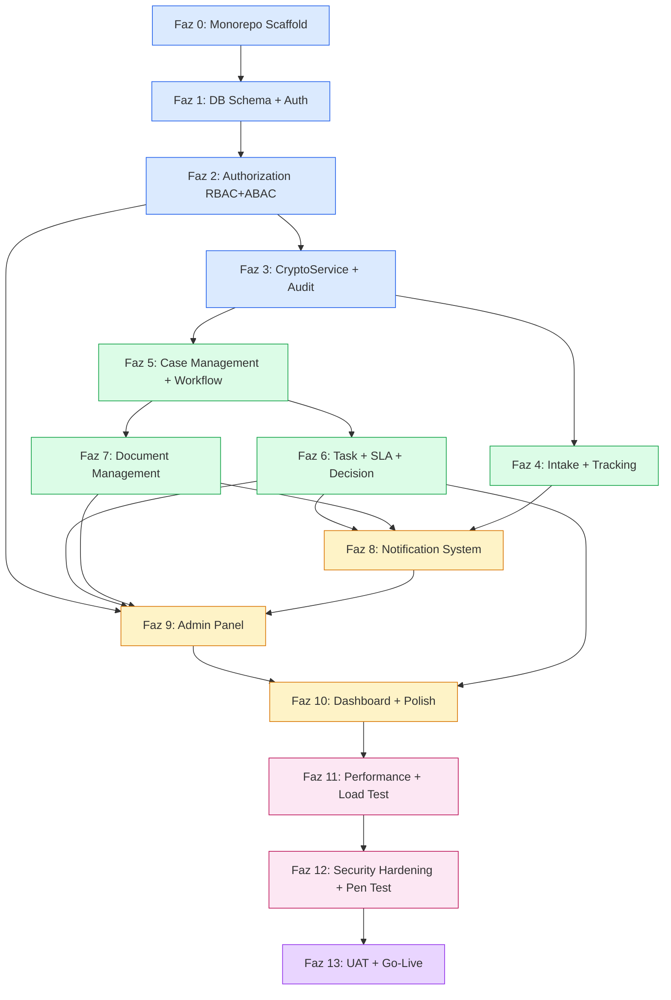

# Yıldız Holding Etik Bildirim Uygulaması — Uygulama Yol Haritası

> Bu platform **vibe coding** ile geliştirilir: Cursor (veya benzer AI coding agent) kullanan developer iteratif olarak inşa eder. Geleneksel sprint-retro-standup ritmi değil, **faz-bazlı dikey dilim** modeli uygulanır. Her faz agent session'larına bölünür; her session sonrası human gate ile ilerlenir. Bu doküman fazların sırasını, bağımlılıklarını, her faz için agent'a verilecek context materyalini ve vibe-coding'e özel risk yönetimini tanımlar.

---

## 1. Vibe Coding Çalışma Modeli

### 1.1 Kim Ne Yapar

| Aktör                 | Sorumluluk                                                                                                                                                                                  |
| --------------------- | ------------------------------------------------------------------------------------------------------------------------------------------------------------------------------------------- |
| **Developer**         | Yön belirleme, karar verme, her faz sonunda human gate review, test doğrulama, production deploy onayı, ADR yazımı (agent drafts, insan onaylar), pen-test ve Bilgi Güvenliği koordinasyonu |
| **Cursor Agent**      | Kod yazımı, test yazımı, refactor, dokümantasyon draft, CI hataları diagnose + fix, consistency audit, migration üretimi                                                                    |
| **10 Doküman**        | Agent'ın bilgi tabanı. Her session başında ilgili doküman(lar) context'e yüklenir                                                                                                           |
| **.mdc Cursor Rules** | Agent'ın kural kitabı — nasıl kod yazar, hangi pattern'leri izler, hangi anti-pattern'lerden kaçınır (ayrı skill ile üretilir)                                                              |

Developer'ın **kod yazmadığı** varsayımı. Developer'ın zihinsel yükü: "doğru soruyu sor, doğru context ver, output'u doğrula." Agent'ın zihinsel yükü: "kuralı uygula, test yaz, refactor, consistency koru." Agent tek başına production yolunu açamaz — `main` branch'e merge insan onayı gerektirir.

### 1.2 Agent Session Akışı

Her bir geliştirme session'ı tek döngü:

```
1. Developer: intent belirler (örn. "WorkflowCommandHandler'a chair_gate → agenda_ready transition'ı ekle")
2. Developer: ilgili dokümanları agent context'ine koyar
   - 01_DOMAIN_MODEL (case state machine geçiş tablosu)
   - 03_API_CONTRACTS (transition endpoint)
   - 04_BACKEND_SPEC (WorkflowCommandHandler pattern)
   - 07_SECURITY_IMPLEMENTATION (clearance check, PolicyGuard)
   - 08_TESTING_STRATEGY (transition matrix test seti)
3. Developer: prompt yazar — net hedef + constraint
4. Agent: kod yazar (file create/modify)
5. Agent: test yazar (pozitif + negatif deny senaryoları)
6. Agent: `pnpm test` + `pnpm lint` + `pnpm typecheck` çalıştırır, hatası varsa fix eder
7. Developer: output'u review eder — state machine doğru mu, audit event üretiyor mu, clearance kontrolü var mı?
8. Developer: kabul → commit; reject → agent'a iterate
9. Developer: PR aç → CI → squash merge
```

Tipik session süresi 30–90 dakika. Büyük feature (workflow engine, admin panel) birden fazla session gerektirir.

### 1.3 Faz Kavramı

**Sprint yerine faz.** Farklar:

| Sprint (geleneksel)              | Faz (vibe coding)                         |
| -------------------------------- | ----------------------------------------- |
| Zamanla bağlı (2 hafta)          | İşle bağlı (feature-complete olana kadar) |
| Velocity ölçümü (story points)   | İterasyon sayısı ölçümü                   |
| Retrospective + planning ritüeli | Her faz sonrası human gate checklist      |
| Pair programming, standup        | Solo + agent, async context handoff       |
| Team estimation                  | Developer kendi kapasitesine göre         |

Faz süresi tahmini yapılır ama katı değil — "5–8 agent session" gibi approximate.

### 1.4 Human Gate

Her faz sonunda developer'ın manuel kontrol listesi:

- Feature çalışıyor mu (lokal end-to-end)?
- Test coverage threshold'unu karşılıyor mu (kritik modüller ≥%90, toplam ≥%80)?
- `pnpm lint` + `pnpm typecheck` green mi?
- Dokümantasyon güncellendi mi (yeni ADR gerekliyse yazıldı mı)?
- Consistency: önceki fazlardaki pattern'ler doğru uygulandı mı (`@RequirePolicy` decorator, `@AuditAction` decorator, Zod validation, error code taxonomy)?
- Staging'e deploy edildi, smoke test yapıldı mı?
- Security-sensitive dosya değişikliği varsa ek review yapıldı mı?

Gate fail → sonraki faza geçilmez. Agent ile iterate edilir.

### 1.5 Hallucination ve Drift'e Karşı Kalkanlar

Vibe coding'in doğal riskleri ve bunlara karşı kalkan mekanizmaları:

1. **TypeScript strict + Zod** — `any` yasak, `strictNullChecks: true`; yanlış tipler compile'da yakalanır. Zod schema'lar frontend-backend paylaşımlı (`packages/dto`).
2. **Test coverage gate** — Kritik modüller (authorization, workflow, document, audit, crypto) ≥%90 line. Agent test yazmayı atlasa bile CI block eder.
3. **10 doküman** — Doğru pattern referansı. Agent hatırlamadığında ilgili dokümanı okur; doküman olmadan "best guess" yapması engellenir.
4. **.mdc cursor rules** — Pattern reinforcement: `@RequirePolicy` decorator zorunluluğu, audit event üretimi, error code formatı, Prisma transaction pattern'i.
5. **ESLint custom rules** — Proje-özel constraint'ler: controller method'a policy decorator zorunlu, `dangerouslySetInnerHTML` yasak, `localStorage` yasak (session cookie-only), `console.log` production'da yasak.
6. **PR CI pipeline** — 12 adımlı otomatik kontrol: lint, typecheck, unit, integration, SAST, SCA, secret scan, container scan.
7. **Human gate** — Son savunma. Developer her faz sonunda checklist ile review eder.

---

## 2. Bağımlılık Grafiği



**Kritik path:** F0 → F1 → F2 → F3 → F5 → F6 → F8 → F9 → F10 → F11 → F12 → F13. Foundation zinciri (F0–F3) sıralı bağımlıdır — paralel çalışamaz. F5 (workflow engine) gecikmesi downstream'deki tüm fazları etkiler çünkü task, document, notification ve admin modülleri workflow engine'e bağımlıdır.

**Paralelleştirilebilir:** F4 (intake + tracking) ve F5 (case management) birbirinden bağımsız başlayabilir — ikisi de F3'e bağımlı ama birbirlerine değil. F7 (document) ve F6 (task) F5'e bağımlı ama birbirlerinden bağımsız çalışabilir.

Solo developer + agent olduğu için paralelleştirme avantajı sınırlıdır. Ancak düşük-bağımlılık görevleri (seed data, email template, master data seed, error page UI) blocking task beklerken arada yapılabilir.

---

## 3. Faz Detayları

---

### Faz 0 — Monorepo Scaffold

#### Kapsam

- pnpm workspaces + Turborepo kurulumu
- `apps/{api, web, worker}` + `packages/{shared, dto, policy}` iskeleti
- Root config: `.nvmrc` (Node 22), `.editorconfig`, `.gitignore`, `turbo.json`, `pnpm-workspace.yaml`
- `@ethics/eslint-config` paylaşımlı ESLint config paketi
- Prettier + Husky + lint-staged + commitlint setup
- `docker-compose.yml` — PostgreSQL 16, MinIO, ClamAV
- `.github/workflows/pr-check.yml` — minimal lint + typecheck + build
- `.env.example` kök + her app altında placeholder
- `README.md` + onboarding section

#### Agent Kick-off Materyali

- `09_DEV_WORKFLOW` — monorepo workspace yapısı, tool versions, commit convention, Docker Compose servisleri, tooling tablosu

Tek session yeterli. Prompt: "Bu dokümana uygun monorepo iskeleti kur. Apps ve packages yapısını oluştur. Her app'te boş `index.ts` placeholder; her package'te `index.ts` + `package.json`. Docker Compose servisleri, Husky hooks ve commitlint aktif."

#### Deliverable

- `pnpm install` başarılı çalışır
- `pnpm dev` — henüz bir şey başlatmıyor ama command exists
- `pnpm lint` + `pnpm typecheck` green (boş projelerde)
- `docker compose up` — PostgreSQL, MinIO, ClamAV ayağa kalkar
- İlk commit + PR + CI green

#### Human Gate

> **Scaffold:** Repo iskeleti tamamlandı. `docker compose up` ve örnek conventional commit ile commitlint doğrulaması merge öncesi developer tarafından yapılmalıdır.

- Klasör yapısı `04_BACKEND_SPEC`'teki workspace tablosuyla birebir eşleşiyor
- Her internal package `@ethics/*` scope'unda
- `turbo.json` pipeline tanımlı (build, lint, typecheck, test, dev)
- Husky hooks aktif — commitlint + lint-staged
- Docker Compose servisleri tanımlı ve sağlık kontrolü `docker compose ps` ile doğrulandı
- `.env.example` kök + `apps/api/.env.example` + `apps/web/.env.example`

#### Vibe Coding Risk Uyarıları

- **Agent başka monorepo tool'u seçebilir** (Nx, Lerna). Prompt'ta açıkça Turborepo + pnpm belirt.
- **Agent package scope'larını tutarsız yapabilir** (bir yerde `@ethics`, diğerinde `@ethics-platform`). Prompt'ta `@ethics/*` convention'ı belirt.
- **Agent gereksiz boilerplate ekler** (CI for 6 environments, 3 dummy packages). Minimal kurulum iste.
- **Agent Docker Compose'da ClamAV'ı unutabilir** — bu proje için zorunlu, ilk günden hazır olmalı.

#### Tahmini İterasyon

2–3 agent session (~2–4 saat developer time).

#### Cursor faz kuralı

- **Rule:** `.cursor/rules/50-phase-00-monorepo-scaffold.mdc`
- **Branch:** `feature/F0-monorepo-scaffold` (`48-git-phase-branch.mdc`)
- **Durum:** tamamlandı

#### İterasyon planı (agent)

| #   | Hedef                                                                                      | Stop                                                           |
| --- | ------------------------------------------------------------------------------------------ | -------------------------------------------------------------- |
| 1   | pnpm workspaces + Turborepo + apps/packages iskeleti + root tooling (ESLint, Prettier, TS) | `pnpm install` + `pnpm lint` + `pnpm typecheck` green          |
| 2   | Docker Compose (postgres, minio, clamav) + Husky/commitlint + CI + README + `.env.example` | `docker compose up` healthy + CI workflow tanımlı              |
| 3   | Human gate kapanışı: `.vscode`, CI format check, `develop` branch, PR                      | PR açık + human gate checklist + squash merge → `develop`      |

---

### Faz 1 — Database Schema + Auth Foundation

#### Kapsam

**Backend:**

- NestJS + TypeScript strict mode boilerplate (`apps/api`)
- Prisma schema v1:
  - `users`, `user_sessions` (connect-pg-simple), `login_attempts`
  - `user_roles` (rol enum inline — ayrı `roles`/`role_permissions` tablosu yok)
  - `companies`, `locations`, `functions`, `positions` (master data iskeleti)
  - `audit_events` (append-only placeholder — chain hash Faz 3)
  - `system_settings` (key/value, type metadata)
  - `kvkk_consent_versions` (+ acceptance history Faz 10 consent modal)
- İlk migration + seed script (superadmin user + v1 consent version + roller + varsayılan system settings)
- Auth modülü:
  - `AuthService` — OIDC PKCE login, callback, logout, session management
  - `AuthController` — `/auth/oidc/login`, `/auth/oidc/callback`, `/auth/logout`, `/auth/me`
  - `passport-openidconnect` strategy (dev: Google, prod: kurumsal IdP)
  - JIT provisioning (kullanıcı kaydı oluşturur, rol atamaz)
  - `SessionGuard` (HttpOnly cookie), `CsrfGuard` (double-submit cookie)
  - express-session + connect-pg-simple (server-side session)
- `packages/shared` ilk enum'ları: `WorkflowState`, `Role`, `ClearanceLevel`, `Permission`
- `packages/dto` ilk Zod schema'ları (auth DTO'ları)
- Pino structured logging + correlation ID interceptor
- Global exception filter + standart error response zarfı
- Health endpoint + readiness probe
- Helmet middleware (security headers)
- `@nestjs/throttler` rate limit base config

**Frontend:**

- React + Vite + TypeScript strict boilerplate (`apps/web`)
- MUI base setup + tema konfigürasyonu
- React Router route tanımları + `AuthGuard`, `GuestGuard`
- OIDC login sayfası (tek buton: "Kurumsal Hesapla Giriş Yap")
- Axios client + interceptor (session cookie otomatik, 401 → `/auth/login` redirect)
- Zustand `useAuthStore`
- TanStack Query setup
- `InternalLayout` iskeleti (sidebar placeholder, topbar placeholder)

**Integration:**

- `.github/workflows/pr-check.yml` genişletme — unit + integration test (Testcontainers)
- İlk end-to-end: Docker Compose ile lokal çalıştır → OIDC login → dashboard placeholder (boş sayfa)

#### Agent Kick-off Materyali

Session'lara bölünmeli — tek session'da yazılamaz:

- **Session 1.1 — Prisma schema + migrations:** `02_DATABASE_SCHEMA` (users, sessions, roles, master data, audit_logs, system_settings tabloları), `04_BACKEND_SPEC` (Prisma module pattern)
- **Session 1.2 — Auth service + OIDC:** `07_SECURITY_IMPLEMENTATION` (Bölüm 1.1 OIDC PKCE, 1.4 sequence diagram, JIT provisioning kuralları), `03_API_CONTRACTS` (auth endpoint'leri)
- **Session 1.3 — Guards + middleware zinciri:** `04_BACKEND_SPEC` (middleware zinciri sırası: Helmet → CORS → body parser → rate limiter → correlation ID → session guard → CSRF guard → validation pipe → audit interceptor → exception filter), `03_API_CONTRACTS` (error taxonomy)
- **Session 1.4 — Frontend scaffold + OIDC login:** `05_FRONTEND_SPEC` (framework, klasör yapısı, route groups, Axios interceptor), `06_SCREEN_CATALOG` (S-AUTH-CALLBACK)
- **Session 1.5 — Seed + testing:** `08_TESTING_STRATEGY` (factory pattern, Testcontainers), `09_DEV_WORKFLOW` (local setup)

#### Deliverable

- Lokal: `docker compose up` → `pnpm dev` → browser → OIDC login (Google) → `/app/dashboard` (boş placeholder) yönlendirilir
- Logout çalışır → login'e döner
- JIT: ilk kez giriş yapan kullanıcı DB'de oluşur ama rol atanmaz
- Health endpoint `200 OK` döner
- Seed: superadmin + roller + permission set
- CI green: lint + typecheck + unit + integration

#### Human Gate

- Prisma schema `02_DATABASE_SCHEMA` ile birebir (tablo adları, kolon adları, index'ler)
- OIDC PKCE flow tam çalışıyor (code_verifier + code_challenge)
- JIT provisioning: yeni kullanıcı DB'de oluşuyor, hiçbir rol atanmıyor
- Session HttpOnly + Secure + SameSite=Strict cookie
- CSRF double-submit cookie aktif
- Rate limit: base config aktif (`@nestjs/throttler`)
- Error response zarfı `03_API_CONTRACTS` formatına uygun
- Correlation ID her request'te log'larda görünüyor
- Frontend Axios interceptor: 401 → `/auth/login` redirect
- Test coverage: auth module ≥%90

#### Vibe Coding Risk Uyarıları

- **Agent kendi JWT çözümü yazabilir** — bu proje JWT kullanmaz; server-side session + HttpOnly cookie. OIDC token'lar backend'de kalır, frontend'e iletilmez. Prompt'ta açıkça "JWT yok, server-side session" belirt.
- **Agent express-session yerine özel session mekanizması kurabilir** — connect-pg-simple + express-session zorunlu. `07_SECURITY_IMPLEMENTATION` Bölüm 1.1'i oku.
- **Agent CSRF korumasını "later" bırakabilir** — ilk günden zorunlu, her mutating endpoint'te aktif.
- **Agent JIT provisioning'de varsayılan rol atayabilir** — deny-by-default ihlali. JIT yalnızca kayıt oluşturur, rol atamaz.
- **Agent access token'ı frontend'e iletebilir** — backend'de kalır. Frontend yalnızca session cookie ile çalışır.
- **Agent login_attempts tablosunu unutabilir** — brute-force koruması ilk günden.

#### Tahmini İterasyon

10–15 agent session (~6–9 gün developer time). En yoğun foundation fazı.

#### Cursor faz kuralı

- **Rule:** `.cursor/rules/51-phase-01-database-auth.mdc`
- **Branch:** `feature/F1-database-auth` (`48-git-phase-branch.mdc`)
- **Durum:** planlandı

#### İterasyon planı (agent)

| #   | Hedef                                                                                                     | Stop                                                            |
| --- | --------------------------------------------------------------------------------------------------------- | --------------------------------------------------------------- |
| 1   | NestJS bootstrap + Prisma schema v1 (auth/user/master data) + ilk migration                               | `prisma migrate dev` + `pnpm typecheck` green                   |
| 2   | Auth modülü: OIDC PKCE, callback, logout, JIT provisioning, connect-pg-simple session                     | Auth integration test: login→callback→me→logout                 |
| 3   | Common katman: guard zinciri (session, CSRF), Helmet, throttler, correlation ID, exception filter, health | Middleware sırası `04_BACKEND_SPEC` ile uyumlu; unit test green |
| 4   | Frontend scaffold: Vite+React+MUI, route guard'lar, login/callback, dashboard placeholder                 | Browser OIDC redirect akışı çalışır                             |
| 5   | Seed (superadmin+roller) + auth test coverage ≥%90 + CI Testcontainers                                    | E2E smoke: docker compose → OIDC login → dashboard; human gate  |

---

### Faz 2 — Authorization (RBAC + ABAC + Clearance)

#### Kapsam

**Backend:**

- `PolicyGuard` full implementation: `@RequirePolicy('case:pre_review')` decorator + guard
- `PolicyScope` — ABAC row filtering: company, assignment, function/location, clearance
- `FieldMaskingService` — response seviyesinde alan maskeleme (admin raporun içeriğini göremez)
- `DocumentPolicy` skeleton (grant model Faz 7'de doldurulacak)
- `packages/policy` tam dolduruldu: `Permission` enum (tüm MVP permission'lar), `role-permission-map.ts`, `abac-rules.ts`, `field-visibility-defaults.ts`
- Permission enum tüm MVP permission'ları içerir (7 rol × N permission)
- Clearance level check: `user.clearance_level >= case.confidentiality_level`
- Seed: roller + permission set + test kullanıcıları (her rol için)

**Frontend:**

- `RoleGuard` component: route-level koruma
- `usePermissions()` hook: permission set management
- `<PermissionGate>` component: UI element gizleme (güvenlik katmanı değil, UX optimizasyonu)

**Integration:**

- Unit test: policy evaluation senaryoları (her rol × her permission, pozitif + negatif)
- Integration test: endpoint bazlı yetkilendirme (yetkili → 200, yetkisiz → 403)

#### Agent Kick-off Materyali

- **Session 2.1 — PolicyGuard + @RequirePolicy:** `07_SECURITY_IMPLEMENTATION` (Bölüm 3 yetkilendirme katmanları), `04_BACKEND_SPEC` (policy.guard.ts, require-policy.decorator.ts)
- **Session 2.2 — PolicyScope ABAC:** `07_SECURITY_IMPLEMENTATION` (Bölüm 3 ABAC koşulları: company, assignment, function/location, clearance), `04_BACKEND_SPEC` (policy-scope.service.ts)
- **Session 2.3 — FieldMaskingService:** `07_SECURITY_IMPLEMENTATION` (admin içerik göremez kuralı, field visibility matrix), `04_BACKEND_SPEC` (field-masking.service.ts)
- **Session 2.4 — Permission enum + role-permission map:** `packages/policy` tam doldurma, `07_SECURITY_IMPLEMENTATION` (yetki matrisi tablosu)
- **Session 2.5 — Frontend PermissionGate + RoleGuard:** `05_FRONTEND_SPEC` (route guards, permission hook), `06_SCREEN_CATALOG` (sidebar menü permission gating)
- **Session 2.6 — Test coverage:** `08_TESTING_STRATEGY` (authorization modülü ≥%90, negatif deny zorunlu)

#### Deliverable

- Superadmin tüm endpoint'lere erişir; rolsüz kullanıcı hiçbir endpoint'e erişemez (deny-by-default)
- Clearance check: SENSITIVE vaka → NORMAL clearance kullanıcı 403 alır
- FieldMasking: admin rolü case detail'da `report_text`, `incident_description` göremez (null/masked)
- Frontend `<PermissionGate>`: sidebar menu item'ları rol bazlı gizleniyor
- Test: authorization modülü ≥%90 coverage, her permission en az 1 pozitif + 1 negatif test

#### Human Gate

- Permission enum tüm MVP permission'ları içeriyor
- Role-permission map `07_SECURITY_IMPLEMENTATION` yetki matrisiyle birebir
- ABAC: company scope doğru (dar rol kullanıcı yalnızca kendi şirketini görür)
- Clearance: `STRICTLY_CONFIDENTIAL` vakaya `SENSITIVE` clearance ile erişim → 403
- Field masking: `admin` rolü case detail'da encrypted alanları göremez (integration test)
- `@RequirePolicy` decorator tüm mevcut endpoint'lerde (spot check: auth + admin)
- Frontend PermissionGate **güvenlik katmanı değil** — backend enforcement zorunlu

#### Vibe Coding Risk Uyarıları

- **Agent permission check'i yalnızca frontend'te yapabilir** — backend'te her endpoint'te guard zorunlu. Her yeni endpoint'te `@RequirePolicy` unutulmaması ESLint custom rule ile enforce edilir.
- **Agent clearance check'i ayrı yapmak yerine PolicyGuard'a entegre etmeyebilir** — PolicyGuard tek noktada RBAC + ABAC + clearance birlikte çözer.
- **Agent permission enum'u incomplete bırakabilir** — placeholder'lar kalır. Faz başında full liste çıkarılır, agent metadata'yı toplu doldurur.
- **Agent field masking'i controller'da if/else ile yapabilir** — `FieldMaskingService` response interceptor pattern'inde yapılır. Controller clean kalır.

#### Tahmini İterasyon

8–12 agent session (~5–7 gün developer time).

#### Cursor faz kuralı

- **Rule:** `.cursor/rules/52-phase-02-authorization.mdc`
- **Branch:** `feature/F2-authorization` (`48-git-phase-branch.mdc`)
- **Durum:** planlandı

#### İterasyon planı (agent)

| #   | Hedef                                                                              | Stop                                                    |
| --- | ---------------------------------------------------------------------------------- | ------------------------------------------------------- |
| 1   | `packages/policy` tam doldurma (Permission enum, role map, ABAC, field visibility) | Enum matris `07` §3.5 ile uyumlu; unit test green       |
| 2   | PolicyGuard + `@RequirePolicy` decorator; mevcut internal endpoint'lere uygulama   | Deny-by-default: rolsüz → 403; superadmin → 200         |
| 3   | PolicyScope ABAC row filtering (company, assignment, clearance)                    | Scope builder unit test; mock list query filtered       |
| 4   | FieldMaskingService + DocumentPolicy skeleton                                      | Admin alan göremez unit test; DocumentPolicy grant stub |
| 5   | Frontend RoleGuard + PermissionGate + `usePermissions`                             | Sidebar menü rol/permission ile gizlenir                |
| 6   | Rol bazlı seed kullanıcılar + authz ≥%90 coverage + integration deny testleri      | Human gate checklist                                    |

---

### Faz 3 — CryptoService + Audit Foundation

#### Kapsam

**Backend:**

- `CryptoService` — AES-256-GCM encrypt/decrypt, her alan ayrı DEK (data encryption key)
- `KeyManagementAdapter` — dev: lokalde sabit key (`.env`), prod: AWS KMS CMK ile DEK wrap/unwrap
- Per-document envelope encryption foundation (doküman upload'ı Faz 7'de; kriptografik altyapı burada hazırlanır)
- `AuditEventPublisher` — domain transaction ile aynı `$transaction` içinde `audit_outbox` kaydı oluşturma (fail-closed)
- `AuditSealService` — chain hash (SHA-256) trigger (DB seviyesinde, application code'da değil)
- Append-only DB trigger: `audit_logs` tablosunda UPDATE ve DELETE yasak (TRUNCATE dahil)
- `SafeLoggerService` — Pino wrapper, PII redaction (email → `***@***.com`, phone → `***`)
- `RedactionService` — hassas alan maskeleme kuralları (audit event snapshot'larında PII redacted)
- Worker: `audit-chain-verify.job.ts` — periyodik chain hash bütünlüğü doğrulama (placeholder; Faz 8'de cron schedule eklenir)

**Integration:**

- Unit test: encrypt → decrypt roundtrip, DEK üretimi, KMS mock
- Integration test: audit outbox + chain hash trigger, append-only constraint (UPDATE/DELETE denemesi fail)
- Integration test: fail-closed — domain transaction + audit outbox aynı transaction'da, birinin fail'i diğerini rollback eder

#### Agent Kick-off Materyali

- **Session 3.1 — CryptoService + KMS adapter:** `07_SECURITY_IMPLEMENTATION` (Bölüm 8 encryption: AES-256-GCM, DEK, KEK, KMS), `04_BACKEND_SPEC` (crypto/ dizini)
- **Session 3.2 — Audit outbox + publisher:** `07_SECURITY_IMPLEMENTATION` (Bölüm 9 audit: fail-closed, outbox, chain hash), `04_BACKEND_SPEC` (audit/ dizini)
- **Session 3.3 — DB triggers (chain hash + append-only):** `02_DATABASE_SCHEMA` (audit_logs tablo yapısı, trigger tanımları)
- **Session 3.4 — SafeLogger + RedactionService:** `04_BACKEND_SPEC` (safe-logger.service.ts, redaction.service.ts), `07_SECURITY_IMPLEMENTATION` (PII redaction kuralları)
- **Session 3.5 — Testing:** `08_TESTING_STRATEGY` (crypto + audit test senaryoları)

#### Deliverable

- CryptoService: `encrypt("plaintext")` → ciphertext; `decrypt(ciphertext)` → plaintext; DEK her çağrıda ayrı üretilir
- KMS adapter: dev'de lokal key, prod'da AWS KMS endpoint (henüz test ortamı yok — mock)
- Audit: herhangi bir mutating işlem → `audit_outbox` kaydı aynı transaction'da → worker consume eder → `audit_logs` tablosuna yazar → chain hash doğru
- Append-only: `DELETE FROM audit_logs` → DB error
- SafeLogger: log çıktısında email, phone gibi PII alanları masked
- Test coverage: crypto + audit modülleri ≥%90

#### Human Gate

- AES-256-GCM: IV her encryption'da random, DEK her alan için ayrı
- KMS adapter interface clean — provider değişikliği tek dosya (key-management.adapter.ts)
- Chain hash trigger DB seviyesinde (application code'da değil) — tamper-proof
- Append-only trigger: `UPDATE audit_logs SET ...` → fail (integration test)
- Fail-closed: audit outbox yazma başarısız → domain transaction rollback (integration test)
- SafeLogger: `pnpm dev` çıktısında PII yok (grep ile kontrol)
- RedactionService: audit event snapshot'larında encrypted alanlar `[REDACTED]`

#### Vibe Coding Risk Uyarıları

- **Agent chain hash'i application code'da compute edebilir** — DB trigger kullanılmalı. Application code'da compute edilirse tamper yüzeyi büyür. `02_DATABASE_SCHEMA`'daki trigger tanımını oku.
- **Agent encrypt/decrypt'i her serviste ayrı yazabilir** — `CryptoService` merkezi, tek injection noktası. Başka servis doğrudan `crypto` import etmez.
- **Agent audit outbox'ı domain transaction dışında yazabilir** — fail-closed ihlali. `$transaction([domainOp, auditOutbox])` pattern zorunlu.
- **Agent DEK'i sabit tutabilir** (tüm alanlar aynı key) — her alan ayrı DEK; key rotation'da granüler kontrol.
- **Agent KMS adapter'ı "later" bırakabilir** — interface + lokal mock ilk günden hazır. Prod'a geçişte yalnızca adapter değişir.

#### Tahmini İterasyon

8–12 agent session (~5–7 gün developer time).

---

### Faz 4 — Intake + Tracking (Dış Form + Anonim Takip)

#### Kapsam

**Backend:**

- Intake modülü:
  - `IntakeController` — `POST /api/v1/intake/reports` (report create), `GET /intake/categories`, `GET /intake/kvkk-text`
  - Report oluşturma: 18 alt kategori, kategori bazlı dinamik alan (`category_specific_data` JSONB encrypted), KVKK consent version kaydı
  - `tracking_code` üretimi (12 karakter alfanümerik, unique)
  - `tracking_code_password_hash` — argon2id (memory ≥64 MB, iterations ≥3)
  - Dosya upload: presigned URL → client PUT → quarantine → ClamAV scan → AVAILABLE/REJECTED
  - Rate limit: dış form 10 req/dk/IP
- Tracking modülü:
  - `TrackingController` — `POST /tracking/verify`, `GET /tracking/status`, `POST /tracking/messages`, `POST /tracking/attachments`
  - `TrackingGuard` — X-Tracking-Code + X-Tracking-Password header doğrulama (her istekte yeniden)
  - Session açılmaz, cookie bırakılmaz (anonim iz bırakmama garantisi)
  - Brute-force koruması: IP + tracking_code bazlı rate limit, eşik aşılınca geçici kilit
  - Güvenli mesajlaşma: bildirimci ↔ sekreterya, mesaj içerikleri encrypted

**Frontend:**

- `PublicIntakeLayout` — sade, KVKK footer, kurumsal header
- S-REPORT-FORM — multi-step wizard (kategori seçimi → dinamik alanlar → ilgili kişiler → dosya yükleme → KVKK onay → özet → gönder)
- S-REPORT-SUCCESS — tracking code teslim ekranı ("Bu kodu saklayın")
- `AnonymousFollowupLayout` — tracking code context
- S-TRACKING-LOGIN — tracking code + parola giriş
- S-TRACKING-STATUS — durum görüntüleme
- S-TRACKING-MESSAGES — güvenli mesajlaşma thread
- `FileUploadZone`, `CategorySelector`, `DynamicCategoryFields`, `KvkkConsentCheckbox`, `TrackingPasswordSection`

**Integration:**

- E2E: dış form doldur → gönder → tracking code al → tracking code ile sorgula → durum gör
- Integration test: argon2id roundtrip, rate limit, ClamAV quarantine flow

#### Agent Kick-off Materyali

- **Session 4.1 — Intake backend (report create):** `03_API_CONTRACTS` (intake endpoint'leri), `01_DOMAIN_MODEL` (Report entity, 18 kategori enum), `07_SECURITY_IMPLEMENTATION` (KVKK consent versiyonlama)
- **Session 4.2 — Tracking backend (anonim auth):** `03_API_CONTRACTS` (tracking endpoint'leri), `07_SECURITY_IMPLEMENTATION` (Bölüm 1.3 anonim auth, argon2id, session-less), `04_BACKEND_SPEC` (tracking.guard.ts)
- **Session 4.3 — File upload (presigned + quarantine + ClamAV):** `03_API_CONTRACTS` (document upload), `07_SECURITY_IMPLEMENTATION` (dosya güvenliği, MIME/uzantı whitelist, ClamAV), `04_BACKEND_SPEC` (document module)
- **Session 4.4 — Frontend: S-REPORT-FORM wizard:** `06_SCREEN_CATALOG` (S-REPORT-FORM tam şablon), `05_FRONTEND_SPEC` (multi-step form pattern, Zod validation)
- **Session 4.5 — Frontend: tracking ekranları:** `06_SCREEN_CATALOG` (S-TRACKING-LOGIN, S-TRACKING-STATUS, S-TRACKING-MESSAGES)
- **Session 4.6 — Secure messaging:** `03_API_CONTRACTS` (secure message endpoint'leri), `01_DOMAIN_MODEL` (SecureMessage entity)
- **Session 4.7 — Testing:** `08_TESTING_STRATEGY` (intake + tracking test senaryoları)

#### Deliverable

- Dış kullanıcı `/report` sayfasında formu doldurur → dosya yükler → KVKK onaylar → gönderir → tracking code ekranı
- Tracking code + parola ile `/tracking` → durum görüntüleme + mesajlaşma çalışır
- ClamAV: enfekte dosya → REJECTED state (quarantine'de kalır)
- Rate limit: 11. istek → 429
- Test: intake + tracking modülleri ≥%80 coverage, brute-force senaryosu

#### Human Gate

- Tracking code formatı `ETK-XXXX-XXXX` (12 karakter alfanümerik)
- argon2id parametreleri: memory ≥64 MB, iterations ≥3, parallelism ≥1
- Session-less: tracking doğrulama sonrası cookie set edilmiyor (`Set-Cookie` header yok)
- ClamAV integration: temiz dosya → AVAILABLE, enfekte → REJECTED
- KVKK consent version kaydediliyor (hangi versiyon onaylandı)
- Multi-step form: geri git → veri korunuyor; ileri git → validation çalışıyor
- Error code'ları `03_API_CONTRACTS` ile birebir
- Encrypted alanlar: `incident_description`, `category_specific_data`, `reporter_identity_*`, `reporter_contact_*` DB'de ciphertext

#### Vibe Coding Risk Uyarıları

- **Agent session/cookie bırakabilir** tracking doğrulama sonrası — kesinlikle yasak. Her istek yeniden tracking_code + parola doğrulamasından geçer.
- **Agent argon2id yerine bcrypt kullanabilir** — tracking code parolası için argon2id zorunlu (memory-hard, brute-force'a dayanıklı).
- **Agent dosya upload'ı tek endpoint olarak tasarlayabilir** (client → backend → S3 relay) — scalability engeli. Presigned URL pattern zorunlu.
- **Agent ClamAV scan'i sync yapabilir** — async quarantine pattern. Upload → quarantine → background scan → AVAILABLE/REJECTED.
- **Agent KVKK consent version'ını kaydetmeyi unutabilir** — report kaydında `kvkk_consent_version` zorunlu.
- **Agent kategori bazlı dinamik alanları hard-code'layabilir** — `category_specific_data` JSONB, kategori schema'sı konfigürasyon bazlı.

#### Tahmini İterasyon

10–14 agent session (~6–8 gün developer time).

---

### Faz 5 — Case Management + Workflow Engine

#### Kapsam

**Backend:**

- Case entity + CRUD (ABAC-scoped queries)
- `WorkflowCommandHandler` — state machine executor
  - 17 state, 20+ geçiş
  - Command bazlı precondition doğrulama (rol, clearance, atama, gerekli doküman/görev tamamlanmış mı)
  - Idempotent komutlar (idempotency_key + optimistic_lock_version)
  - CaseTransition kaydı (append-only) — her geçişte `from_state`, `to_state`, `command`, `actor`, `reason`
  - Side-effect orchestration: geçişe bağlı task oluşturma, audit event üretimi
- Aşama 1 geçişleri: `report_submitted` → `secretariat_review` → `pre_research` → `chair_gate` → `agenda_ready` / `not_on_agenda_closed`
- Aşama 2 geçişleri: `agenda_ready` → `rapporteur_assigned` → `rapporteur_report_submitted` → `agenda_ready` (döngü), `agenda_ready` → `member_approval`
- Aşama 3 geçişleri: `member_approval` → `decision_draft` → `board_chair_review` → `board_approved` / `agenda_ready` (veto)
- Aşama 4 geçişleri: `board_approved` → `implementation_letter_prepared` → `action_assigned` → `action_response_pending` → `agenda_ready` → `follow_up_decision` → `closed_archived` / `action_assigned`
- `ConfidentialityLevel` güncelleme (council_secretary + council_chair, gerekçeli, auditli)

**Frontend:**

- S-CASE-LIST — filtreleme (state, company, confidentiality, tarih), ABAC-scoped
- S-CASE-DETAIL — vaka detay, CaseTimeline (transition tarihçesi), CaseActionBar (availableActions), TransitionDialog (command onay + reason input)

**Integration:**

- Workflow transition matrix testleri: her geçiş × doğru rol × yanlış rol × yanlış state × clearance yetersiz × idempotency × side-effect doğrulama
- E2E: report_submitted → secretariat_review → pre_research → chair_gate → agenda_ready tam akış

#### Agent Kick-off Materyali

- **Session 5.1 — Prisma schema: cases + case_transitions:** `02_DATABASE_SCHEMA` (case, case_transition tabloları)
- **Session 5.2 — WorkflowCommandHandler pattern:** `04_BACKEND_SPEC` (transition/ dizini), `01_DOMAIN_MODEL` (case state machine, geçiş tablosu)
- **Session 5.3 — Aşama 1 geçişleri:** `01_DOMAIN_MODEL` (report_submitted → chair_gate), `03_API_CONTRACTS` (transition endpoint)
- **Session 5.4 — Aşama 2 geçişleri (raportör + üye onay):** `01_DOMAIN_MODEL` (agenda_ready → member_approval, raportör döngüsü)
- **Session 5.5 — Aşama 3 + 4 geçişleri:** `01_DOMAIN_MODEL` (karar → HYKB → uygulama → aksiyon)
- **Session 5.6 — Case CRUD + ABAC scoping:** `03_API_CONTRACTS` (case endpoint'leri), `07_SECURITY_IMPLEMENTATION` (ABAC case filtreleme)
- **Session 5.7 — Frontend S-CASE-LIST + S-CASE-DETAIL:** `06_SCREEN_CATALOG` (S-CASE-LIST, S-CASE-DETAIL tam şablonları)
- **Session 5.8 — Transition matrix testleri:** `08_TESTING_STRATEGY` (Bölüm 4 workflow transition matrix — 8 test tipi per geçiş)

#### Deliverable

- Council secretary: report → case açar → ön değerlendirme → kurul başkanı gündeme alır → gündemde
- Raportör döngüsü: raportör atanır → rapor yükler → agenda_ready'e döner
- Veto: HYKB veto → agenda_ready'e döner
- Aksiyon döngüsü: aksiyon atanır → dönüş → kurul takip → kapatma
- Case list: ABAC-scoped (council_secretary tüm vakaları görür; action_owner yalnızca atandığını)
- Transition matrix: tüm geçişler pozitif + negatif test edildi
- CI green, workflow modülü ≥%90 coverage

#### Human Gate

- State machine: 17 state × 20+ geçiş, `01_DOMAIN_MODEL` geçiş tablosuyla birebir
- Idempotent: aynı command ikinci kez → çift geçiş üretmez (integration test)
- Optimistic locking: concurrent transition → biri success, diğeri 409 (integration test)
- Precondition: gerekli doküman/görev tamamlanmamış → 422
- CaseTransition append-only: UPDATE/DELETE → DB error
- ABAC: action_owner yalnızca atandığı vakayı görür (integration test)
- Clearance: `STRICTLY_CONFIDENTIAL` vakaya `SENSITIVE` clearance → 403
- Audit event: her transition için audit kaydı oluşuyor
- Side-effect: transition → ilgili task oluşuyor (PENDING state)

#### Vibe Coding Risk Uyarıları

- **Agent state machine transition'ları enforce etmeyebilir** — herhangi state → herhangi state. Explicit allowed-transitions map zorunlu; map dışı geçiş → 409.
- **Agent idempotency_key kontrolünü atlayabilir** — çift tıklama ve retry senaryosunda çift transition oluşur. Zorunlu.
- **Agent precondition validation'ı "happy path only" yapabilir** — her geçiş için precondition seti (doğru rol, doğru state, clearance, atama) tam listelenmiş olmalı.
- **Agent CaseTransition'ı update edebilir** (status düzeltme için) — append-only. Yeni transition kaydı oluşturulur.
- **Agent side-effect'leri (task oluşturma, notification event) transition sonrasında ayrı endpoint'te yapabilir** — aynı transaction'da olmalı. Partial state (transition yapıldı ama task oluşmadı) kabul edilmez.

#### Tahmini İterasyon

12–18 agent session (~7–10 gün developer time). En karmaşık domain fazı.

---

### Faz 6 — Task Management + SLA + Decision

#### Kapsam

**Backend:**

- Task lifecycle: PENDING → IN_PROGRESS → COMPLETED / CANCELLED / DELEGATED
- Task type catalog: 11 görev tipi (ön değerlendirme, raportör inceleme, üye onay, karar yazısı, HYKB review, uygulama yazısı, aksiyon dönüşü, vb.)
- `TaskService` — create (transition side-effect), complete, delegate, cancel
- SLA engine: `SlaCalculatorService` + `BusinessCalendarService`
  - 14 iş günü hesabı (hafta sonu + Türkiye resmi tatili + holding özel tatil + yarım gün)
  - `SlaPolicyConfig` tablosundan görev tipi bazlı SLA süresi, uyarı eşikleri
  - `task.sla_due_at` assignment-time'da hesaplanır
- Delegation/reassignment: devir eden → DELEGATED, yeni task → PENDING (original task referanslı)
- `TaskEvent` — append-only yaşam döngüsü kaydı
- DecisionVote modülü:
  - Kurul üye onay/itiraz
  - 24 takvim saati sessiz kabul: `SilentAcceptanceHandler` (worker job)
  - Oy birliği kontrolü

**Frontend:**

- S-TASK-LIST — 3 tab: bekleyen / devam eden / tamamlanan; SLA badge (yeşil/sarı/kırmızı)
- S-TASK-DETAIL — vaka bağlamı, görev açıklaması, action paneli (tamamla/devret), SLA countdown

**Integration:**

- Integration test: SLA hesaplama (tatil günleri atla, yarım gün), sessiz kabul trigger (24h timeout)
- E2E: task oluşur → kullanıcı tamamlar → case transition tetiklenir

#### Agent Kick-off Materyali

- **Session 6.1 — Task CRUD + lifecycle:** `03_API_CONTRACTS` (task endpoint'leri), `01_DOMAIN_MODEL` (Task state machine, task type catalog)
- **Session 6.2 — SLA engine:** `04_BACKEND_SPEC` (sla-calculator.service.ts, business-calendar.service.ts), `02_DATABASE_SCHEMA` (sla_policy_configs, business_calendars tabloları)
- **Session 6.3 — Delegation + TaskEvent:** `01_DOMAIN_MODEL` (delegation semantics), `03_API_CONTRACTS` (delegate endpoint)
- **Session 6.4 — DecisionVote + sessiz kabul:** `01_DOMAIN_MODEL` (kurul karar mekanizması), `04_BACKEND_SPEC` (silent-acceptance.handler.ts)
- **Session 6.5 — Frontend S-TASK-LIST + S-TASK-DETAIL:** `06_SCREEN_CATALOG` (S-TASK-LIST, S-TASK-DETAIL)
- **Session 6.6 — Testing (SLA + sessiz kabul):** `08_TESTING_STRATEGY` (SLA hesaplama, fake clock ile 24h sessiz kabul)

#### Deliverable

- Task oluşur (transition side-effect) → kullanıcı task listesinde görür → tamamlar → case state ilerler
- SLA badge: yeşil (>%50 kalan), sarı (≤%20 kalan), kırmızı (aşılmış)
- Delegation: görev devredilir → yeni task oluşur, eski DELEGATED
- Sessiz kabul: 24h timeout → sistem `SILENT_ACCEPTANCE` vote kaydı üretir → decision_draft'a geçiş
- Test: task + SLA modülleri ≥%90 coverage

#### Human Gate

- 11 görev tipi enum tam tanımlı
- SLA hesaplama: tatil günleri atlanıyor (integration test ile doğrula — hafta sonu + resmi tatil)
- SlaPolicyConfig: admin'den görev tipi bazlı SLA süresi değiştirilebilir
- Sessiz kabul: 24h sonra otomatik SILENT_ACCEPTANCE vote (fake clock testi)
- Delegation: original task referansı korunuyor, yeni task'ta `delegated_from_task_id`
- TaskEvent append-only
- E2E: task complete → case transition otomatik tetikleniyor

#### Vibe Coding Risk Uyarıları

- **Agent SLA'yı calendar days ile hesaplayabilir** — iş günü hesabı zorunlu (hafta sonu + tatil hariç). `BusinessCalendarService` kullanılmalı.
- **Agent sessiz kabul job'ını `setInterval` ile yapabilir** — `@nestjs/schedule` cron job (worker'da). Process restart'ta interval kaybı riski.
- **Agent delegation'ı "task update" olarak yapabilir** — yanlış semantic. Eski task DELEGATED, yeni task oluşur.
- **Agent oy birliği kontrolünü "majority" olarak uygulayabilir** — oy birliği (unanimity) zorunlu.

#### Tahmini İterasyon

10–14 agent session (~6–8 gün developer time).

---

### Faz 7 — Document Management

#### Kapsam

**Backend:**

- Document upload flow: presigned URL → client PUT → `POST /documents` (meta kayıt) → quarantine → ClamAV scan → AVAILABLE / REJECTED
- Per-document envelope encryption: DEK wrap/unwrap (CryptoService + KMS adapter)
- `DocumentAccessGrant` modeli: vaka erişimi yetmez, ayrıca doküman bazlı grant gerekir
- `DocumentPolicyService` — grant check + clearance check + rol check
- Download: kısa ömürlü presigned URL (TTL 5 dk)
- Document version management: yeni versiyon → eski versiyon korunur
- Document category enum: 13 kategori (bildirim eki, raportör raporu, karar yazısı, uygulama yazısı, aksiyon dönüşü, vb.)
- `DocumentVersion` tablosu: her upload yeni versiyon; version_number auto-increment
- Malware scan worker: `malware-scan.job.ts` (ClamAV instream)

**Frontend:**

- `<FileViewer>` component: indirme butonu (presigned URL ile)
- Case detail'daki doküman sekmesi: liste + upload + indirme
- Upload progress indicator + quarantine status badge

**Integration:**

- Integration test: upload → quarantine → scan → AVAILABLE/REJECTED
- Integration test: grant olmadan download → 403
- Integration test: per-document encryption roundtrip

#### Agent Kick-off Materyali

- **Session 7.1 — Document entity + upload flow:** `03_API_CONTRACTS` (document endpoint'leri), `02_DATABASE_SCHEMA` (documents, document_versions, document_access_grants tabloları)
- **Session 7.2 — Per-document envelope encryption:** `07_SECURITY_IMPLEMENTATION` (Bölüm 8 encryption), `04_BACKEND_SPEC` (crypto.service.ts)
- **Session 7.3 — DocumentAccessGrant + DocumentPolicy:** `07_SECURITY_IMPLEMENTATION` (doküman erişim kuralları: grant zorunluluğu, holding seviyesi rol yetmez), `04_BACKEND_SPEC` (document-policy.service.ts)
- **Session 7.4 — Malware scan worker:** `04_BACKEND_SPEC` (malware-scan.job.ts), `07_SECURITY_IMPLEMENTATION` (ClamAV, MIME/uzantı whitelist)
- **Session 7.5 — Frontend doküman UI:** `06_SCREEN_CATALOG` (case detail doküman sekmesi)
- **Session 7.6 — Testing:** `08_TESTING_STRATEGY` (document modülü: encryption, grant, scan)

#### Deliverable

- Dosya upload → quarantine → ClamAV scan → AVAILABLE
- Download: grant olan kullanıcı → presigned URL → dosya indirilir
- Grant olmayan kullanıcı → 403
- Per-document encryption: S3'te encrypted, indirme sırasında decrypt
- Version: yeni upload → version 2 oluşur, version 1 korunur
- CI green, document modülü ≥%90 coverage

#### Human Gate

- Upload flow: presigned URL pattern (client → S3 direct, backend relay yok)
- Quarantine: enfekte dosya REJECTED state'te, indirme engelleniyor
- Grant zorunluluğu: holding seviyesi rol dahi grant olmadan indirme yapamaz
- Per-document encryption: S3'te `SELECT` / `GET` → encrypted veri
- MIME + uzantı whitelist: desteklenmeyen dosya → 400
- Dosya boyut limiti: tek dosya 50 MB, toplam 200 MB (system_settings'ten konfigüre edilebilir)
- Download URL TTL: 5 dakika

#### Vibe Coding Risk Uyarıları

- **Agent doküman erişimini case erişimiyle eşitleyebilir** — ayrı grant modeli zorunlu. Case görebilmek dokümanı görmek anlamına gelmez.
- **Agent download'ı backend relay ile yapabilir** — presigned URL pattern zorunlu (scalability).
- **Agent encryption'ı "later" bırakabilir** — Faz 3'teki CryptoService doğrudan kullanılır, ek geliştirme yok.
- **Agent ClamAV timeout'u handle etmeyebilir** — quarantine'de kalan dosya timeout sonrası REJECTED olmalı.

#### Tahmini İterasyon

8–12 agent session (~5–7 gün developer time).

---

### Faz 8 — Notification System

#### Kapsam

**Backend:**

- `notifications` tablosu: in-app bildirimler
- `NotificationService` — event trigger → notification kaydı + e-posta kuyruğu
- Outbox + worker dispatch pattern: `notification-dispatcher.job.ts`
- SMTP email sender (Nodemailer): dev: Mailpit, staging/prod: kurumsal SMTP relay
- İçeriksiz şablon: e-posta gövdesi hassas veri taşımaz ("Yeni bir göreviniz var — platforma giriş yapınız")
- `notification_templates` tablosu (28 şablon seed): event tipi × metin × aktif/pasif
- Event triggers:
  - `TASK_ASSIGNED` — yeni görev oluşunca
  - `TASK_COMPLETED` — görev tamamlanınca
  - `CASE_TRANSITION` — vaka state değişince
  - `SLA_WARNING` — SLA uyarı eşiği
  - `SLA_BREACH` — SLA aşıldı
  - `SILENT_ACCEPTANCE_WARNING` — 24h dolmadan X saat kala
  - `DECISION_VOTE_REQUESTED` — üye onay bekleniyor
  - `ACTION_ASSIGNED` — aksiyon sahibine atandı
  - `SECURE_MESSAGE_RECEIVED` — güvenli mesaj geldi (bildirimci tarafı e-posta yok; iç kullanıcıya)
  - Diğer şablon event'leri (28 toplam)
- Cron jobs:
  - `sla-reminder.job.ts` — SLA uyarı pipeline (her 5 dk)
  - `silent-acceptance.job.ts` — 24h sessiz kabul kontrolü (her 5 dk)
  - `audit-chain-verify.job.ts` — periyodik chain hash doğrulama (günlük)
  - `retention-purge.job.ts` — retention süresi dolan kayıtların imhası (günlük)
- Notification endpoints: list, mark-read, mark-all-read, unread-count

**Frontend:**

- `<NotificationBell>` topbar component (30 sn polling, unread count badge)
- S-NOTIFICATION-CENTER — full page bildirim listesi, filtre, mark-all-read
- Bildirim tıklama → ilgili ekrana navigation (case detail, task detail, vb.)

**Integration:**

- Integration test: transition → notification kaydı + outbox → worker → (Mailpit'te email)
- Integration test: SLA cron → SLA_WARNING notification üretimi

#### Agent Kick-off Materyali

- **Session 8.1 — Notifications schema + service:** `02_DATABASE_SCHEMA` (notifications, notification_templates tabloları), `03_API_CONTRACTS` (notification endpoint'leri)
- **Session 8.2 — Outbox + worker dispatch:** `04_BACKEND_SPEC` (worker/ dizini, notification-dispatcher.job.ts)
- **Session 8.3 — SMTP email sender + templates:** `07_SECURITY_IMPLEMENTATION` (e-posta güvenliği: içeriksiz şablon, DKIM/SPF/DMARC), `04_BACKEND_SPEC` (email-relay.service.ts)
- **Session 8.4 — Event triggers (tüm event'ler):** `01_DOMAIN_MODEL` (hangi state'te tetiklenir)
- **Session 8.5 — Cron jobs (SLA, sessiz kabul, chain verify, retention):** `04_BACKEND_SPEC` (worker jobs listesi)
- **Session 8.6 — Frontend NotificationBell + S-NOTIFICATION-CENTER:** `06_SCREEN_CATALOG` (S-NOTIFICATION-CENTER), `05_FRONTEND_SPEC` (polling pattern)

#### Deliverable

- Case transition → ilgili kullanıcıya in-app notification + email (Mailpit'te görünür)
- SLA warning: SLA penceresinde kalan ≤%20 → SLA_WARNING notification
- NotificationBell: unread count doğru, tıklama → ilgili ekrana git
- 28 notification template seed data'da
- Cron jobs: SLA reminder + sessiz kabul + audit chain verify + retention purge çalışır
- CI green

#### Human Gate

- E-posta şablonları içeriksiz: bildirim metninde vaka detayı, bildirimci kimliği, rapor içeriği yok
- Outbox pattern: notification kaydı + outbox aynı transaction'da
- Worker dead letter queue: failed job'lar izole
- SLA cron: her 5 dk çalışıyor (staging'de doğrulandı)
- Sessiz kabul: 24h timeout → SILENT_ACCEPTANCE vote + notification
- Notification polling: 30 sn aralık (5 sn değil — gereksiz API load)
- Mark-read: tıklama anında sayaç azalır (optimistic), failure'da rollback
- Retention purge: yalnızca retention süresi dolan ve legal_hold olmayan kayıtlar

#### Vibe Coding Risk Uyarıları

- **Agent e-posta şablonunda vaka detayı ekleyebilir** — içeriksiz şablon zorunlu. E-posta yalnızca "Yeni göreviniz var" seviyesinde.
- **Agent event trigger'ları inline service'te atabailir** — decoupled pattern: domain event → notification service. Test edilebilirlik + cross-cutting concern ayrımı.
- **Agent cron job'ları `setInterval` ile yapabilir** — `@nestjs/schedule` zorunlu (process restart'ta interval kaybı riski).
- **Agent notification polling'ini 5 sn yapabilir** — 30 sn yeterli, 5 sn gereksiz API load.
- **Agent retention purge'da legal_hold kontrolü atlayabilir** — legal_hold olan kayıtlar retention süresi dolsa bile silinmez.

#### Tahmini İterasyon

8–12 agent session (~5–7 gün developer time).

---

### Faz 9 — Admin Panel

#### Kapsam

**Backend:**

- Admin endpoint'ler:
  - User/role/clearance yönetimi (maker-checker gerekli aksiyonlar)
  - Master data CRUD (company, location, function, position)
  - System settings (get list, bulk update — maker-checker)
  - Field visibility config
  - Action matrix config (maker/checker rolleri)
  - SLA policy config
  - Business calendar (tatil, yarım gün CRUD)
  - Notification template editor (get/update/preview/send-test)
  - KVKK text versiyonlama (create/update/publish — maker-checker)
  - Audit event list + filter + CSV export (async job)
  - Audit chain integrity verify endpoint
  - Document operations monitor
  - System health dashboard endpoint
- Maker-checker pattern: `config.service.ts` — maker creates proposal, checker approves/rejects, maker ≠ checker enforced

**Frontend:**

- `AdminLayout` — admin sidebar, kısıtlı navigation, "admin içerik göremez" prensibi
- S-ADMIN-USER-LIST + S-ADMIN-USER-DETAIL (rol/clearance atama, maker-checker UI)
- S-ADMIN-MASTER-DATA (generic CRUD per type)
- S-ADMIN-SYSTEM-SETTINGS (kategori sekmeleri + dirty diff + maker-checker)
- S-ADMIN-FIELD-VISIBILITY (field × role matrix editor)
- S-ADMIN-ACTION-MATRIX (aksiyon × maker/checker rolleri)
- S-ADMIN-SLA-POLICIES (görev tipi × SLA süresi)
- S-ADMIN-BUSINESS-CALENDAR (takvim UI + tatil CRUD)
- S-ADMIN-NOTIFICATION-TEMPLATES (editor + preview + test send)
- S-ADMIN-KVKK-TEXTS (markdown editor + publish flow + maker-checker)
- S-ADMIN-AUDIT (gelişmiş filtre + JSON diff viewer + CSV export)
- S-ADMIN-DOCUMENT-OPS (quarantine/scan durumu monitor)
- S-ADMIN-SYSTEM-HEALTH (worker durumu, outbox queue, DB connection)

**Integration:**

- Integration test: maker-checker flow (maker creates → checker approves → config aktif)
- E2E: admin login → user create → role assign → clearance set

#### Agent Kick-off Materyali

- **Session 9.1 — User/role/clearance CRUD:** `03_API_CONTRACTS` (admin user endpoint'leri), `07_SECURITY_IMPLEMENTATION` (maker-checker, clearance atama kuralları)
- **Session 9.2 — Master data generic CRUD:** `03_API_CONTRACTS` (admin master data), `02_DATABASE_SCHEMA` (companies, locations, functions, positions)
- **Session 9.3 — System settings + maker-checker pattern:** `03_API_CONTRACTS` (admin config endpoint'leri), `04_BACKEND_SPEC` (config.service.ts maker-checker)
- **Session 9.4 — Field visibility + action matrix:** `07_SECURITY_IMPLEMENTATION` (field visibility matrix, maker-checker aksiyon matrisi)
- **Session 9.5 — SLA policies + business calendar:** `03_API_CONTRACTS` (admin SLA/calendar), `02_DATABASE_SCHEMA` (sla_policy_configs, business_calendars)
- **Session 9.6 — Notification templates + KVKK texts:** `03_API_CONTRACTS` (admin notification/kvkk), `07_SECURITY_IMPLEMENTATION` (KVKK metin versiyonlama)
- **Session 9.7 — Audit viewer (filter + diff + CSV):** `03_API_CONTRACTS` (admin audit endpoint'leri), `07_SECURITY_IMPLEMENTATION` (audit log yapısı)
- **Session 9.8 — Frontend AdminLayout + user ekranları:** `06_SCREEN_CATALOG` (S-ADMIN-USER-LIST, S-ADMIN-USER-DETAIL)
- **Session 9.9 — Frontend config ekranları:** `06_SCREEN_CATALOG` (S-ADMIN-SYSTEM-SETTINGS, S-ADMIN-FIELD-VISIBILITY, S-ADMIN-ACTION-MATRIX)
- **Session 9.10 — Frontend monitoring ekranları:** `06_SCREEN_CATALOG` (S-ADMIN-AUDIT, S-ADMIN-DOCUMENT-OPS, S-ADMIN-SYSTEM-HEALTH)

#### Deliverable

- Admin tüm config ekranlarında CRUD yapabilir; maker-checker gerektiren aksiyonlarda onay akışı çalışır
- Audit viewer: filtre + JSON diff (old_value vs new_value) + CSV export (async)
- Business calendar: tatil ekle/sil → SLA hesaplama etkilenir
- KVKK text publish: yeni versiyon → tüm kullanıcılara consent modal (Faz 10'da UI)
- Admin URL'e normal kullanıcı → 403
- CI green

#### Human Gate

- Maker-checker: maker ≠ checker enforced (aynı kişi olamaz)
- Admin içerik göremez: S-ADMIN-AUDIT'te `report_text`, `incident_description` gibi alanlar `[REDACTED]`
- CSV export: async job pattern (>10K kayıt için)
- System settings bulk update: tek transaction (atomic)
- Notification template preview: backend'te render (XSS koruması)
- KVKK text publish: destructive confirmation ("ONAYLIYORUM" pattern)
- AdminLayout: normal kullanıcı URL ile girerse 403

#### Vibe Coding Risk Uyarıları

- **Agent maker-checker'ı frontend-only yapabilir** — backend enforcement zorunlu. Maker ve checker aynı kişi → backend reject.
- **Agent audit viewer'da unredacted veri gösterebilir** — FieldMaskingService admin rolüne de uygulanır.
- **Agent CSV export'u client-side yapabilir** — büyük veri memory sorunu. Backend async job + presigned URL.
- **Agent KVKK publish'i non-destructive olarak işaretleyebilir** — destructive (geri alınamaz, tüm kullanıcıları etkiler).
- **Agent master data için 8 ayrı endpoint yazabilir** — generic endpoint + `:type` param pattern daha temiz.

#### Tahmini İterasyon

12–16 agent session (~7–10 gün developer time). En hacimli UI fazı.

---

### Faz 10 — Dashboard + Error Pages + Polish

#### Kapsam

**Backend:**

- `/dashboard/summary` — aggregate metadata: toplam bildirim, açık/kapalı durum, SLA aşımı, bekleyen görev, şirket/kategori dağılımı
- Session list + revoke endpoints (kendi session'ları)

**Frontend:**

- S-DASHBOARD — aggregate widget'lar (permission-gated): Bekleyen Görevler, Açık Vakalar, SLA Uyarıları, Son Bildirimler, Kategori Dağılımı
- InternalLayout finalizasyonu: sidebar (tüm menu items, PermissionGate), topbar (NotificationBell + user menu + breadcrumb)
- S-FORBIDDEN (403), S-NOT-FOUND (404), S-ERROR (500), S-SESSION-EXPIRED (modal overlay)
- KVKK consent modal: yeni version publish → blocking modal (ESC disabled, outside click disabled)
- Genel UI polish: loading states, empty states, error states tutarlılığı

**Integration:**

- E2E: dashboard widget'lar doğru veri gösteriyor (permission-gated)
- E2E: session expired → modal → re-login

#### Agent Kick-off Materyali

- **Session 10.1 — Dashboard backend:** `03_API_CONTRACTS` (dashboard endpoint)
- **Session 10.2 — S-DASHBOARD widget'lar:** `06_SCREEN_CATALOG` (S-DASHBOARD)
- **Session 10.3 — Sidebar + topbar finalizasyonu:** `05_FRONTEND_SPEC` (navigation, layout), `06_SCREEN_CATALOG` (global navigation)
- **Session 10.4 — Error pages + session expired:** `06_SCREEN_CATALOG` (S-FORBIDDEN, S-NOT-FOUND, S-ERROR, S-SESSION-EXPIRED)
- **Session 10.5 — KVKK consent modal + UI polish:** `07_SECURITY_IMPLEMENTATION` (consent versiyonlama), `06_SCREEN_CATALOG` (consent modal)

#### Deliverable

- Dashboard'da kullanıcıya uygun widget'lar (permission-gated)
- Error page'ler UX polished (teknik detay yok)
- Sidebar permission-gated menüler düzgün
- Session expired → modal → re-login smooth
- KVKK consent modal: blocking, geri alınamaz

#### Human Gate

- Dashboard widget'lar parallel lazy load (her biri bağımsız, tek widget fail → diğerleri render)
- Widget'lar permission-gated (ilgili permission yoksa widget görünmez)
- Error page'lerde technical detail yok (stack trace prod'da gösterilmez)
- Consent modal: ESC disabled, outside click disabled, X butonu yok
- Session expired modal: otomatik tetikleniyor (session timeout)

#### Vibe Coding Risk Uyarıları

- **Agent dashboard widget'ları single big query ile yapabilir** — widget-level isolation + parallel fetch.
- **Agent error page'lerde stack trace gösterebilir** — env-based render (dev'de OK, prod'da yasak).
- **Agent consent modal'ın ESC disable'ını unutabilir** — blocking modal, kapatılamaz.

#### Tahmini İterasyon

6–10 agent session (~4–6 gün developer time).

---

### Faz 11 — Performance + Load Test

#### Kapsam

- Lighthouse CI integration (PR'da otomatik)
- Bundle size analysis + lazy import optimization (route splitting)
- Database query review (`EXPLAIN ANALYZE`, eksik index tespiti)
- k6 load test senaryoları: login storm (100 concurrent), case list (1000 req/min), workflow transition (burst), dashboard aggregate
- Capacity planning: container sizing, DB instance class, connection pool

#### Agent Kick-off Materyali

- `08_TESTING_STRATEGY` (load test + performance test bölümleri)
- `05_FRONTEND_SPEC` (Web Vitals hedefleri)
- `00_PROJECT_OVERVIEW` (ölçek: yıllık 200–250 bildirim, düşük/orta eşzamanlılık)

#### Deliverable

- Lighthouse: performance ≥80, accessibility ≥90, best practices ≥90
- Bundle size < 200 KB gzipped initial
- P95 API response < 500 ms (100 concurrent user)
- k6 senaryoları staging'de green (0 kritik error rate)
- Bottleneck report + fix

#### Human Gate

- Lighthouse CI PR'da çalışıyor, eşikler block ediyor
- Bundle analyzer: lazy-loaded route'lar doğru split edilmiş
- DB slow query log → indexed queries
- k6 sonuçları P95/P99 ayrımı doğru (histogram'a bakıldı)

#### Vibe Coding Risk Uyarıları

- **Agent optimization için her şeyi memoize edebilir** — premature optimization. Bottleneck tespit + fokuslu fix.
- **Agent "fix bundle size" deyince her şeyi dynamic import yapabilir** — critical path dynamic import performance regression yaratır. Strategic splitting.

#### Tahmini İterasyon

5–8 session (~3–5 gün developer time). İterasyon yoğun — her fix sonrası load test yeniden çalıştır.

---

### Faz 12 — Security Hardening + Penetration Test

#### Kapsam

- OWASP ZAP full scan (staging'de)
- Snyk dependency vulnerability cleanup (0 HIGH/CRITICAL hedefi)
- Penetration test (dış firma veya kapsamlı internal review)
- CSP policy tightening (nonce-based scripts, unsafe-inline yok)
- Secret rotation drill (session secret, OIDC client secret, DB password, KMS key rotation)
- Backup restore drill (staging'de snapshot restore → test query başarılı)
- Incident response runbook completion (15+ runbook: deployment, rollback, DB restore, secret rotation, break-glass, DDoS response, data breach, audit alarm, vb.)
- SAST/SCA/container scan: 0 HIGH/CRITICAL
- DAST: staging'de full scan

#### Agent Kick-off Materyali

- `07_SECURITY_IMPLEMENTATION` tüm bölümler
- `08_TESTING_STRATEGY` (security test bölümü)
- `09_DEV_WORKFLOW` (deployment, runbook)

#### Deliverable

- ZAP baseline passed (false positive ignore list minimal)
- Snyk: 0 HIGH/CRITICAL vulnerabilities
- Pen-test report: 0 critical, findings remediated
- CSP strict policy — inline script yok, nonce-based
- Secret rotation playbook çalışır (staging'de test)
- Backup restore drill success
- Runbook dizini 15+ runbook

#### Human Gate

- Pen-test raporu review edildi
- Tüm critical/high findings remediated
- CSP'de inline script sadece nonce'lu
- Secret rotation drill success (staging'de)
- Backup restore drill: staging'de snapshot restore → test query başarılı
- Runbook'lar end-to-end okunmuş

#### Vibe Coding Risk Uyarıları

- **Agent security findings'i "quick fix" yapabilir** — her finding için root cause analysis.
- **Agent CSP'yi "unsafe-inline" ile esnetebilir** — yasak. Nonce pattern zorunlu.
- **Agent pen-test raporundaki finding'leri "out of scope" olarak işaretleyebilir** — karar insanın.

#### Tahmini İterasyon

8–15 session (pen-test raporuna bağlı). ~5–10 gün developer time.

---

### Faz 13 — UAT + Go-Live

#### Kapsam

- Production IaC apply (AWS: VPC, RDS PostgreSQL, ECS Fargate, S3, KMS CMK, CloudFront, ALB, WAF, Secrets Manager, CloudWatch — Bilgi Güvenliği onaylı topology)
- Production seed: superadmin + roller + system settings defaults + business calendar + notification templates
- OIDC production IdP konfigürasyonu (kurumsal IdP + MFA TOTP zorunlu)
- SMTP production relay konfigürasyonu (DKIM/SPF/DMARC)
- KMS customer-managed keys (field encryption + document encryption + infra)
- ClamAV production instance
- Monitoring + alerting: CloudWatch dashboards, alarmlar, PagerDuty routing
- UAT: Etik ekibi + KVKK + Bilgi Güvenliği + IT ile test senaryoları (sentetik veri)
- Bug fixes from UAT
- Production readiness checklist completion
- Soft launch: pilot user grubu
- Full rollout

#### Agent Kick-off Materyali

- Tüm dokümanlar (mature state)
- Pen-test remediation report
- UAT bug list
- `09_DEV_WORKFLOW` (deployment, production deploy kuralları, rollback)

#### Deliverable

- Production URL açık
- İlk superadmin login + MFA setup
- Pilot user grubu vakaları işliyor
- CloudWatch + monitoring dashboard aktif
- On-call rotation başladı

#### Human Gate

- Production IaC apply success (dev/staging module parity)
- Production RDS snapshot taken before go-live
- Production secrets AWS Secrets Manager'da
- DNS + TLS certificate active
- Email deliverability test (production SMTP, SPF/DKIM/DMARC)
- Monitoring dashboard: CPU, memory, error rate, 5xx rate, login rate
- Runbook'lar `docs/runbooks/` dizininde complete
- UAT sign-off (Etik ekibi + KVKK + Bilgi Güvenliği)
- Production'da test/dev seed çalışmadığından emin ol (prod-specific seed ayrı)
- Communication plan: kullanıcılara duyuru

#### Vibe Coding Risk Uyarıları

- **Agent prod deploy'u "just run it" yaklaşımı** — `09_DEV_WORKFLOW` release checklist zorunlu. Dört-göz onayı.
- **Agent staging → prod config farkını unutabilir** — farklı OIDC provider, farklı SMTP, farklı KMS key, farklı S3 bucket. Env-specific config explicit.
- **Agent go-live'da dev seed script'i çalıştırabilir** — prod seed script ayrı (yalnızca superadmin + roller + calendar).

#### Tahmini İterasyon

10–20 session (UAT bug count'a bağlı). ~7–15 gün developer time.

---

## 4. Vibe Coding Risk Kaydı

| Risk ID | Kategori                                                 | Olasılık | Etki   | Mitigasyon                                                              |
| ------- | -------------------------------------------------------- | -------- | ------ | ----------------------------------------------------------------------- |
| VR-01   | Agent hallucinates non-existent library                  | Yüksek   | Orta   | `pnpm install` immediately — fail-fast. `--frozen-lockfile` CI'da       |
| VR-02   | Context drift (uzun session'da eski karar unutulur)      | Yüksek   | Yüksek | Session başına ilgili 2–4 doc context'e; 1.5 saatten uzun session'ı böl |
| VR-03   | Over-abstraction (MVP'de complex pattern)                | Orta     | Orta   | Her faz sonunda "complexity azaltılabilir mi?" code review              |
| VR-04   | Security shortcut (policy decorator unutma)              | Orta     | Kritik | ESLint custom rule: controller method'a `@RequirePolicy` zorunlu        |
| VR-05   | Test kaçırma (happy path only)                           | Yüksek   | Orta   | Coverage gate + edge case checklist + negatif deny testi zorunlu        |
| VR-06   | Consistency drift (aynı pattern iki farklı impl.)        | Yüksek   | Orta   | `.mdc` cursor rules + faz sonunda consistency audit                     |
| VR-07   | Breaking change yanlışlıkla (backward compat kırma)      | Orta     | Yüksek | Expand-contract migration pattern, integration test suite               |
| VR-08   | Doküman güncelleme unutma (kod doc ile sync değil)       | Yüksek   | Orta   | Her PR'da "ilgili doküman güncel mi?" checklist sorusu                  |
| VR-09   | Prompt spesifikasyonu eksik → agent tahmin eder          | Yüksek   | Yüksek | Net hedef + constraint + referans doc; belirsizlikte agent sorsun       |
| VR-10   | Agent kendini düzeltmez (CI failure'da aynı yolu dener)  | Orta     | Orta   | CI green olana kadar iterate; 3 başarısız denemede developer müdahale   |
| VR-11   | Kritik business logic eksik (workflow edge case)         | Orta     | Yüksek | Domain model zorunlu reading, state machine transition matrix testi     |
| VR-12   | Performance regression (N+1 query, bundle bloat)         | Yüksek   | Orta   | Faz 11 load test + bundle analyzer PR'da                                |
| VR-13   | Agent suggestion kabul baskısı (her şey OK gibi görünür) | Yüksek   | Yüksek | Human gate'ler, code review disiplini, "acele kabul etme" kuralı        |
| VR-14   | Encryption altyapısı "later" bırakılır                   | Orta     | Kritik | Faz 3'te zorunlu, downstream modüller encryption olmadan başlamaz       |
| VR-15   | Audit event üretimi eksik (bazı mutation'larda yok)      | Orta     | Yüksek | `@AuditAction` decorator zorunlu, consistency audit her faz sonunda     |

### 4.1 Global Mitigasyon Prensipleri

1. **Session başına odaklanmış context.** Tüm 10 dokümanı her session'a verme; ilgili 2–4 doc.
2. **Faz sonrası consistency audit.** Agent'a "son 5 commit'e bak, eski fazlardaki pattern ile uyumlu mu?" prompt.
3. **Human gate'ler atla yasak.** Fail olan gate → geri dön, iterate.
4. **Test-first mentality.** Her feature için test planda, test olmadan kod merge edilmez.
5. **ADR disiplini.** Önemli karar alındığında agent draft yazsın, developer onaylasın.
6. **Eski karar değişiminde explicit acknowledgment.** "Artık X yerine Y kullanıyoruz" → ADR güncellemesi + ilgili doc update.
7. **Security-first build order.** Encryption ve audit her domain modülüyle aynı fazda; sonradan ekleme refactoring ve risk doğurur.

---

## 5. Teknik Borç Kaydı

| Borç                                                                   | Aciliyet | Tahmini çaba | Notlar                                                                            |
| ---------------------------------------------------------------------- | -------- | ------------ | --------------------------------------------------------------------------------- |
| Redis / message broker yok — PostgreSQL outbox + worker                | Düşük    | 1 hafta      | Yıllık 200–250 bildirim hacmi için yeterli; hacim 10x artarsa eklenir             |
| HR/SAP nightly sync yok — kullanıcılar admin tarafından manuel eklenir | Orta     | 2–3 hafta    | Teknik sözleşme MVP kapsamı dışı; JIT provisioning SSO üzerinden çalışır          |
| Native mobil uygulama yok — responsive web                             | Düşük    | 2–3 ay       | İlk faz ihtiyacını karşılar                                                       |
| Çok dilli yapı yok — yalnızca Türkçe                                   | Düşük    | 3–4 hafta    | MVP Türkiye odaklı; uluslararası genişleme kararıyla eklenir                      |
| Full-text / OCR doküman araması yok — metadata araması                 | Düşük    | 1–2 hafta    | İş sahibi istemedi; şifreli içerik index'e çoğalması güvenlik riski               |
| E-imza entegrasyonu yok — tüm onaylar dijital                          | Düşük    | 2–3 hafta    | Dijital onaylar yeterli; e-imza platformu entegrasyonu ayrı kapsam                |
| Telefon / çağrı merkezi kanalı yok — yalnızca web form                 | Düşük    | 3–4 hafta    | KVKK, ses kaydı, transkript ek kararlar gerektirir                                |
| MİM API entegrasyonu yok — dış forma yönlendirme                       | Düşük    | 1–2 hafta    | Otomatik intake; serbest format, eksik veri, KVKK riskleri                        |
| Gelişmiş analytics / BI entegrasyonu yok — temel dashboard             | Düşük    | 2–3 hafta    | MVP temel dashboard ile başlar                                                    |
| WAF konfigürasyonu uygulama katmanına bağımlı değil                    | Orta     | 1 hafta      | Uygulama rate-limit/validation çalıştırır; WAF ek savunma, go-live checklist'inde |
| Kurul toplantı takvimi modülü yok                                      | Düşük    | 1–2 hafta    | SLA ve iş günü takvimi mevcut; toplantı planlaması ayrı modül                     |
| Eğitim modülü yok                                                      | Düşük    | 3–4 hafta    | Etik eğitim ve sertifika yönetimi ayrı kapsam                                     |

### 5.1 Vibe Coding Yan Etkileri

Vibe coding'in doğal yan etkileri ve tolere stratejisi:

- **Abstraction inconsistency** — farklı zamanlarda agent farklı abstraction level tercih eder. 6 ay sonra "big consistency sprint" ile cleanup.
- **Naming inconsistency** — `getCaseById` vs `findCaseById` vs `fetchCase`. ESLint naming-convention rule ile minimize.
- **Over-engineered edge cases** — agent bazen gereksiz complexity ekler. Periodic simplification pass.
- **Test coverage "pass" ama düşük kalite** — mock'lar gerçek davranışı yansıtmıyor. Mutation testing (Stryker) opsiyonel yıllık audit.

Bu yan etkiler MVP'de tolere edilir; post-MVP "hardening" fazında cleanup.

---

## 6. Post-MVP Vision

| Dalga                                               | Süre   | Odak                                                                                       |
| --------------------------------------------------- | ------ | ------------------------------------------------------------------------------------------ |
| **Wave 1 — Security Enhancements** (Go-live + 3 ay) | 2–3 ay | HSM for key ceremony, SIEM integration, IP whitelist admin, ASVS L3 kalan %20 tamamlama    |
| **Wave 2 — Integration Ecosystem** (Q sonrası)      | 2–3 ay | HR/SAP nightly sync, webhook outbound API, MİM API kontrollü intake                        |
| **Wave 3 — Analytics + Reporting** (6 ay sonrası)   | 2–3 ay | Dashboard drill-down, executive report, KPI tracking, CSV/PDF export, BI tool entegrasyonu |
| **Wave 4 — Process Expansion** (+9 ay)              | 2–3 ay | Ek süreç tipleri (compliance review, disclosure management), özel form fields generic      |
| **Wave 5 — Mobile + Çok Dil** (+12 ay)              | 3–4 ay | Native mobil (React Native), push notifications, i18n framework                            |
| **Wave 6 — AI + Automation** (+18 ay)               | —      | Auto-categorization, SLA prediction, anomaly detection in audit logs                       |

Her dalga sonunda:

- Production metrics review
- Kullanıcı geri bildirim analizi
- Security posture audit
- Tech debt remediation

### 6.1 Architectural Evolution Expectations

MVP'nin ilk yılında beklenen mimari değişimler:

- **Auth:** OIDC dev Google → production kurumsal IdP (Keycloak, Azure AD, vb.). Aynı passport + session modeli korunur.
- **DB:** Single instance → Multi-AZ failover (RDS). Read replica değerlendirmesi hacim artışında.
- **Compute:** ECS Fargate → olgunluk sonrası EKS değerlendirmesi.
- **Encryption:** Lokal key adapter → AWS KMS CMK. Key rotation prosedürü production ile birlikte kesinleşir.
- **Observability:** CloudWatch → Datadog/New Relic değerlendirmesi (maturity + cost).
- **Messaging:** PostgreSQL outbox → Redis/RabbitMQ broker (hacim artışında).

Her değişim ADR ile dokümante edilir. Expand-contract pattern zorunlu.

---

## 7. Success Metrics

### 7.1 MVP Release Sonrası 3 Ay

| Metric                             | Target                                                   |
| ---------------------------------- | -------------------------------------------------------- |
| API p95 latency (iç ekranlar)      | < 500 ms                                                 |
| Dış form submit latency (p95)      | < 2 saniye                                               |
| Uptime (aylık)                     | ≥ %99                                                    |
| RPO (veri kaybı toleransı)         | ≤ 4 saat                                                 |
| RTO (kesinti sonrası ayağa kalkma) | ≤ 2 iş saati                                             |
| Audit chain bütünlüğü              | %100 — kırılma yok                                       |
| Güvenlik gate geçiş oranı          | %100 — yüksek/kritik bulgu ile release yok               |
| Critical security incident         | 0                                                        |
| Data loss incident                 | 0                                                        |
| Yetkilendirme doğruluğu            | Sıfır yanlış pozitif erişim                              |
| Test coverage (kritik modüller)    | ≥ %90 line, ≥ %85 branch                                 |
| MVP'de dijitalleşen süreç          | 1 adet: uçtan uca etik bildirim → aksiyon takibi → arşiv |

### 7.2 Agent-Specific Metrics

Vibe coding delivery ölçüsü:

- **Faz completion rate:** F0–F13 roadmap hedeflerinin tamamlanma oranı
- **Consistency score:** Rastgele seçilen 10 endpoint'te `@RequirePolicy` + `@AuditAction` + Zod validation oranı → %95+
- **Bug velocity:** Post-release ilk 30 günde kritik bug sayısı → < 5
- **Agent iteration efficiency:** Ortalama "feature → merge" iterasyon sayısı → 3–5 per feature
- **Documentation currency:** Random doc spot-check: kod ile uyumlu → %90+
- **Test coverage sürdürülebilirlik:** Faz sonunda overall %80+, kritik modüllerde ≥%90

### 7.3 Business Impact

MVP'nin iş sonuçları:

- Etik bildirim sürecinin uçtan uca dijitalleşmesi — bildirimden arşive kadar (önceden manuel/Excel/e-posta).
- Yönetici/kurul onay akışında SLA takibi ve otomatik eskalasyon — zaman tasarrufu ve hesap verebilirlik.
- KVKK uyumlu gizlilik mekanizması — per-field encryption, audit trail, clearance-based erişim kontrolü ile yasal risk azaltma.
- Anonim bildirim kanalı — çalışan güven endeksi artışı, ihbar teşviki.
- Kurumsal hafıza — tüm vakaların tarihçesi, kararları ve aksiyonları aranabilir arşivde.

---

## 8. Agent Kick-off Prompt Şablonu

Her faz/session için developer şu pattern ile agent'a prompt verir:

```markdown
# [Faz N — Session X] <Session başlığı>

## Hedef

[Net, ölçülebilir hedef. Tek cümle.]

## Context (agent okuması zorunlu)

- docs/01_DOMAIN_MODEL.md — [hangi bölümler, örn: "Case state machine, Aşama 1 geçişleri"]
- docs/03_API_CONTRACTS.md — [hangi bölümler, örn: "case transition endpoint'leri"]
- docs/07_SECURITY_IMPLEMENTATION.md — [hangi bölümler, örn: "clearance check, PolicyGuard"]

## Scope

Aşağıdaki file'ları oluştur/güncelle:

- apps/api/src/modules/case-management/transition/transition.service.ts
- apps/api/src/modules/case-management/transition/transition.validators.ts
- apps/api/src/modules/case-management/transition/**tests**/transition.service.spec.ts

## Constraints

- WorkflowCommandHandler pattern'ini `04_BACKEND_SPEC` Bölüm 6'dan reuse et
- Zod schema'ları `packages/dto`'dan import et, yenisini yazma
- Her geçiş için audit event üret (`@AuditAction` + `AuditEventPublisher`)
- Clearance check PolicyGuard'da, ayrı if/else yazma

## Deliverable

- [ ] `pnpm lint` green
- [ ] `pnpm typecheck` green
- [ ] `pnpm test` green, coverage workflow modülü için %90+
- [ ] `pnpm test:integration` green
- [ ] Manual smoke test: council_secretary login → case create → secretariat_review → pre_research → chair_gate → agenda_ready tam akış

## Explicit Don'ts

- State machine transition'ları enforce etmeden herhangi state → herhangi state geçişi yapma
- Audit event üretmeyi atla
- Clearance check'i skip etme
- CaseTransition kaydını update etme (append-only)

## Related ADR

ADR-0001: Versioned State Machine Pattern
```

Bu şablon `.mdc` cursor rules ile birleşir: cursor rules genel disiplin (kodlama stili, test yazım, `any` yasak), prompt faz-özel hedef.

---

## 9. Doküman Yaşam Döngüsü

Bu 10 doküman **canlı** — MVP inşası sırasında sürekli güncellenir:

| Doküman                      | Ne zaman güncellenir                        |
| ---------------------------- | ------------------------------------------- |
| `00_PROJECT_OVERVIEW`        | Kapsam değişimi (nadir)                     |
| `01_DOMAIN_MODEL`            | Yeni entity, state machine değişikliği      |
| `02_DATABASE_SCHEMA`         | Her migration sonrası                       |
| `03_API_CONTRACTS`           | Her yeni endpoint veya endpoint değişikliği |
| `04_BACKEND_SPEC`            | Pattern ekleme/değişikliği, yeni middleware |
| `05_FRONTEND_SPEC`           | Yeni global pattern, library ekleme         |
| `06_SCREEN_CATALOG`          | Her yeni ekran, kritik UX değişikliği       |
| `07_SECURITY_IMPLEMENTATION` | Yeni security control, pen-test remediation |
| `08_TESTING_STRATEGY`        | Coverage hedefi değişimi, yeni test tool    |
| `09_DEV_WORKFLOW`            | Süreç değişikliği                           |
| `10_IMPLEMENTATION_ROADMAP`  | Faz durum güncellemesi, risk kaydı yenileme |

**Altın kural:** Kod doküman ile sync değilse, ya kod yanlış (fix), ya doküman eski (update). Uyumsuzluk tolere edilmez.

Her PR'da reviewer sorusu: "Bu değişiklik hangi dokümanı etkiliyor? Güncellendi mi?"

---

Bu yol haritası **öneri**, **değişmez kanun değil**. Vibe coding iteratif — öğrenme ile fazlar yeniden düzenlenebilir. MVP sonrası retrospektif ile faz sıralaması optimize edilir. Developer'ın sorumluluğu: her fazı **bitirdiğinden emin ol**, yarım bırakma. "Daha sonra döneriz" kararı tech debt üretir. MVP bitirme disiplini, perfect oluşturma disiplininden önce gelir.

---

_Bu doküman Yıldız Holding Etik Bildirim Uygulaması mimari kararlarından türetilmiştir. Kararlar değiştiğinde doküman yeniden üretilir._
