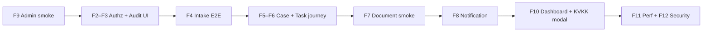

# UAT — Human Gate Kontrol Listesi

> **Versiyon:** 1.0  
> **Kaynak:** `Docs/10_IMPLEMENTATION_ROADMAP.md` §1.4 Human Gate + faz bazlı Human Gate bölümleri  
> **İlgili:** `Docs/09_DEV_WORKFLOW.md`, `Docs/08_TESTING_STRATEGY.md`, `Docs/06_SCREEN_CATALOG.md`

---

## 1. Amaç

Bu doküman, MVP fazlarının tamamlanması sonrasında developer ve paydaşların (Etik ekibi, KVKK, Bilgi Güvenliği, IT) uygulayacağı **Human Gate** manuel kontrol listesidir.

Otomatik CI kapıları (lint, typecheck, unit/integration test, coverage, SAST/SCA) Human Gate'i **tamamlamaz**; bu liste son savunma katmanıdır.

---

## 2. Uygulama Politikası

| Karar | Açıklama |
| --- | --- |
| **Ne zaman?** | **Faz 9 (Admin Panel) tamamlandıktan sonra** — tek seferde, uçtan uca |
| **Neden ertelendi?** | Admin ekranları (`S-ADMIN-*`) henüz tasarlanmadı / implemente edilmedi. Birçok Human Gate maddesi admin UI, sistem ayarları veya maker-checker akışları üzerinden doğrulanır. |
| **Faz 9 öncesi** | Bu dokümandaki maddeler **işaretlenmez** (erken spot-check yapılmayacak). CI + otomatik testler yeterli geçici kapıdır. |
| **Faz 9 sonrası** | Tüm fazlar (F0–F12) için bu dokümandaki ilgili maddeler **sırayla** uygulanır; Faz 13 go-live Human Gate ayrıca §8'de. |

### Durum kodları

| Kod | Anlam |
| --- | --- |
| ⏸ | Planlandı — Faz 9 sonrası uygulanacak |
| ✅ | Geçti |
| ❌ | Kaldı — düzeltme gerekli |
| ➖ | Uygulanamaz / kapsam dışı (gerekçe notta) |

---

## 3. Ortam ve Ön Koşullar

UAT oturumu başlamadan önce:

- [ ] ⏸ Staging ortamı deploy edilmiş (`09_DEV_WORKFLOW` release checklist)
- [ ] ⏸ Sentetik veri only — gerçek etik bildirim / PII yok
- [ ] ⏸ `pnpm lint` + `pnpm typecheck` + `pnpm test` green (CI ile uyumlu)
- [ ] ⏸ Worker servisi çalışır durumda (`apps/worker` — outbox, ClamAV, SLA cron vb.)
- [ ] ⏸ Mailpit veya staging SMTP erişilebilir (bildirim fazı için)
- [ ] ⏸ Test kullanıcıları: her MVP rolü için en az bir hesap (seed veya admin panelden oluşturulmuş)

**Referans komutlar (lokal smoke — Faz 9 sonrası staging ile karşılaştırılır):**

```bash
pnpm dev
pnpm --filter @ethics/worker dev
pnpm --filter @ethics/api test:coverage:document   # Faz 7 coverage gate
```

---

## 4. Genel Human Gate (Tüm Fazlar)

`Docs/10` §1.4 — her faz merge öncesi/sonrası geçerli genel kontroller.

| # | Kontrol | Admin gerekli? | Durum | Not |
| --- | --- | --- | --- | --- |
| G-01 | Feature lokal/staging end-to-end çalışıyor | Hayır | ⏸ | Faz 9 sonrası tam journey |
| G-02 | Kritik modül coverage ≥%90; backend toplam ≥%80 | Hayır | ⏸ | CI raporu + spot review |
| G-03 | `pnpm lint` + `pnpm typecheck` green | Hayır | ⏸ | |
| G-04 | İlgili `Docs/` güncel; yeni ADR gerekiyorsa yazıldı | Hayır | ⏸ | |
| G-05 | Pattern tutarlılığı: `@RequirePolicy`, `@AuditAction`, Zod, error code | Kısmen | ⏸ | Admin endpoint spot-check → Faz 9 |
| G-06 | Staging deploy + smoke test | Hayır | ⏸ | |
| G-07 | Security-sensitive değişiklik → ek reviewer (Bilgi Güvenliği) | Hayır | ⏸ | Faz 12 öncesi özellikle |

---

## 5. Faz Bazlı Kontroller

### Faz 0 — Monorepo Scaffold

| # | Kontrol | Admin gerekli? | Durum |
| --- | --- | --- | --- |
| F0-01 | Klasör yapısı `04_BACKEND_SPEC` workspace tablosuyla uyumlu | Hayır | ⏸ |
| F0-02 | `@ethics/*` scope tutarlı | Hayır | ⏸ |
| F0-03 | Turborepo pipeline: build, lint, typecheck, test, dev | Hayır | ⏸ |
| F0-04 | Husky + commitlint + lint-staged aktif | Hayır | ⏸ |
| F0-05 | Cloud-only; local Docker Compose yok | Hayır | ⏸ |
| F0-06 | `.env.example` kök + apps/api + apps/web | Hayır | ⏸ |

---

### Faz 1 — Database Schema + Auth

| # | Kontrol | Ekran / kanıt | Admin gerekli? | Durum |
| --- | --- | --- | --- | --- |
| F1-01 | Prisma schema `02_DATABASE_SCHEMA` ile birebir | Migration diff | Hayır | ⏸ |
| F1-02 | OIDC PKCE tam akış (code_verifier + code_challenge) | Browser login | Hayır | ⏸ |
| F1-03 | JIT provisioning: rol atanmaz (deny-by-default) | DB + `/me` | Hayır | ⏸ |
| F1-04 | Session: HttpOnly + Secure + SameSite=Strict | DevTools cookie | Hayır | ⏸ |
| F1-05 | CSRF double-submit cookie (mutating istekler) | Network tab | Hayır | ⏸ |
| F1-06 | Rate limit aktif | 429 senaryosu | Hayır | ⏸ |
| F1-07 | Error response zarfı `03_API_CONTRACTS` | API response | Hayır | ⏸ |
| F1-08 | Correlation ID log'larda | API + log | Hayır | ⏸ |
| F1-09 | Frontend 401 → `/auth/login` redirect | Browser | Hayır | ⏸ |
| F1-10 | Auth modülü coverage ≥%90 | CI | Hayır | ⏸ |

---

### Faz 2 — Authorization (RBAC + ABAC + Clearance)

| # | Kontrol | Ekran / kanıt | Admin gerekli? | Durum |
| --- | --- | --- | --- | --- |
| F2-01 | Permission enum tüm MVP permission'ları içeriyor | `packages/policy` | Hayır | ⏸ |
| F2-02 | Role-permission map `07_SECURITY` matrisiyle birebir | Doküman karşılaştırma | Hayır | ⏸ |
| F2-03 | ABAC company scope: dar rol yalnızca kendi şirketi | S-CASE-LIST | Hayır | ⏸ |
| F2-04 | Clearance: SC vaka + S clearance → 403 | API / UI | Hayır | ⏸ |
| F2-05 | Field masking: admin `report_text` göremez | S-CASE-DETAIL | Hayır | ⏸ |
| F2-06 | `@RequirePolicy` tüm internal endpoint'lerde | Spot check | Kısmen | ⏸ |
| F2-07 | PermissionGate UX only — backend enforcement | API deny test | Hayır | ⏸ |
| F2-08 | Authz modülü ≥%90 coverage | CI | Hayır | ⏸ |

---

### Faz 3 — CryptoService + Audit

| # | Kontrol | Ekran / kanıt | Admin gerekli? | Durum |
| --- | --- | --- | --- | --- |
| F3-01 | AES-256-GCM: random IV, alan başına ayrı DEK | Unit/integration test | Hayır | ⏸ |
| F3-02 | KMS adapter: provider değişimi tek dosya | Kod review | Hayır | ⏸ |
| F3-03 | Chain hash DB trigger seviyesinde | DB trigger test | Hayır | ⏸ |
| F3-04 | Append-only: audit_logs UPDATE/DELETE → fail | Integration test | Hayır | ⏸ |
| F3-05 | Fail-closed: audit outbox fail → domain rollback | Integration test | Hayır | ⏸ |
| F3-06 | SafeLogger: log çıktısında PII yok | grep log | Hayır | ⏸ |
| F3-07 | Audit snapshot: encrypted alanlar `[REDACTED]` | S-ADMIN-AUDIT | **Evet** | ⏸ |
| F3-08 | Crypto + audit ≥%90 coverage | CI | Hayır | ⏸ |

---

### Faz 4 — Intake + Tracking

| # | Kontrol | Ekran / kanıt | Admin gerekli? | Durum |
| --- | --- | --- | --- | --- |
| F4-01 | Tracking code formatı `ETK-XXXX-XXXX` | S-REPORT-SUCCESS | Hayır | ⏸ |
| F4-02 | argon2id: memory ≥64 MB, iterations ≥3 | Kod / test | Hayır | ⏸ |
| F4-03 | Tracking session-less: Set-Cookie yok | Network tab | Hayır | ⏸ |
| F4-04 | ClamAV: temiz → AVAILABLE, enfekte → REJECTED | Upload test | Hayır | ⏸ |
| F4-05 | KVKK consent version kaydediliyor | DB / API | Hayır | ⏸ |
| F4-06 | Wizard: geri/ileri validation + veri korunumu | S-REPORT-FORM | Hayır | ⏸ |
| F4-07 | Error code'ları `03_API_CONTRACTS` ile uyumlu | API | Hayır | ⏸ |
| F4-08 | Hassas alanlar DB'de ciphertext | DB inspect | Hayır | ⏸ |
| F4-09 | E2E: form → tracking code → login → durum + mesaj | Journey | Hayır | ⏸ |
| F4-10 | Intake + tracking ≥%80 coverage | CI | Hayır | ⏸ |

---

### Faz 5 — Case Management + Workflow

| # | Kontrol | Ekran / kanıt | Admin gerekli? | Durum |
| --- | --- | --- | --- | --- |
| F5-01 | State machine 17 state × 20+ geçiş (`01_DOMAIN_MODEL`) | Matrix test | Hayır | ⏸ |
| F5-02 | Idempotent command: çift geçiş yok | Integration test | Hayır | ⏸ |
| F5-03 | Optimistic lock: concurrent → 409 | Integration test | Hayır | ⏸ |
| F5-04 | Precondition fail → 422 | API | Hayır | ⏸ |
| F5-05 | CaseTransition append-only | DB trigger | Hayır | ⏸ |
| F5-06 | ABAC: action_owner yalnızca atandığı vaka | S-CASE-LIST | Hayır | ⏸ |
| F5-07 | Clearance deny senaryosu | API | Hayır | ⏸ |
| F5-08 | Her transition audit kaydı | S-ADMIN-AUDIT | **Evet** | ⏸ |
| F5-09 | Transition → task side-effect (PENDING) | S-TASK-LIST | Hayır | ⏸ |
| F5-10 | E2E: secretary açılış → gündem akışı smoke | S-CASE-DETAIL | Hayır | ⏸ |
| F5-11 | Workflow ≥%90 coverage | CI | Hayır | ⏸ |

---

### Faz 6 — Task + SLA + Decision

| # | Kontrol | Ekran / kanıt | Admin gerekli? | Durum |
| --- | --- | --- | --- | --- |
| F6-01 | 11 görev tipi enum tanımlı | Kod / UI | Hayır | ⏸ |
| F6-02 | SLA: tatil + hafta sonu atlanıyor | Integration test | Hayır | ⏸ |
| F6-03 | SlaPolicyConfig: görev tipi bazlı SLA değiştirilebilir | S-ADMIN-SLA-POLICIES | **Evet** | ⏸ |
| F6-04 | Sessiz kabul: 24h → SILENT_ACCEPTANCE vote | Worker cron test | Hayır | ⏸ |
| F6-05 | Delegation: eski DELEGATED, yeni task + referans | S-TASK-DETAIL | Hayır | ⏸ |
| F6-06 | TaskEvent append-only | DB | Hayır | ⏸ |
| F6-07 | E2E: task complete → case transition | Journey | Hayır | ⏸ |
| F6-08 | SLA badge renkleri (yeşil/sarı/kırmızı) | S-TASK-LIST | Hayır | ⏸ |
| F6-09 | Task/SLA/decision ≥%90 coverage | CI | Hayır | ⏸ |

---

### Faz 7 — Document Management

| # | Kontrol | Ekran / kanıt | Admin gerekli? | Durum |
| --- | --- | --- | --- | --- |
| F7-01 | Upload: presigned URL (client → storage direct, relay yok) | Network: PUT storage | Hayır | ⏸ |
| F7-02 | Quarantine → async scan → AVAILABLE / REJECTED | S-CASE-DETAIL doküman sekmesi | Hayır | ⏸ |
| F7-03 | Enfekte dosya REJECTED; indirme engelli | UI badge + download deny | Hayır | ⏸ |
| F7-04 | Grant zorunlu: holding rolü dahi grant olmadan indiremez | API 403 + UI disabled | Hayır | ⏸ |
| F7-05 | Case erişimi ≠ doküman erişimi | Grant revoke test | Hayır | ⏸ |
| F7-06 | Per-document encryption: storage'da ciphertext | Storage/DB inspect | Hayır | ⏸ |
| F7-07 | MIME + uzantı whitelist → 400 | Upload deny | Hayır | ⏸ |
| F7-08 | Boyut limiti: tek 50 MB, toplam 200 MB | Upload deny | Kısmen | ⏸ |
| F7-09 | Download presigned URL TTL 5 dk | API response | Hayır | ⏸ |
| F7-10 | ClamAV timeout → REJECTED | Worker test | Hayır | ⏸ |
| F7-11 | Versiyon: v2 upload → v1 korunur | Doküman sekmesi | Hayır | ⏸ |
| F7-12 | Document modülü ≥%90 coverage | `pnpm test:coverage:document` | Hayır | ⏸ |
| F7-13 | Quarantine / scan izleme (ops) | S-ADMIN-DOCUMENT-OPS | **Evet** | ⏸ |
| F7-14 | Dosya limitleri system_settings'ten konfigüre | S-ADMIN-SYSTEM-SETTINGS | **Evet** | ⏸ |

**Faz 7 manuel smoke senaryosu (Faz 9 sonrası staging):**

1. Case detail → Dokümanlar sekmesi → PDF yükle → "Taranıyor" badge
2. Worker malware-scan job → "Kullanılabilir" badge
3. İndir → dosya açılır
4. Grant iptal (transition veya admin) → indirme disabled / 403
5. EICAR test dosyası → "Reddedildi" badge, indirme yok

---

### Faz 8 — Notification System

| # | Kontrol | Ekran / kanıt | Admin gerekli? | Durum |
| --- | --- | --- | --- | --- |
| F8-01 | E-posta şablonları içeriksiz (vaka detayı yok) | Mailpit / SMTP | Kısmen | ⏸ |
| F8-02 | Outbox + notification aynı transaction | Integration test | Hayır | ⏸ |
| F8-03 | Worker dead letter: failed job izole | Worker log | Hayır | ⏸ |
| F8-04 | SLA cron ~5 dk (staging) | Cron log | Hayır | ⏸ |
| F8-05 | 24h sessiz kabul → vote + notification | Worker | Hayır | ⏸ |
| F8-06 | NotificationBell 30 sn polling | S-NOTIFICATION-CENTER | Hayır | ⏸ |
| F8-07 | Mark-read optimistic + rollback | UI | Hayır | ⏸ |
| F8-08 | Retention purge: legal_hold skip | Worker / admin | **Evet** | ⏸ |
| F8-09 | 28 template seed | S-ADMIN-NOTIFICATION-TEMPLATES | **Evet** | ⏸ |

---

### Faz 9 — Admin Panel

> **Bu faz tamamlanmadan** §4–§7'deki admin-gerektiren maddeler ve aşağıdaki liste **uygulanamaz**.

| # | Kontrol | Ekran | Durum |
| --- | --- | --- | --- |
| F9-01 | Maker-checker: maker ≠ checker (backend reject) | S-ADMIN-SYSTEM-SETTINGS, S-ADMIN-USER-DETAIL | ⏸ |
| F9-02 | Admin içerik göremez: audit'te hassas alan `[REDACTED]` | S-ADMIN-AUDIT | ⏸ |
| F9-03 | CSV export async (>10K kayıt) | S-ADMIN-AUDIT | ⏸ |
| F9-04 | System settings bulk update atomic | S-ADMIN-SYSTEM-SETTINGS | ⏸ |
| F9-05 | Notification template preview (XSS korumalı) | S-ADMIN-NOTIFICATION-TEMPLATES | ⏸ |
| F9-06 | KVKK text publish: destructive onay ("ONAYLIYORUM") | S-ADMIN-KVKK-TEXTS | ⏸ |
| F9-07 | AdminLayout: normal kullanıcı URL → 403 | Tüm `/app/admin/*` | ⏸ |
| F9-08 | User/role/clearance CRUD | S-ADMIN-USER-LIST, S-ADMIN-USER-DETAIL | ⏸ |
| F9-09 | Master data generic CRUD | S-ADMIN-MASTER-DATA | ⏸ |
| F9-10 | Field visibility matrisi | S-ADMIN-FIELD-VISIBILITY | ⏸ |
| F9-11 | Action matrix (maker-checker) | S-ADMIN-ACTION-MATRIX | ⏸ |
| F9-12 | SLA policies + business calendar | S-ADMIN-SLA-POLICIES, S-ADMIN-BUSINESS-CALENDAR | ⏸ |
| F9-13 | Document ops monitor | S-ADMIN-DOCUMENT-OPS | ⏸ |
| F9-14 | System health | S-ADMIN-SYSTEM-HEALTH | ⏸ |

---

### Faz 10 — Dashboard + Polish

| # | Kontrol | Ekran | Admin gerekli? | Durum |
| --- | --- | --- | --- | --- |
| F10-01 | Dashboard widget parallel lazy load | S-DASHBOARD | Hayır | ⏸ |
| F10-02 | Widget'lar permission-gated | S-DASHBOARD | Hayır | ⏸ |
| F10-03 | Error page: prod'da stack trace yok | Error routes | Hayır | ⏸ |
| F10-04 | KVKK consent modal: blocking (ESC/X kapalı) | Modal | Hayır | ⏸ |
| F10-05 | Session expired modal otomatik | InternalLayout | Hayır | ⏸ |
| F10-06 | Sidebar permission-gated menüler | InternalLayout | Hayır | ⏸ |

---

### Faz 11 — Performance + Load Test

| # | Kontrol | Kanıt | Durum |
| --- | --- | --- | --- |
| F11-01 | Lighthouse CI PR gate (perf ≥80, a11y ≥90) | CI artifact | ⏸ |
| F11-02 | Bundle initial < 200 KB gzipped | Analyzer | ⏸ |
| F11-03 | DB slow query → index fix | EXPLAIN | ⏸ |
| F11-04 | k6: P95 < 500 ms, 0 kritik error | k6 report | ⏸ |

---

### Faz 12 — Security Hardening

| # | Kontrol | Kanıt | Durum |
| --- | --- | --- | --- |
| F12-01 | Pen-test raporu review | Rapor | ⏸ |
| F12-02 | Critical/high findings remediated | Ticket list | ⏸ |
| F12-03 | CSP nonce-based; unsafe-inline yok | Header inspect | ⏸ |
| F12-04 | Secret rotation drill (staging) | Runbook | ⏸ |
| F12-05 | Backup restore drill (staging) | Runbook | ⏸ |
| F12-06 | Runbook'lar 15+ adet complete | `docs/runbooks/` | ⏸ |
| F12-07 | SAST/SCA/container: 0 HIGH/CRITICAL | CI | ⏸ |
| F12-08 | ZAP/DAST staging scan | Rapor | ⏸ |

---

## 6. Faz 9 Sonrası Önerilen Uygulama Sırası

Admin panel hazır olduktan sonra tek UAT oturumunda önerilen sıra:



1. **F9 admin** — tüm `S-ADMIN-*` ekranları erişilebilir ve maker-checker çalışır
2. **F2–F3** — audit viewer redaction, permission spot-check
3. **F4** — dış form + tracking tam journey
4. **F5–F6** — vaka geçişleri + görev + SLA (admin'den tatil/SLA policy ayarla → doğrula)
5. **F7** — doküman upload/scan/download + document-ops monitor
6. **F8** — bildirim + e-posta içeriksizlik
7. **F10** — dashboard + KVKK blocking modal
8. **F11–F12** — performans ve güvenlik kapıları (go-live öncesi)

---

## 7. Kayıt Tutma

Her oturum için:

| Alan | Değer |
| --- | --- |
| Tarih | |
| Ortam | staging / pre-prod |
| Uygulayan | |
| Faz aralığı | örn. F0–F10 |
| Geçen / Kalan | |
| Blocker notları | |

Bulgu formatı: `UAT-{Faz}-{MaddeNo}` — örn. `UAT-F7-04` — issue tracker'a link.

---

## 8. Faz 13 — Go-Live Human Gate (UAT Sign-off Sonrası)

Faz 9 sonrası UAT tamamlandığında, production cutover için ayrıca (`Docs/10` §Faz 13):

| # | Kontrol | Durum |
| --- | --- | --- |
| GL-01 | Production IaC apply success | ⏸ |
| GL-02 | RDS snapshot go-live öncesi | ⏸ |
| GL-03 | Secrets AWS Secrets Manager'da | ⏸ |
| GL-04 | DNS + TLS aktif | ⏸ |
| GL-05 | E-posta deliverability (SPF/DKIM/DMARC) | ⏸ |
| GL-06 | Monitoring dashboard (CPU, 5xx, login rate) | ⏸ |
| GL-07 | Runbook'lar complete | ⏸ |
| GL-08 | **UAT sign-off** — Etik + KVKK + Bilgi Güvenliği | ⏸ |
| GL-09 | Prod'da dev seed çalışmadığı doğrulandı | ⏸ |
| GL-10 | Kullanıcı duyuru planı | ⏸ |

---

## 9. Onay

| Rol | Ad | Tarih | İmza |
| --- | --- | --- | --- |
| Developer / Tech Lead | | | |
| Etik İşleri | | | |
| KVKK | | | |
| Bilgi Güvenliği | | | |

---

## 10. Revizyon Geçmişi

| Versiyon | Tarih | Değişiklik |
| --- | --- | --- |
| 1.0 | 2026-06-14 | İlk sürüm — tüm faz Human Gate maddeleri; uygulama Faz 9 sonrası planlandı |
